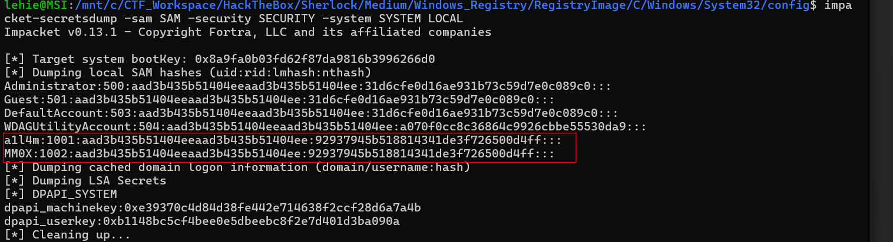
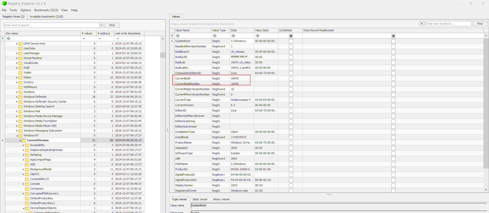
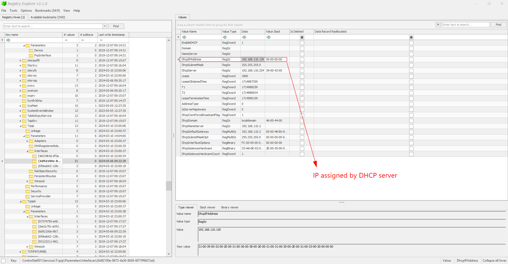
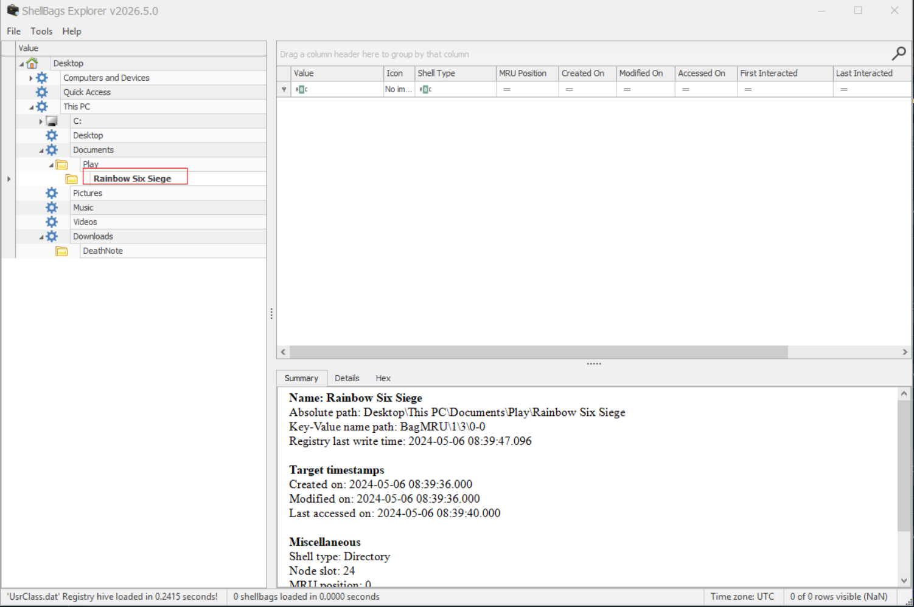
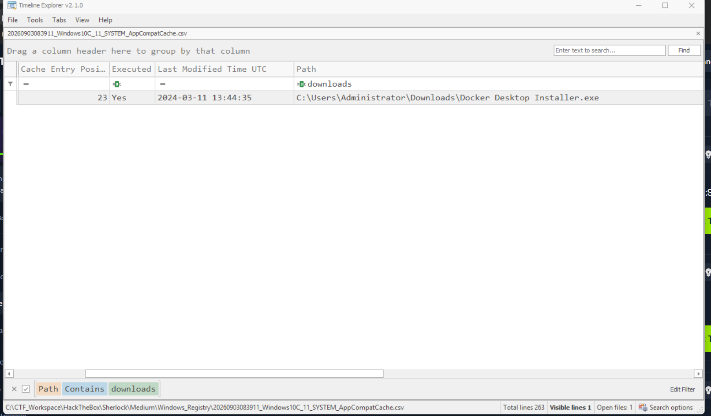
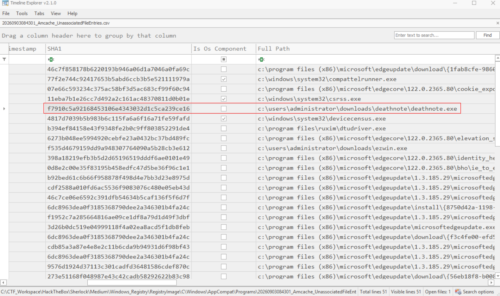
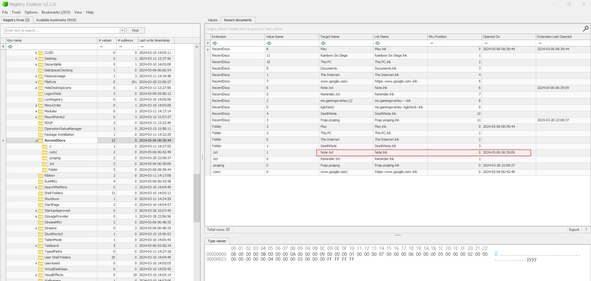
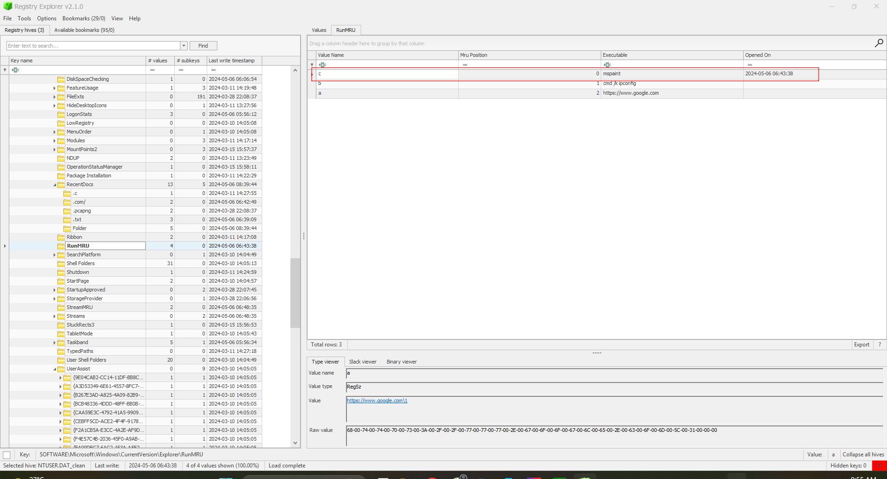
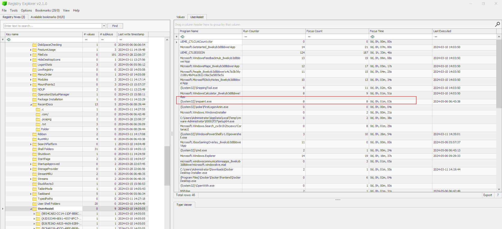

# Windows Registry

## Sherlock scenario
As a cybersecurity analyst, you've been given an image containing all the registry hives from one of our employee’s machines. Your task is to thoroughly examine the provided artifacts and respond to a series of questions based on your analysis.

## Given artefacts

C drive containing only registry files

## Questions

### 1. How many users were added?

Our main tool in this task is Eric Zimmerman's tool like Registry Explorer, Shellbags Explorer. For this task, we may use R.E to parse the SAM registry, but instead I use impacket-secretsdump to quickly grasp the users, their NTLM hash as well:

There is only 2 added user, others are built-in accounts

**Answer: 2**

### 2. What is the build number of the user's operating system?

Parse SOFTWARE, reach Microsoft\Windows NT\CUrrentVersion:

**Answer: 19045**

### 3. What was the IP address of the machine you are investigating right now?

Parse SYSTEM, reach CurrentControlSet\Services\Tcpip\Parameters\Interfaces:

**Answer: 192.168.110.130**

### 4. We suspect that the user may have some video games on their work PC. What is the name of the game?

For this question we will use ShellBags, parse UsrClass.dat  with ShellBags Explorer:

In Documents folder, a weird game is present

**Answer: Rainbow Six siege**

### 5. There was a file that got executed from the Downloads directory. What is the modification time of the said file? (Answer Format: YYYY-MM-DD HH:MM:SS)

For modification time of executable files, we may use prefetch, Amcache or Shimcache, but prefetch is not available, so this time I use AppCompatCache, a.k.a Shimcache:

**Answer: 2024-03-11 13:44:35**

### 6. We believe that the user may have installed some malicious files on their work PC. What is the SHA1 hash of the malicious file?

For SHA1, we may immediately think about Amcache:

**Answer: f7910c5a92168453106e4343032d1c5ca239ce16**

### 7. What is the malware family name of the previous file?

Submit its hash for online Threat Intelligence platforms

**Answer: jaik**

### 8. The user opened a file on 2024-05-06 06:39:09 on their work PC. What is the name of that file?

For recently opened file, a good place to seek for is RecentDocs, parse NTUSER.dat, reach Software\Microsoft\Windows\CurrentVersion\Explorer\RecentDocs:

**Answer: note.txt**

### 9. The user opened MSPaint on their work PC. Can you determine the exact time it happened? (Answer Format: YYYY-MM-DD HH:MM:SS)

Still in that hive but we choose RunMRU instead of RecentDocs:

So mspaint is opened through Run diaglog, instead of using Explorer GUI

**Answer: 2024-05-06 06:43:38**

### 10. Can you find out how long the user had MSPaint open? (Answer Format: MM:SS)

Still in that hive, open UserAssist\\{target user's GUID}:

**Answer: 01:03**
