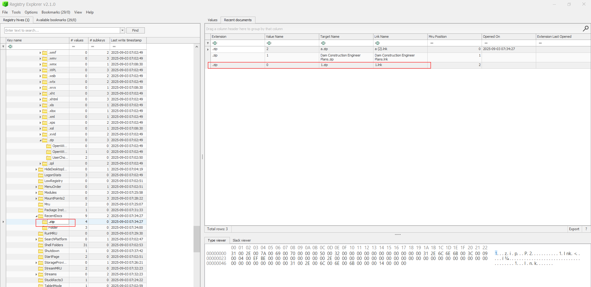
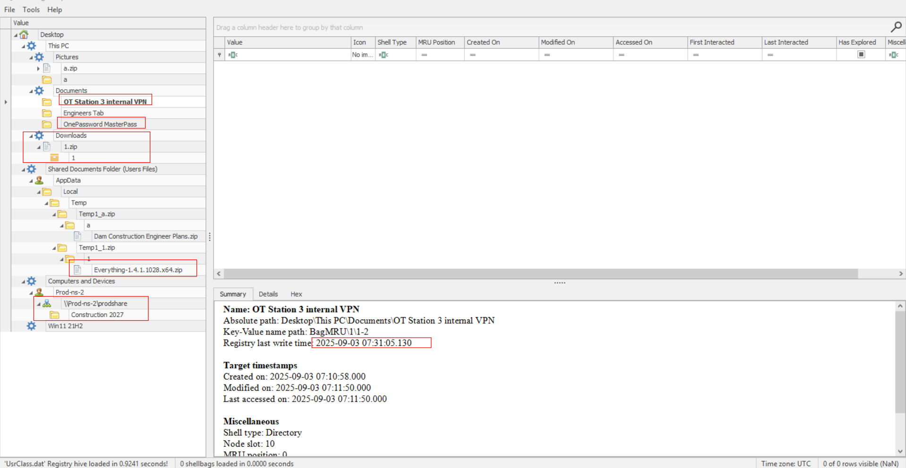
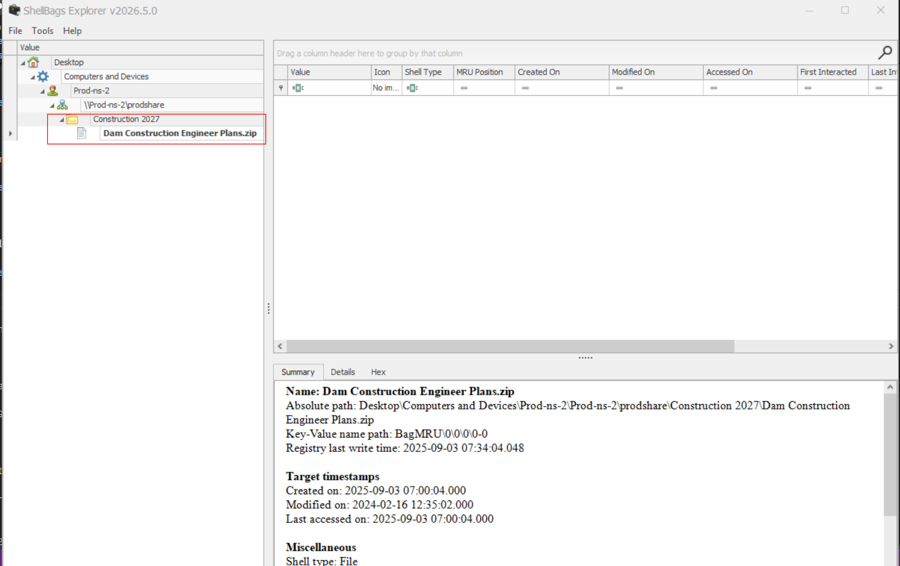

# Baggage

## Sherlock Scenario

This Sherlock provides players with an opportunity to analyze Shellbag artifacts. Shellbags can be used to find evidence of folder access by a specific user, access to network shares, and navigation of archive file contents. This information can be leveraged during investigations to identify potential data access, data staging, and data exfiltration attempts.

## Given artifact

The C's drive of compremised machine, but only hives like NTUSER.dat, UsrClass.dat, ...

## Foundational Knowledge

### What are ShellBags?
ShellBags are a set of Registry keys created by the Windows operating system to remember the layout, size, icon, and view preferences (e.g., "Details" vs. "Large Icons") of a folder. Their sole purpose is to ensure that when a user reopens a folder, it looks exactly the way they left it.

### How do things get recorded?
*   **GUI Interaction is Required**: ShellBags are **only** generated when a folder is accessed via the Windows Graphical User Interface (Windows Explorer). If an attacker uses the command line (e.g., `cd`, `dir`, `copy`) or runs an automated script to move files, **no ShellBags are created**.
*   **Archives count as folders**: Because Windows Explorer has a built-in zip viewer that allows you to browse `.zip` files as if they were standard folders, double-clicking a zip file generates ShellBag artifacts just like opening a directory!
*   **Persistence**: ShellBags are incredibly valuable to forensic analysts because they persist even if the folder is deleted, the zip file is removed, or the USB drive/Network Share is disconnected. They serve as definitive proof of *historical folder existence* and *interactive user access*.

### The Hive Split Quirk (`UsrClass.dat` vs `NTUSER.DAT`)
As you discovered in Task 8, Shellbags can be tricky because Windows splits them between two hives:
1.  **`UsrClass.dat`**: Located in `AppData\Local\Microsoft\Windows\`, this hive stores the vast majority of Shellbags for local drives (C:\, Desktop, Downloads). 
2.  **`NTUSER.DAT`**: Located in the root of the user's profile, this hive primarily handles legacy artifacts and **remote network share (UNC) paths**. 

## Questions

### 1. What was the name of the archive file downloaded by the compromised account?

At first I blindly rip the hive NTUSER.dat using Registry Explorer and find for `.zip`, it did work:

But the more accurate procedure should be to open `UsrClass.dat` in ShellBags Explorer, another tools made by Eric Zimmerman:

This screenshot would help us answer a lot of questions

**Answer: 1.zip**

### 2. What was the name of the utility brought in by the attacker to search for sensitive data?

As I have noted, when `.zip` file is double-clicked, Windows lets us browse it as if it were folder, but it silently extracts the content to the temp folder, and Shellbags does log it like normal folder. Look at the previous screenshot, `1.zip` holds the tool

**Answer: Everything 1.4.1.1028**

### 3. The attacker navigated the filesystem and found sensitive files used by the victim in their day-to-day work. When was the VPN folder accessed by the attacker?

In previous snapshot

**Answer: 2025-09-03 07:31:05**

### 4. What was the name of the directory containing the victim's passwords?

**Answer: OnePassword MasterPass**

### 5. The attacker also accessed a network share to pillage network data. What is the UNC path?

In `Computers and Devices` part

**Answer: \\Prod-ns-2\prodshare**

### 6. When is the dam construction planned?

The folder in network share is Construction 2027, thus the dam should be planned to start in 2027

**Answer: 2027**

### 7. What was the name of the archive file present on the network share?

`UsrClass.dat` won't display it, we will load `NTUSER.dat` into Shellbags Explorer:

**Answer: Dam Construction Engineer Plans.zip**

### 8. When was the archive file from the network share accessed?

**Answer: 2025-09-03 07:34:04**

### 9. The attacker created a staging folder to prepare for collection and exfiltration. What is the full path of the staging folder?

We see a zip file in `Pictures` folder, that's it

**Answer: C:\users\Steve\Pictures\a**

### 10. The attacker compressed the staging folder to prepare the data for exfiltration. When was the exfiltration archive file accessed?

They double-click it to check the content before exfiltration, it gets logged in the temp folder

**ANswer: 2025-09-03 07:34:30**
