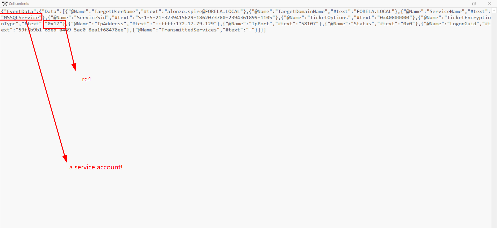
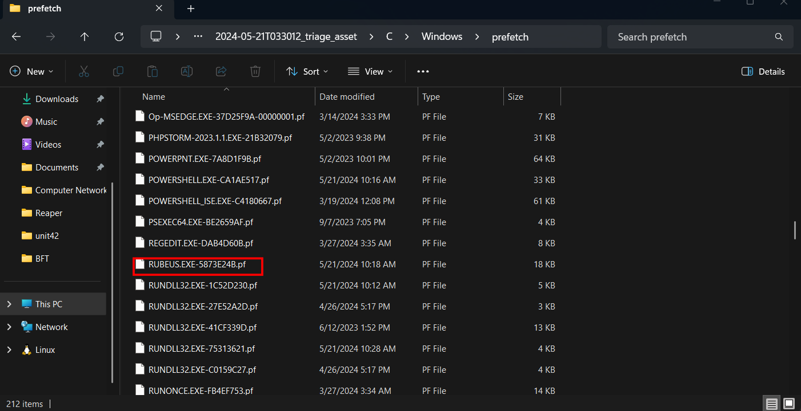
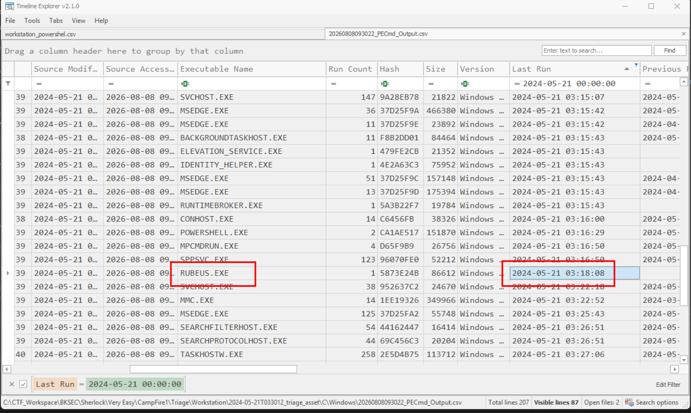
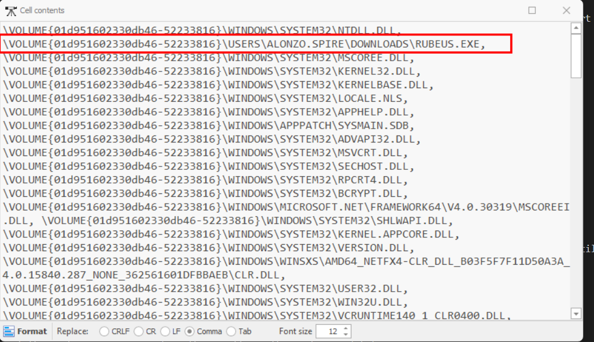

# Campfire 1 

## Sherlock Scenario

Alonzo Spotted Weird files on his computer and informed the newly assembled SOC Team. Assessing the situation it is believed a Kerberoasting attack may have occurred in the network. It is your job to confirm the findings by analyzing the provided evidence.

You are provided with:

1- Security Logs from the Domain Controller

2- PowerShell-Operational Logs from the affected workstation

3- Prefetch Files from the affected workstation

## Given artifact

Already mentioned in the scenario

## Foundational knowledge

### Kerberos and its mechanism

Kerberos is a network authentication protocol designed to secure client-server communications using strong cryptography and secret-key sharing. It uses a trusted third party called the `Key Distribution Center (KDC)` to issue temporary identity credentials called tickets

**Core Architecture Components**

The Kerberos ecosystem relies on three main parts within its database:

- `Authentication Service (AS)`: Verifies the initial login request of a client and issues a Ticket Granting Ticket (TGT).
- `Ticket Granting Service (TGS)`: Authenticates the TGT and issues a Service Ticket (ST) for specific resources.
- `Target Server`: The network service (e.g., file share, website) the client wants to access.

**The Three-Phase Ticketing Schema**

The authentication flow consists of six messages grouped into three distinct phases:

- `AS-REQ (Request)`: The client sends a plaintext request with their username to the AS.
- `AS-REP (Response)`: The AS verifies the username. It returns two things:A Session Key (SK1), encrypted using a hash of the user's password.The Ticket Granting Ticket (TGT), encrypted using the secret key of the KDC. The client cannot read or modify the TGT.
- `TGS-REQ (Request)`: The client decrypts the Session Key (SK1) using their password. It then sends the unreadable TGT along with an Authenticator (timestamp encrypted with SK1) to the TGS, requesting access to a specific server.
- `TGS-REP (Response)`: The TGS decrypts the TGT (using the KDC key) to verify the client. It generates a new Service Session Key (SK2) and returns The Service Ticket (ST), encrypted using the Target Server's secret key along with the SK2, encrypted using SK1 so the client can read it
- `AP-REQ (Request)`: The client extracts the Service Ticket (ST). It sends the ST along with a new Authenticator (timestamp encrypted with SK2) to the Target Server
- `AP-REP (Response)`: The Target Server decrypts the ST using its own secret key, verifies the timestamp, and extracts SK2. It then sends a confirmation message back to the client to prove its own identity (preventing mutual spoofing).

### Kerberos in Active Directory context

In `Active Directory (AD)`, Kerberos is the default authentication protocol, where the `Domain Controller (DC)` acts as the `Key Distribution Center (KDC)`. AD enhances the standard Kerberos schema by embedding authorization data directly inside the tickets

**The AD-Specific Enhancement: The PAC**

The most critical difference in Active Directory is the inclusion of the PAC (Privilege Attribute Certificate).

- What it is: An extension field embedded inside both the TGT and the Service Ticket.
- What it contains: Your User SID, Group SIDs, and account privileges.
- Why it matters: Instead of the target server looking up what you are allowed to do, your permissions travel inside the ticket itself.
- Security: The PAC is digitally signed by both the KDC and the domain server to prevent users from tampering with their own privileges.

**The AD Kerberos Flow**

1. Initial Login (AS Exchange)

- `The Request`: You type your password or insert a smartcard. The computer sends an AS-REQ to the Domain Controller. It uses Pre-Authentication, meaning it encrypts a current timestamp with your NT password hash to prove you know the password.
- `The Active Directory Action`: The DC looks up your account in the NTDS.dit database.
- `The Response (AS-REP)`: The DC generates your TGT. Crucially, the DC bakes your Group Memberships (SIDs) into the PAC inside this TGT.

2. Requesting a Resource (TGS Exchange)

- `The Request`: You try to access a shared folder on a member server (`\\FileServer01\Share`). Your computer sends a TGS-REQ to the DC.
- `The Active Directory Action`: The DC identifies the target server using its SPN (Service Principal Name), which is an attribute tied to the server's computer account in AD.
- `The Response (TGS-REP)`: The DC copies your PAC from the TGT, puts it into a new Service Ticket (ST), and encrypts the ticket using the target server's account password hash.

3. Accessing the Server (AP Exchange)

- `The Request`: Your computer presents the Service Ticket to FileServer01.
- `The Verification`: The file server decrypts the ticket using its own local password hash. It extracts the PAC.
- `PAC Validation`: To ensure the PAC hasn't been forged, the file server frequently contacts the DC via a Netlogon RPC call to validate the DC's signature on the PAC
- `The Access Decision`: The server compares your SIDs inside the PAC against the NTFS permissions on the folder and grants or denies access.

### Kerberoasting attack

Kerberoasting allows an attacker with standard domain access to harvest password hashes for Active Directory service accounts without sending traffic to the target servers.

As I've noted in the previous part, in AD, every service account running a service (like SQL Server or IIS) uses an identifier called an SPN. And when any user, despite his privilege, asks the DC for the service ticket (TGS), the DC encrypts this TGS ticket using the password hash of the service account associated with that SPN.

Obtaining the account's hash, the attacker can easily perform offline cracking, their attempt may succeed or not, but the threat is inevitable.

That's enough, let's roll up our sleeves

## Questions

## 1. Analyzing Domain Controller Security Logs, can you confirm the UTC date & time when the kerberoasting activity occurred?

First we filter for ID 4769 (A kerberos service ticket was requested). There are some events, now remember what I have noted in the above section, Kerberoasting aims at service accounts, so we will pay attention to them specially:

Here is what we need!

**Answer: 2024-05-21 03:18:09**

## 2. What is the Service Name that was targeted?

**Answer: MSSQLService**

## 3. It is really important to identify the Workstation from which this activity occurred. What is the IP Address of the workstation?

Also in the above image

**Answer: 172.17.79.129**

## 4. Now that we have identified the workstation, a triage including PowerShell logs and Prefetch files are provided to you for some deeper insights so we can understand how this activity occurred on the endpoint. What is the name of the file used to Enumerate Active directory objects and possibly find Kerberoastable accounts in the network?

In the powershell operational log, filter for ID 4104 (Contains content of scripts run), we will see red flag immediately, this is one part of the infamous PowerSploit module

**Answer: powerview.ps1**

## 5. When was this script executed? (UTC)

Scroll left for the time column:

**Answer: 2024-05-21 03:16:32**

## 6. What is the full path of the tool used to perform the actual kerberoasting attack?

In fact, I can realize the malicious tool right after looking at the prefetch folder:

[Rubeus](https://github.com/ghostpack/rubeus) is a raw C# toolset for Kerberos interaction and abuse. However, to find its full path, I still need to follow the intended solution, parse the pf files with Eric Zimmerman's `PECmd`, then open the csv file with his Timeline Explorer

I filter for the time around the incident:

Look at the `Files Loaded` column of this entry, we can see its path as well as other referenced files:

**Answer: C:\Users\Alonzo.spire\Downloads\Rubeus.exe**

## 7. When was the tool executed to dump credentials? (UTC)

Already seen

**Answer: 2024-05-21 03:18:08**
