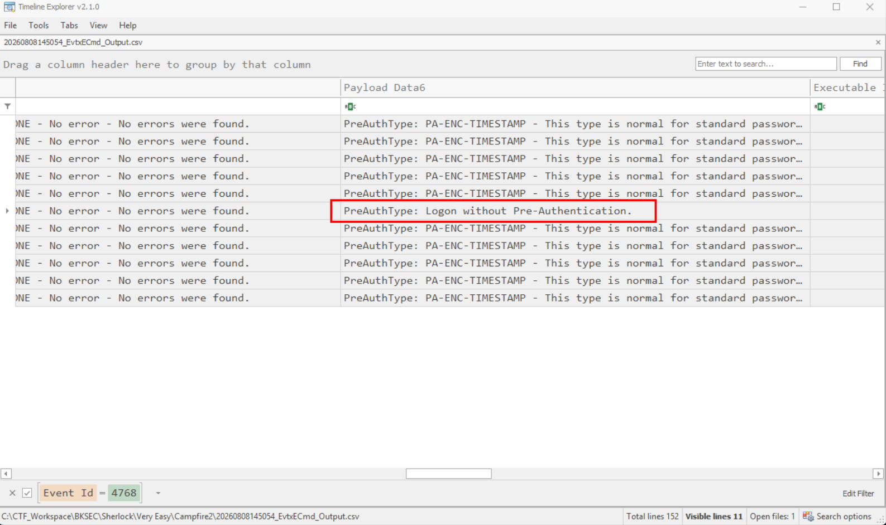
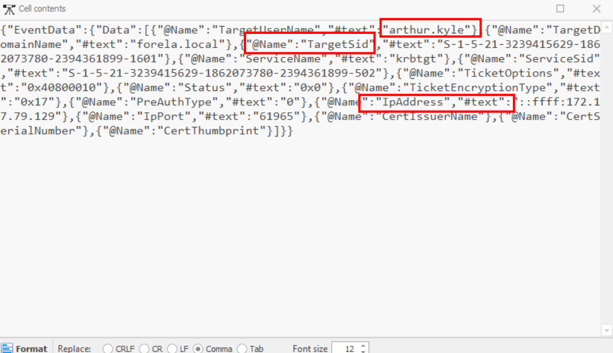
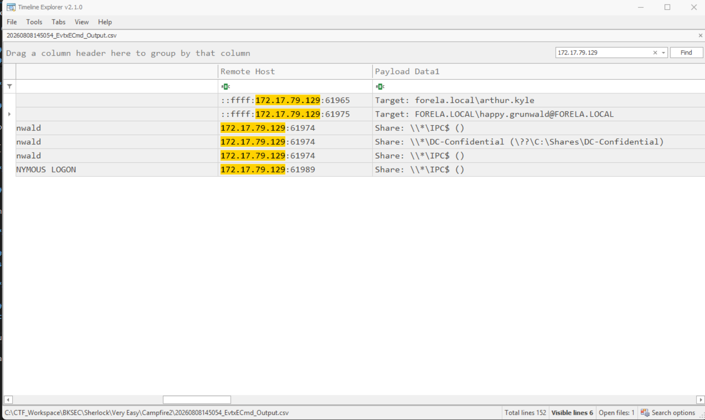

# Campfire 2

## Sherlock scenario

Forela's Network is constantly under attack. The security system raised an alert about an old admin account requesting a ticket from KDC on a domain controller. Inventory shows that this user account is not used as of now so you are tasked to take a look at this. This may be an AsREP roasting attack as anyone can request any user's ticket which has preauthentication disabled.

## Given artifact

The DC's security log

## About AS-REP Roasting attack

Read the foundational knowledge in the Campfire 1's write-up first

An AS-REP Roasting attack also abuses the Active Directory Kerberos protocol, but it exploits a different design flaw: accounts configured without Kerberos pre-authentication required.

While Kerberoasting targets service accounts with SPNs, AS-REP Roasting targets regular user accounts that have this specific, insecure setting enabled.

**How the Abuse Works**

By default, Kerberos requires "pre-authentication." This means a user must encrypt a timestamp with their password hash before the Domain Controller (DC) will talk to them. This proves they know the password.

AS-REP Roasting abuses accounts where this security feature is turned off:

- `The Request (AS-REQ)`: The attacker sends a plain-text authentication request to the DC for a specific username. Because pre-authentication is disabled, the attacker does not need to provide a password or encrypted timestamp.
- `The Response (AS-REP)`: The DC blindly trusts the request and replies with an Authentication Service Response (AS-REP).
- `The Flaw`: Part of this response is encrypted using the target user's password hash.
- `Offline Cracking`: Just like Kerberoasting, the attacker pulls this encrypted data out of the response, takes it offline, and brute-forces it to reveal the plain-text password

## Questions

### 1. When did the ASREP Roasting attack occur, and when did the attacker request the Kerberos ticket for the vulnerable user?

Look at the parsed log and filter for ID 4768 (A Kerberos authentication ticket (TGT) was requested), we can see the user with pre-auth disabled here:

Scroll left for timestamp

**Answer: 2024-05-29 06:36:40**

## 2. Please confirm the User Account that was targeted by the attacker.

Look at the detail column, a lot of information is stored here:

**Answer: arthur.kyle**

## 3. What was the SID of the account?

In the above image

**Answer: S-1-5-21-3239415629-1862073780-2394361899-1601**

## 4. It is crucial to identify the compromised user account and the workstation responsible for this attack. Please list the internal IP address of the compromised asset to assist our threat-hunting team.

**Answer: 172.17.79.129**

## 5. We do not have any artifacts from the source machine yet. Using the same DC Security logs, can you confirm the user account used to perform the ASREP Roasting attack so we can contain the compromised account/s?

Just search for entries with the malicious IP address involving, we can see this user also acts from that machine:

The service request he makes shows nothing malicious, but it is done from the malicious machine

**Answer: happy.grunwald**
