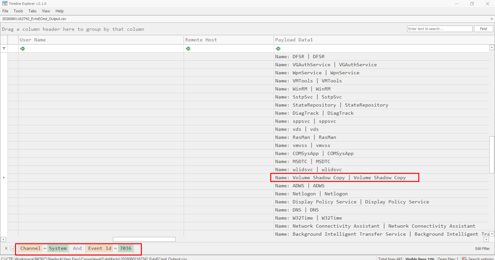
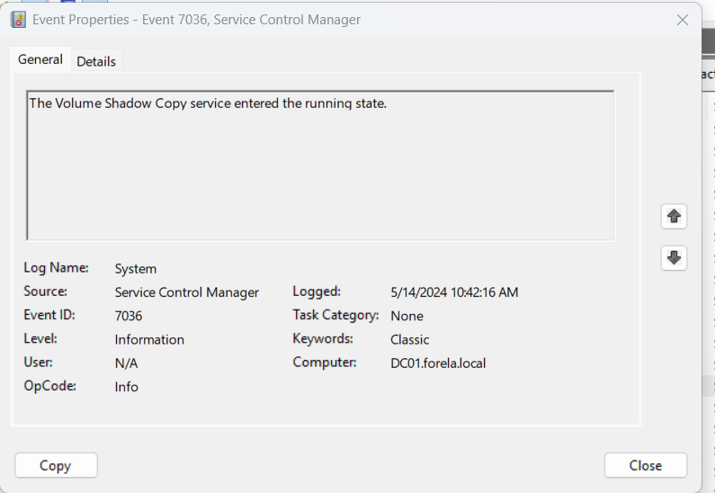
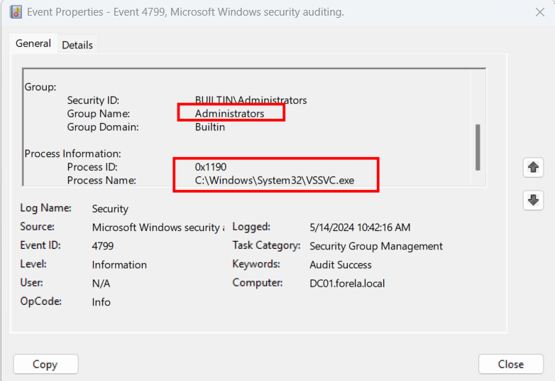
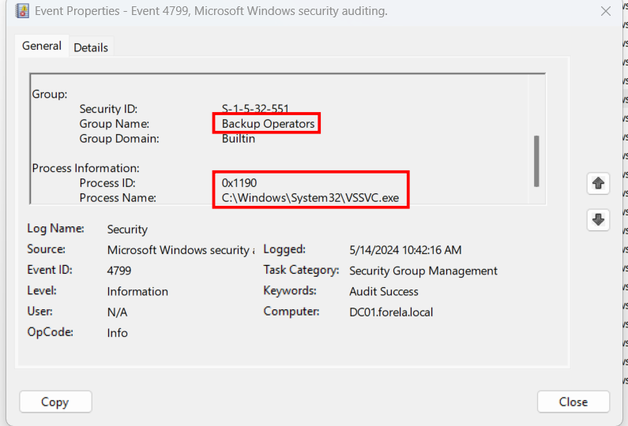
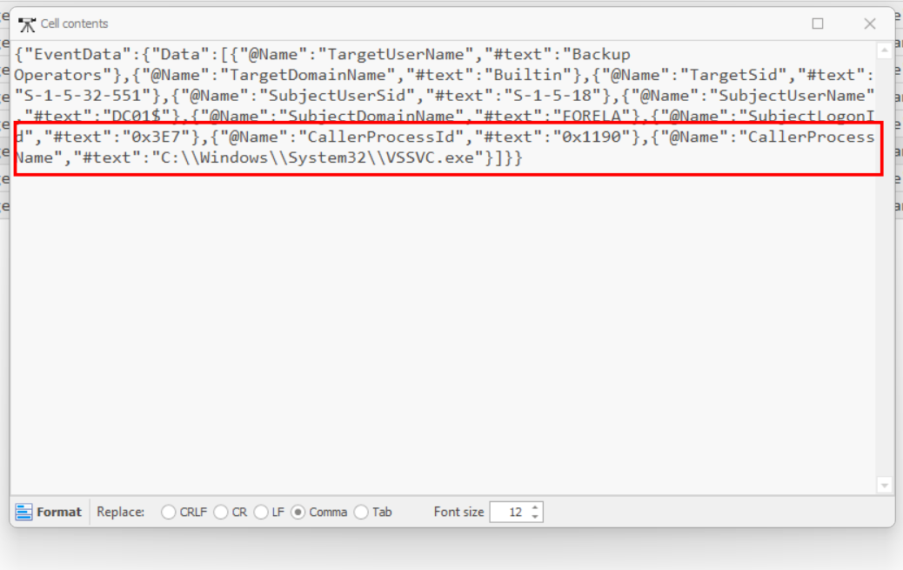
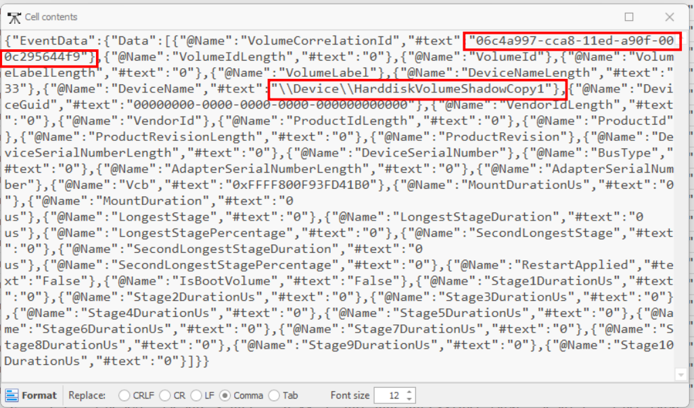
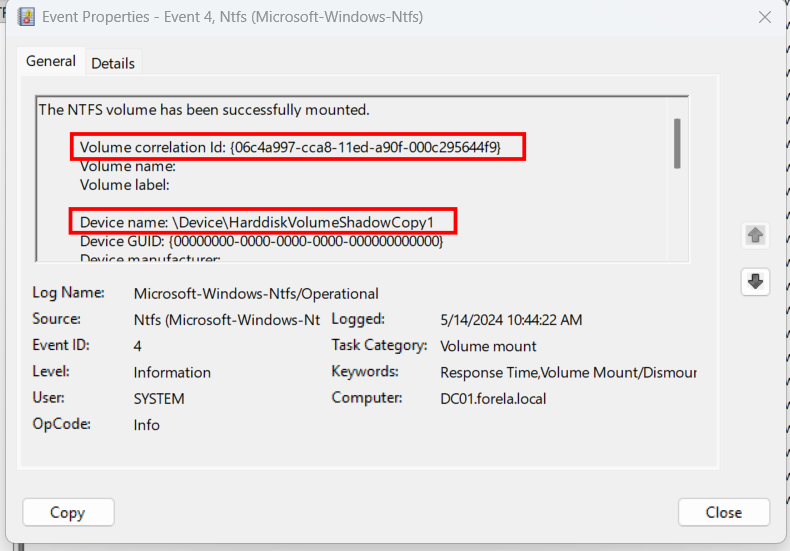
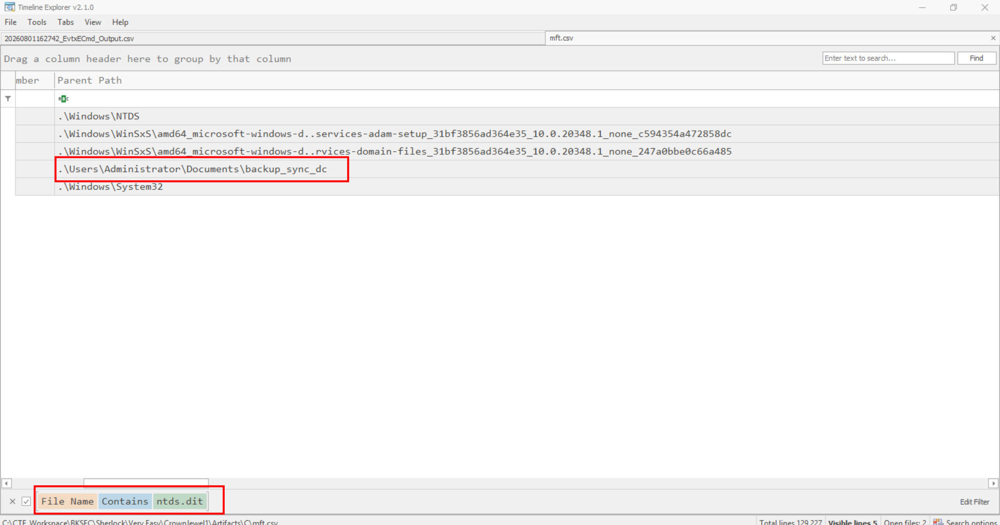
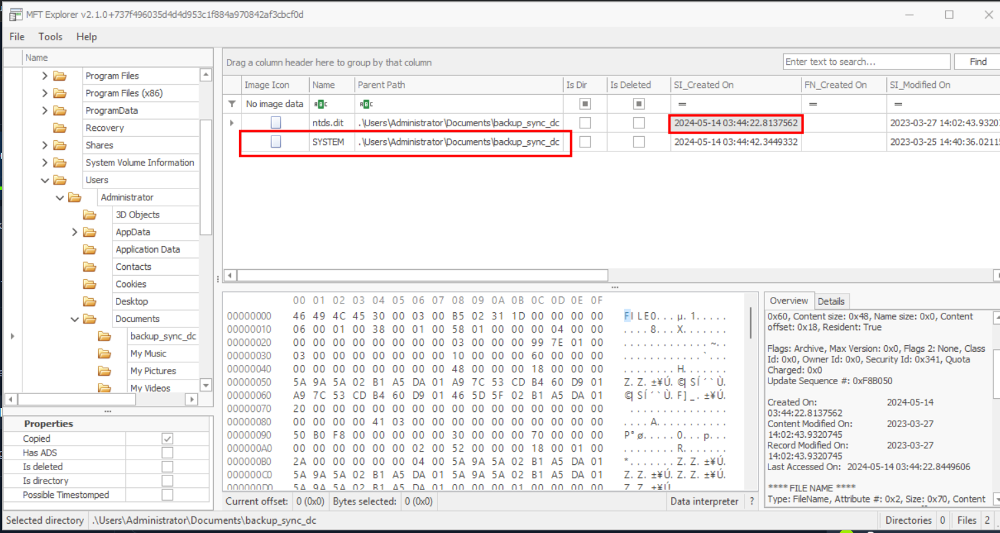
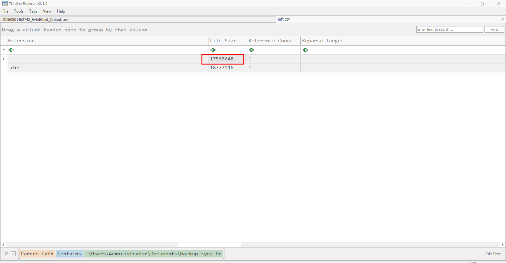

# CrownJewel 1

## Sherlock scenario

Forela's domain controller is under attack. The Domain Administrator account is believed to be compromised, and it is suspected that the threat actor dumped the NTDS.dit database on the DC. We just received an alert of vssadmin being used on the DC, since this is not part of the routine schedule we have good reason to believe that the attacker abused this LOLBIN utility to get the Domain environment's crown jewel. Perform some analysis on provided artifacts for a quick triage and if possible kick the attacker as early as possible.

## Given artifact

The `$MFT` of C drive and three event logs, namely SYSTEM, SECURITY and NTFS-Operational

## Background knowledge about `vssadmin`

Vssadmin is a legitimate, built-in Windows command-line utility used by system administrators to manage the Volume Shadow Copy Service (VSS). VSS automatically captures and stores backup snapshots (shadow copies) of files and volumes, even while they are actively in use. This allows users or administrators to easily restore data to a previous state if it becomes corrupted, modified, or accidentally deleted.

Because it is a native Windows tool, cybercriminals frequently exploit it in a tactic known as "Living off the Land" to execute destructive actions without bringing in external malware.

This utility is often abused by threat actor to:

- `Delete mass amount of backup`: they can force deletion of all existing data snapshots, making recovery impossible during ransomware campaigns

- `Shrink backup storage size`: if barely deleting backup raise a massive red flag in basic security alerts, they may simple shrink the storage allocated for it, forcing Windows to purge all previous snapshots to comply with the new size.

- `Extract sensitive files` (such as `NTDS.dit` the Active Directory database): those files are constantly in use by the domain controller, thus being locked by the operating system, making it impossible to be copied by standard utilities

### Technique to smuggle this file

- `Creating the System Shadow Copy`: The attacker instructs `vssadmin` to create a live snapshot of the main system partition (usually the C: or D: drive) using the command line:
  
  ```bash
  vssadmin create shadow /for=C:
  ```

  This command takes a near-instantaneous snapshot of the drive and provides the attacker with a unique volume path, such as `\\?\GLOBALROOT\Device\HarddiskVolumeShadowCopy1`

- `Copying the Locked NTDS.dit File`: Once the shadow copy exists, the operating system's file lock is effectively bypassed on that snapshot. The attacker utilizes standard command-line tools like copy or esentutl to pull the active Active Directory database out of the backup location

- `Extracting the SYSTEM Registry Hive`: An encrypted ntds.dit file is useless without the boot key required to decrypt it. The attacker extracts the SYSTEM registry hive, which contains this cryptographic key

- `Deleting evidence and offline cracking`: they would delete the shadow copy to evade detection, then use offline crack tool like `secretsdump.py` to extract every username, NTLM password hash, and Kerberos key in the entire organization. This allows them to forge Golden Tickets, crack employee passwords, and establish permanent persistence across the network.

## Questions

For questions involving Event Logs, I will use both Windows Event Viewer directly and Eric Zimmerman's tools

### 1. Attackers can abuse the vssadmin utility to create volume shadow snapshots and then extract sensitive files like NTDS.dit to bypass security mechanisms. Identify the time when the Volume Shadow Copy service entered a running state.

We will look at SYSTEM log, filter for event ID 7036 (Service Control Manager), there are not so many entries, so it's in plain sight:



Scroll left to get the correct UTC timestamp, we can also do the same thing in Event Viewer, but it would display local time (my UTC+7) instead:



**Answer: 2024-05-14 03:42:16**

### 2. When a volume shadow snapshot is created, the Volume shadow copy service validates the privileges using the Machine account and enumerates User groups. Find the two user groups the volume shadow copy process queries and the machine account that did it.

We will pivot to SECURITY event log, filter for ID 4799 (A security-enabled local group membership was enumerated), in Event Viewer, we should use the `Find` feature to isolate the enumeration from `vssvc.exe` only:





The same schema can be applied to the csv parsed by EvtxECMD:



Note the machine account is also displayed

**Answer:  Administrators, Backup Operators, DC01$**

### 3. Identify the Process ID (in Decimal) of the volume shadow copy service process.

This is shown in the previous images, just convert it to decimal

**Answer: 4496**

### 4. Find the assigned Volume ID/GUID value to the Shadow copy snapshot when it was mounted.

We will analyze Microsoft-Windows-NTFS event logs. Filter for event ID 4,9,10,300 and 303. This will filter for only the NTFS volumes mount and dismount events. We should only look at the events near in the related time frame. I find this in an ID 4 event (Volume mounted):



In Event Viewer:



**Answer: {06c4a997-cca8-11ed-a90f-000c295644f9}**

### 5. Identify the full path of the dumped NTDS database on disk.

Use `MFTECmd` to parse the C's $MFT file then open it in Timeline Explorer, I search for NTDS.dit in file name column:



Then scroll left for the parent file path

**Answer: C:\Users\Administrator\Documents\backup_sync_Dc\Ntds.dit**

### 6. When was newly dumped ntds.dit created on disk?

I trace that path in `MFTExplorer`, a GUI tools for master file table:



**Answer: 2024-05-14 03:44:22**

### 7. A registry hive was also dumped alongside the NTDS database. Which registry hive was dumped and what is its file size in bytes?

We may either look at the hex file size in mft explorer or scroll left in timeline explorer for direct decimal representation



**Answer: 17563648**