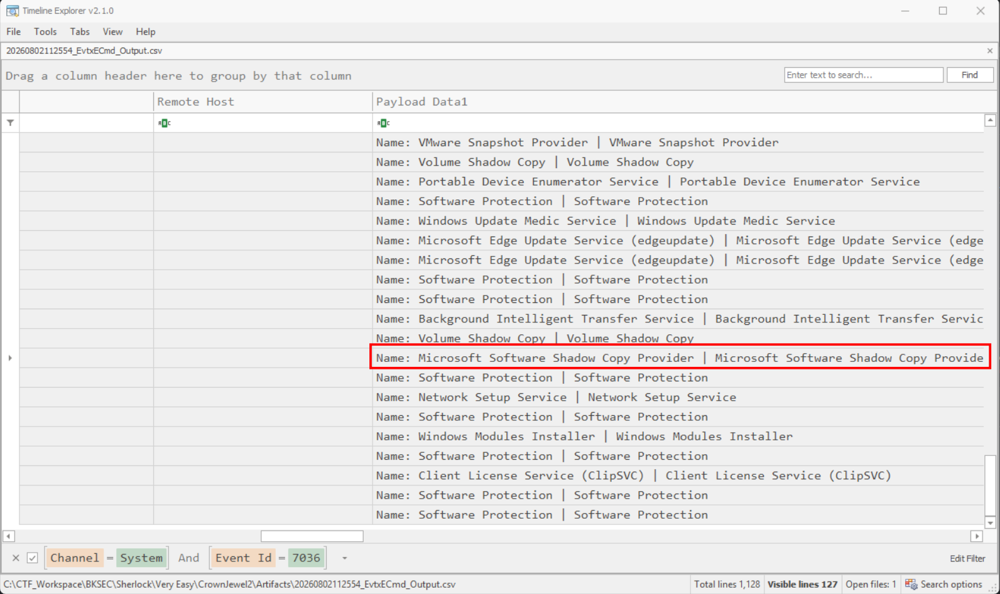
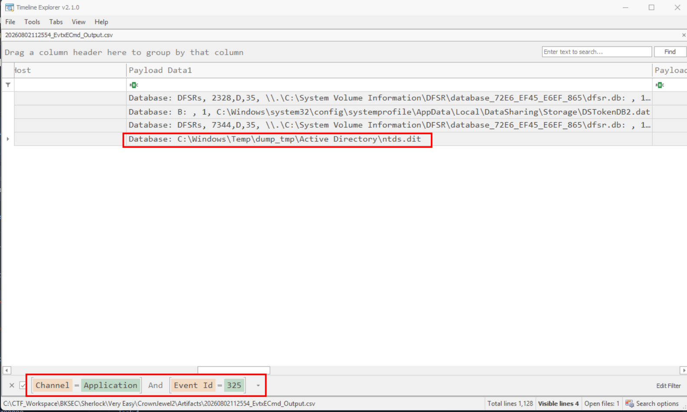
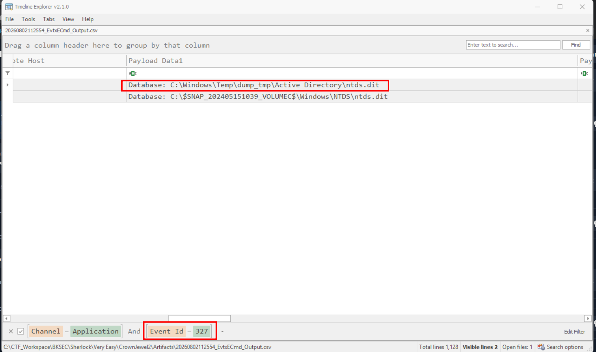
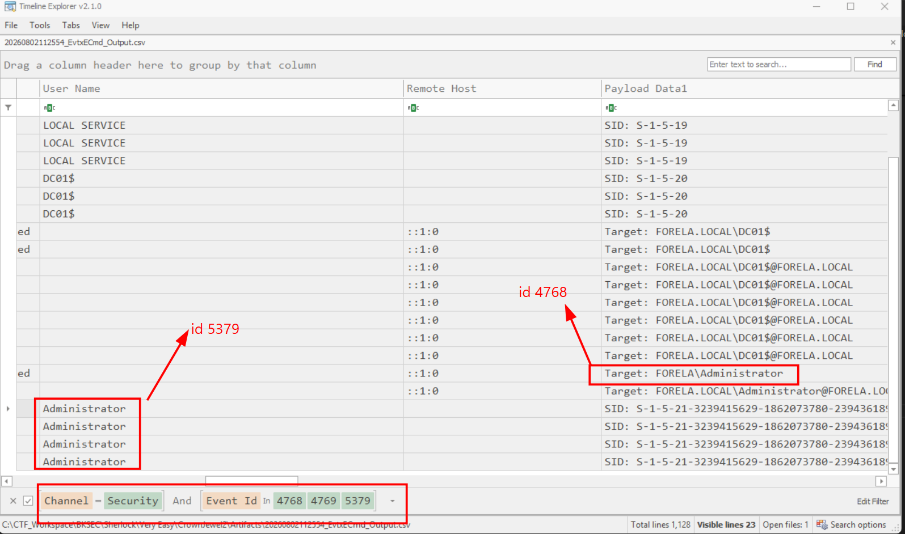

# CrownJewel 2

## Sherlock scenario

Forela's Domain environment is pure chaos. Just got another alert from the Domain controller of NTDS.dit database being exfiltrated. Just one day prior you responded to an alert on the same domain controller where an attacker dumped NTDS.dit via vssadmin utility. However, you managed to delete the dumped files kick the attacker out of the DC, and restore a clean snapshot. Now they again managed to access DC with a domain admin account with their persistent access in the environment. This time they are abusing ntdsutil to dump the database. Help Forela in these chaotic times!!

## Given artifact

Three Windows Event Log, namely SYSTEM, SECURITY, APPLICATION

## Questions

### 1. When utilizing ntdsutil.exe to dump NTDS on disk, it simultaneously employs the Microsoft Shadow Copy Service. What is the most recent timestamp at which this service entered the running state, signifying the possible initiation of the NTDS dumping process?

In `CrownJewel 1`, we already see `vssadmin` being exploited to created a shadow copy of C drive, then extract `ntds.dit`. Now for this sherlock, another legitimate tool is exploited for that sensitive database

`ntdsutil.exe` is a legitimate administrative command-line utility built into Windows Server. It was created to perform deep-level database maintenance, management, and repair for `Active Directory Domain Services (AD DS)`

A legitimate feature offered by `ntdsutil.exe` is IFM (Install From Media). It was designed to help administrators deploy new Domain Controllers in remote branch offices with slow network connections. Instead of replicating a massive, multi-gigabyte Active Directory database over a slow WAN link, an administrator can run this command to package the database onto a USB drive or shipping media, walk it over to the remote site, and install the new Domain Controller offline. And of course, attackers can abuse it as well

Return to our question, I use `EvtxECmd` to parse the logs, and open it with Timeline Explorer, as we did, using SYSTEM log and filter for event ID 7036:

It's here, scroll left for the timestamp

**Answer: 2024-05-15 05:39:55**

### 2. Identify the full path of the dumped NTDS file.

Use Application log, filter for ID 325 (The database engine created a new database), we should see `ntds.dit` the AD database file:

**Answer: C:\Windows\Temp\dump_tmp\Active Directory\ntds.dit**

### 3. When was the database dump created on the disk?

Just scroll left from the last question view to get the timestamp

**Answer: 2024-05-15 05:39:56**

### 4. When was the newly dumped database considered complete and ready for use?

Still in Application log, filter for ID 327 (The database engine detached a new database)

#### Clafiry Attach and Detach in database

Detaching is the process of removing a database from the management of the database engine without deleting the physical files.

- What the engine does: It closes all active user connections, flushes remaining data from RAM onto the disk, and forgets that the database exists.

- What happens to the files: The physical files (.mdf and .ldf) remain exactly where they were on the hard drive. They are now completely unlocked and free to be moved, copied, or emailed.

Attaching is the process of taking existing database files on a disk and introducing them to a database engine.

- What the engine does: It looks at the existing files, verifies their integrity, registers them in its master system list, and brings the database online.

- What happens to the files: The engine locks the files so no other software can mess with them while the engine is running. Users can now query the data again.

**Answer: 2024-05-15 05:39:58**

### 5. Event logs use event sources to track events coming from different sources. Which event source provides database status data like creation and detachment?

In previous log entries, look at `Source` column, we will see it

> ESENT (Extensible Storage Engine NT) is a built-in, high-performance database engine embedded directly into the Microsoft Windows operating system.
> 
> First introduced in Windows 2000, it handles data storage behind the scenes for critical Windows features, meaning you interact with it daily even if you have never heard of it.

**Answer: ESENT**

### 6. When `ntdsutil.exe` is used to dump the database, it enumerates certain user groups to validate the privileges of the account being used. Which two groups are enumerated by the `ntdsutil.exe` process? Give the groups in alphabetical order joined by comma space.

Do exactly the same as in `CrownJewel 1`, just look for `ntdsutil.exe` instead

**Answer: Administrators, Backup Operators**

### 7. Now you are tasked to find the Login Time for the malicious Session. Using the Logon ID, find the Time when the user logon session started.

Note that we are in the AD environment where Kerberos is utilized (The Domain Controller acts as the KDC). In Security log, filter for ID 4768 (A Kerberos authentication ticket (TGT) was requested) and 4769 (A Kerberos service ticket was requested):

We also see the ID 5379 (Credential Manager credentials were read), note that I only focus on the Administrator account, ignoring the machine accounts starting with `$...`. Scroll left for the timestamp.

**Answer: 2024-05-15 05:36:31**