# Phantom Ring

## Sherlock Scenario 

Your organization's SOC team intercepted a suspicious binary during a routine threat hunting operation on a Linux server. The file was found in /var/tmp with an unusual name and was attempting to establish outbound connections. Initial analysis suggests this could be a post-exploitation agent. Your task is to perform static analysis on the binary to identify its capabilities, extract indicators of compromise, and understand the threat actor's infrastructure.

## Given artifact

An ELF executable malware named `agent`

## Questions

### 1.What is the SHA256 hash of the malicious binary?

Just get it

**Answer: 2d7b1b2178f76c26893b2a56cbf9b36700235259e76b893d53817d5b66b634a5**

### 2. What is the IP address hardcoded in the binary for C2 communication?

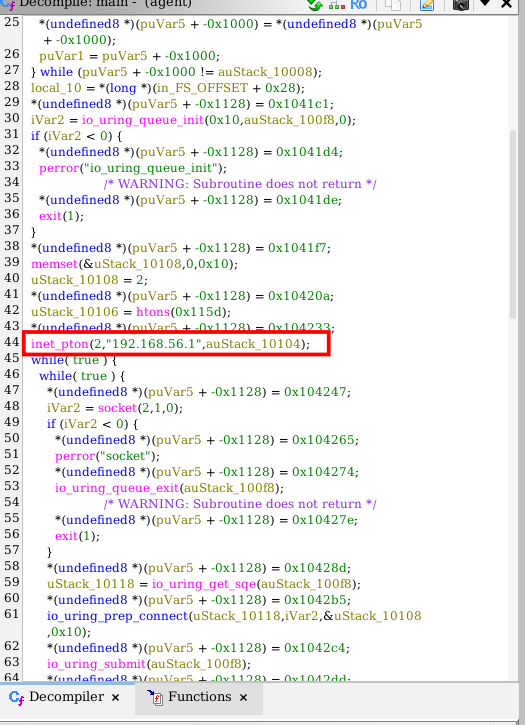

We can see the hard-coded IP address in the `main` function provided by `ghidra` decompiler, it's passed to `inet_pton()` to convert from string to a binary structure (network bytes format)

**Answer: 192.168.56.1**

### 3. What port does the agent connect to on the C2 server?

Also in the `main()` function, we can see `htons()` being called to convert 16-byte unsigned integer from host byte order to network byte order. It is primarily used to format port numbers (like port 80 or 443) so that network hardware and protocols can read them correctly. Suppose the endianness is different between host and internet protocols, if we pass a port number to a socket without converting it, the bytes will be flipped on the network, changing the port entirely (e.g., port 80 becomes port 20480)

> Syntax:
> ```c
> #include <arpa/inet.h>
>
> uint16_t htons(uint16_t hostshort);
> ```
>

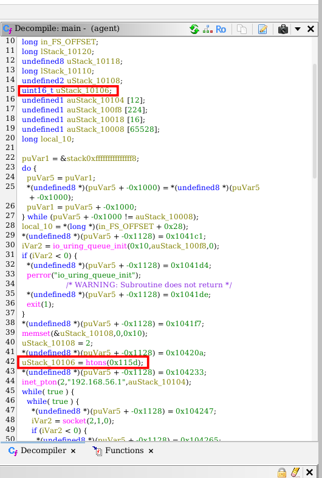

`0x115d` in hex is equivalent to `4445` in decimal

**Answer: 4445**

### 4. How many seconds does the agent wait before attempting to reconnect after a failed connection?

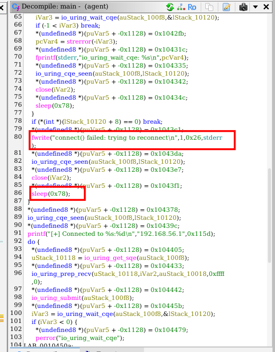

The main function still answers 

**Answer: 120**

### 5. How many different commands does the agent support? (excluding invalid commands)

In the decompiled functions, we can see some with `cmd_` prefix, those are helper functions for available command

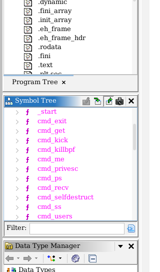

**Answer: 11**

### 6. What Linux kernel interface does this malware abuse to evade EDR syscall monitoring?

We can see `io_uring` being aggressively abused here:

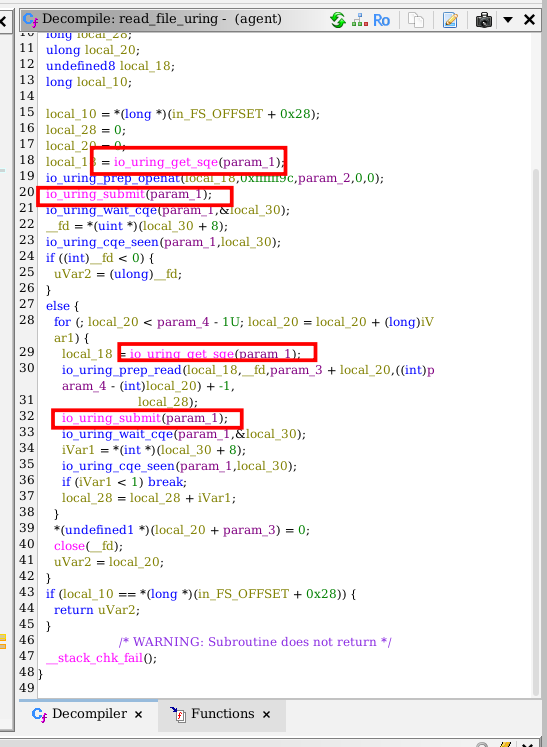

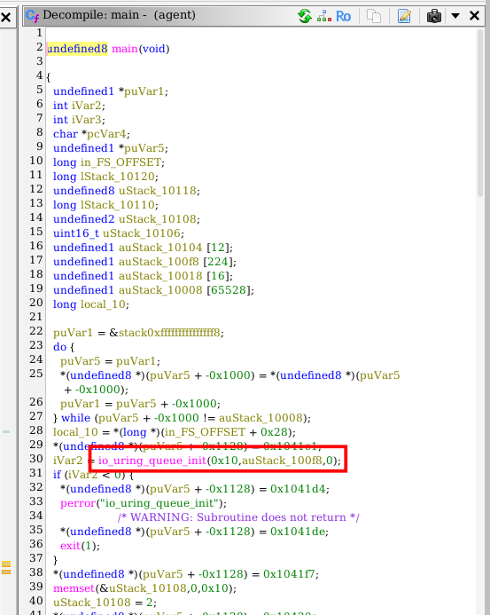

#### What is io_uring?
Traditionally, when a program wants to read a file or send data over a network, it must issue a standard system call (like `read`, `write`, `send`, or `recv`). This causes a "context switch" where the CPU pauses the user application and hands control over to the Linux kernel, adding a small performance delay.

`io_uring` removes this delay by establishing two memory rings shared directly between user space and the kernel:

- `Submission Queue (SQ)`: The application drops multiple I/O requests here without talking to the kernel immediately.

- `Completion Queue (CQ)`: The kernel processes the requests in the background and drops the results here for the application to grab.

By batching or entirely polling these queues, applications can perform massive amounts of read/write/network traffic using zero traditional system calls.

As most Linux Endpoint Detection and Response (EDR) agents, antivirus software, and audit frameworks rely heavily on tracking or hooking standard system calls to spot suspicious activity, if malware leverages `io_uring`, it sidesteps these hooks completely 

**Answer: io_uring**

### 7. What file does the agent read to enumerate logged-in users?

Corresponding to `cmd_users` function is the enumeration command, we can see the file referenced here:

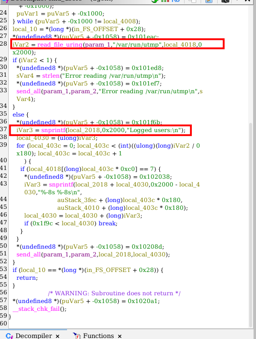

**Answer: /var/run/utmp**

### 8. What directory does the agent scan when searching for SUID binaries for privilege escalation?

Look at `cmd_privesc` function:

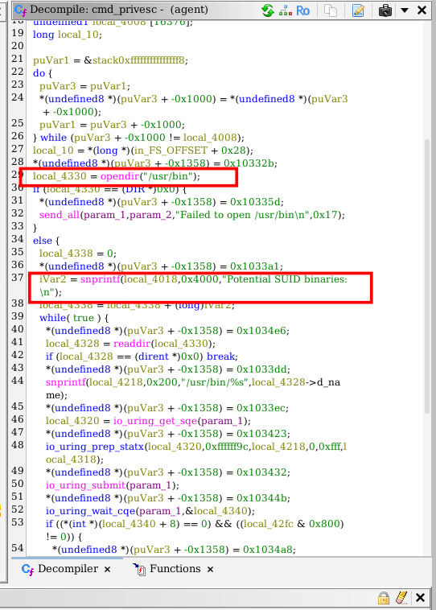

**AnswerL /usr/bin**

### 9. What string does the agent search for in /proc/[pid]/maps to identify security tools using eBPF?

`eBPF` is born to mitigate the problem raised by `io_uring` and the like. Orginally just `BPF`, acting like a set of filters for network packets, extented BPF has now been able to hook into almost any event in the system—file reads, system calls, function executions, or hardware interrupts.

Thus, it can track precisely which application is opening a file or spawning a process, making it impossible for malware to hide by renaming its processes.

Inside `cmd_killbpf`, we can see the functions finds for a virtual, symbolic file descriptor:

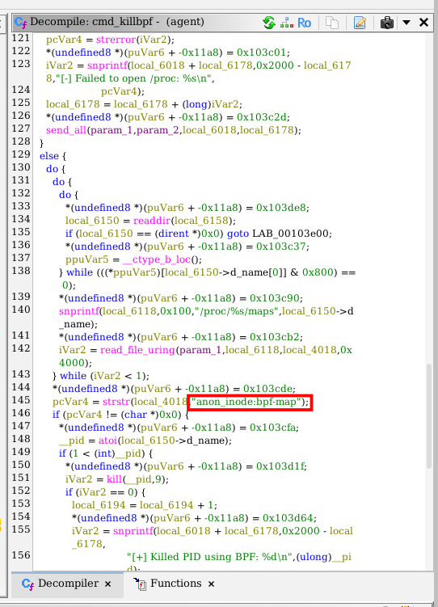

**Answer: anon_inode:bpf-map**

#### What is this thing ?

`anon_inode:bpf-map` is a virtual, symbolic file descriptor (FD) entry in Linux that represents an active eBPF map held open in memory by a process.

In Linux, "Everything is a file." When a process creates a network socket, an epoll instance, or an eBPF data map, the kernel assigns it a File Descriptor. Because these objects do not exist as physical files on your hard drive, they are handled by an internal kernel filesystem called `anon_inodefs` (Anonymous Inode Filesystem).

If you look inside a process's file descriptor folder (e.g., `/proc/[PID]/fd/`), a traditional file shows a path like `/home/user/document.txt`. An eBPF map, however, displays as a symbolic link pointing to `anon_inode:bpf-map`.

### 10. What is the full path of the first tracing file the agent attempts to disable?

Also in `cmd_killbpf`:

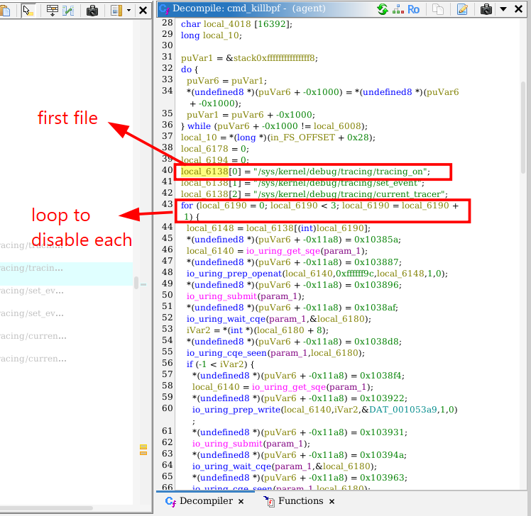

**Answer: /sys/kernel/debug/tracing/tracing_on**

### 11. What procfs path does the agent read to find its own executable location before self-destruction?

In cmd_selfdestruct, the binary needs to find its own path on disk in order to delete itself. It calls readlink on `/proc/self/exe`, which points to the running process's binary location:

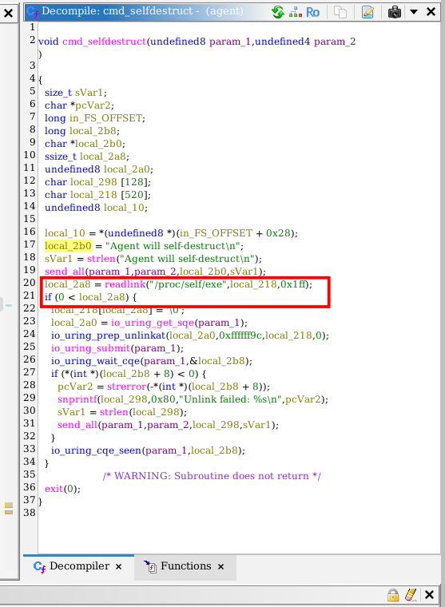

**Answer: /proc/self/exe**

### 12. What command string is compared by the agent to trigger deletion of its own binary?

Look at `process_cmd()` function:

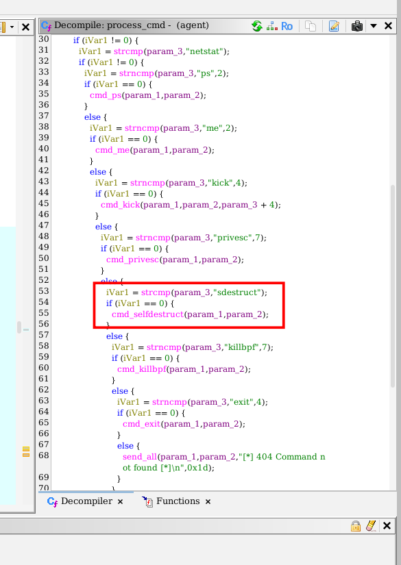

**Answer: sdestruct**
