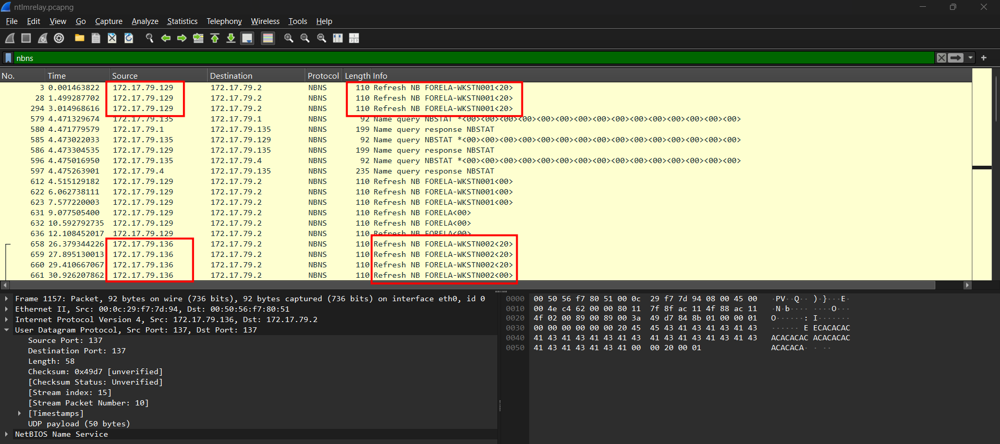
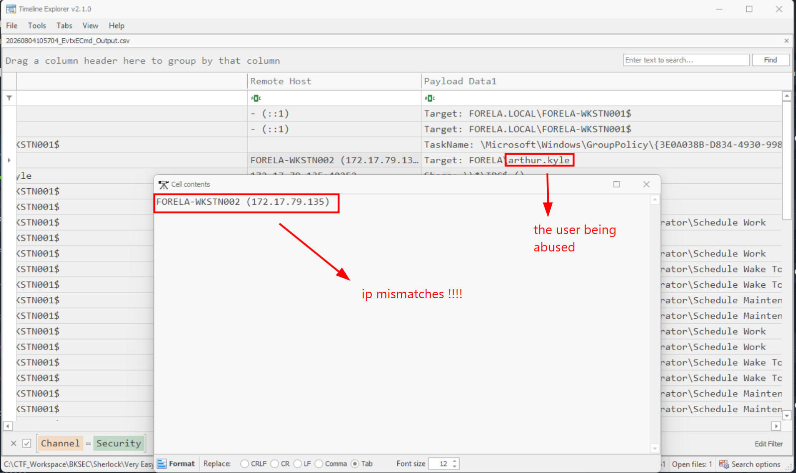
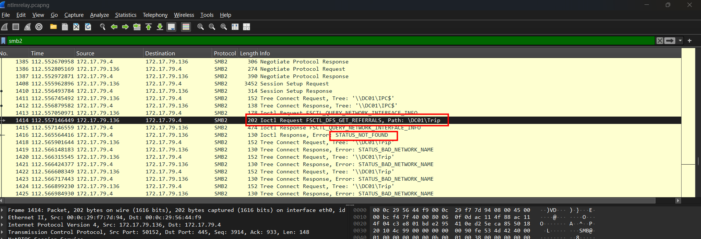
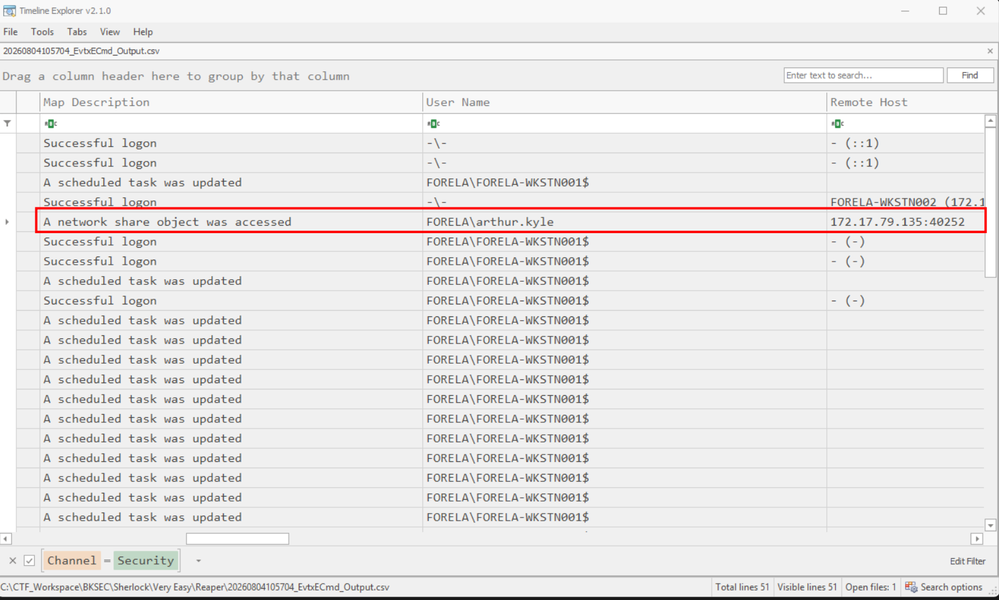
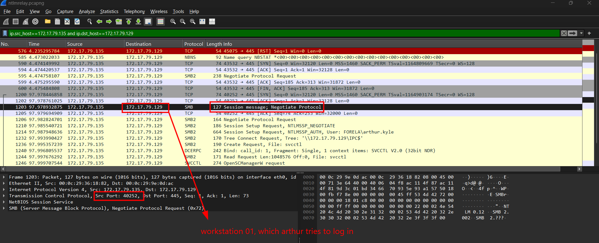
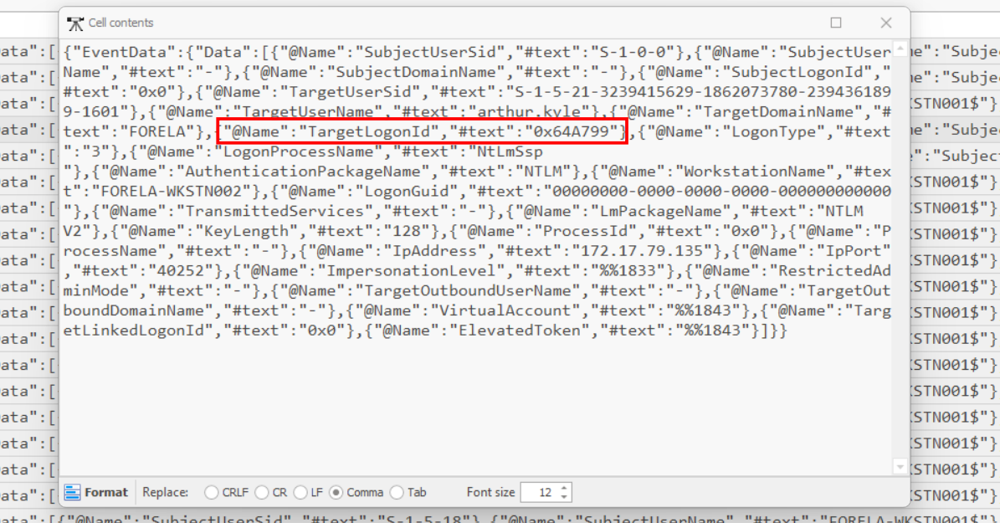

# Reaper

## Sherlock scenario

Our SIEM alerted us to a suspicious logon event which needs to be looked at immediately . The alert details were that the IP Address and the Source Workstation name were a mismatch .You are provided a network capture and event logs from the surrounding time around the incident timeframe. Corelate the given evidence and report back to your SOC Manager.

## Given artifact

Security Event log and a packet capture file

## Questions

### 1. What is the IP Address for Forela-Wkstn001?

Filter the pcap for NetBIOS Name Service NBNS only, we can see the workstations' address inside refresh packets:

**Answer: 172.17.79.129**

### 2. What is the IP Address for Forela-Wkstn002?

In the above image

**Answer: 172.17.79.136**

### 3. What is the username of the account whose hash was stolen by attacker?

Parse the log and open with `Timeline Explorer`, I filter for event 4624 (Successful logon):

We can see the anomaly here, workstation 02 is known to have IP `172.17.79.136`, but here the source is identified as `...135`. This must be the machine conducting relay attack. From the `Username` column, we  can see the abused user

**Answer: arthur.kyle**

### 4. What is the IP Address of Unknown Device used by the attacker to intercept credentials?

Already mentioned in the previous question

**Answer: 172.17.79.135**

### 5. What was the fileshare navigated by the victim user account?

Filter for `smb2` only, we can see the path requested by the victim (the real user as the IP matches), but perhaps he made some typos with the path as the response is pure errors:

**Asnwer: \\DC01\Trip**

### 6. What is the source port used to logon to target workstation using the compromised account?

From the parsed log, we can see the relay machine attempts to access a network share object, that's when he had successfully login into the workstation, double check with the logon attempt in pcap, we can validate the port:

**Answer: 40252**

### 7. What is the Logon ID for the malicious session?

Inside the event mentioned in question 3, I can see the logon ID in the details column:

**Answer: 0x64A799**

### 8. The detection was based on the mismatch of hostname and the assigned IP Address.What is the workstation name and the source IP Address from which the malicious logon occur?

Nothing more to say...

**Answer: FORELA-WKSTN002, 172.17.79.135**

### 9. At what UTC time did the the malicious logon happen?

Scroll left for the timestamp

**Answer: 2024-07-31 04:55:16**

### 10. What is the share Name accessed as part of the authentication process by the malicious tool used by the attacker?

Can be seen in the event mentioned in question 6

**Answer: \\*\IPC$**

## In case you're unclear about these AD things...

### Main endpoints in this scenario

Based on DNS, NBNS, and DHCP queries in the packet capture, we can identify the following hosts:

| IP Address | Hostname / Role | Description |
| :--- | :--- | :--- |
| **172.17.79.4** | `DC01` | Domain Controller |
| **172.17.79.129** | `FORELA-WKSTN001` | Target Workstation (Victim of Logon) |
| **172.17.79.136** | `FORELA-WKSTN002` | Victim Workstation (Source of Credentials) |
| **172.17.79.135** | Unknown Device | **Attacker Machine** (Interceptors/Relayer) |

### Attack sequence

The attack consists of three distinct phases: **Name Resolution Spoofing**, **NTLM Authentication Relaying**, and **Post-Logon Exploitation**.

#### Phase 1: Name Resolution Spoofing (LLMNR Poisoning)

Windows systems use LLMNR (Link-Local Multicast Name Resolution) and NBNS (NetBIOS Name Service) as fallbacks when standard DNS resolution fails. Attackers on the same local network segment can spoof answers to these broadcast requests.

1. **DNS Failure**: At UTC `04:55:10` (relative time `96.65s` in pcapng), the user `arthur.kyle` on `FORELA-WKSTN002` (IP `172.17.79.136`) attempts to access a host named `D`. 
   - **Frame 1149**: DNS Query to Domain Controller (`172.17.79.4`) for `D.forela.local` returns **No such name** (Frame 1150).
   - **Frame 1151**: DNS Query for `D.localdomain` also returns **No such name** (Frame 1156).
2. **Multicast Fallback**: Failing DNS, `FORELA-WKSTN002` broadcasts fallback requests:
   - **Frame 1157**: NBNS Query for `D<20>` (Server Service).
   - **Frames 1162 & 1163**: LLMNR Query to IPv6 and IPv4 multicast groups for the name `D`.
3. **Attacker Poison Response**: The attacker's device (`172.17.79.135`) intercepts these queries and responds:
   - **Frames 1167 & 1169**: Spoofed LLMNR responses stating that `D` is resolved to **`172.17.79.135`** (the attacker's IP).

#### Phase 2: NTLM Authentication Relaying

Believing the attacker's IP is the legitimate host `D`, the victim workstation connects to it via SMB (Port 445) and initiates authentication.

1. **Victim Connection**: In **Frame 1180**, `FORELA-WKSTN002` opens a TCP connection to the attacker (`172.17.79.135`) on port 445.
2. **Negotiation and Session Setup**:
   - **Frame 1195**: `FORELA-WKSTN002` initiates NTLM Negotiation.
   - **Frame 1196**: Attacker replies with `STATUS_MORE_PROCESSING_REQUIRED` and NTLMSSP Challenge.
   - **Frame 1197**: The victim sends NTLMSSP Authentication for `FORELA\arthur.kyle`.
3. **The Relay**: In real-time, the attacker relays these authentication messages to the target machine `FORELA-WKSTN001` (`172.17.79.129`) to obtain a valid logon session:
   - **Frame 1200**: Attacker (`172.17.79.135`) initiates a TCP connection to `FORELA-WKSTN001` (`172.17.79.129`) on port 445 from source port **`40252`**.
   - **Frame 1210**: Attacker relays the NTLM Negotiation request to `FORELA-WKSTN001`.
   - **Frame 1211**: `FORELA-WKSTN001` responds with the NTLMSSP Challenge, which the attacker forwards to the victim (Frame 1212).
   - **Frame 1213**: The victim sends the final NTLMSSP Authentication containing the NTLM cryptographic response to the attacker.
   - **Frame 1214**: The attacker relays this valid authentication response to `FORELA-WKSTN001`.

4. **Domain Controller Validation**:
   - `FORELA-WKSTN001` queries the Domain Controller (`172.17.79.4`) over MS-NRPC (`NetrLogonSamLogonWithFlags` requests in **Frames 1227 & 1228**) to validate the NTLM challenge-response.
   - DC validates the authentication as successful.
   - **Frame 1229**: `FORELA-WKSTN001` returns a successful Session Setup Response to the attacker (`172.17.79.135`).

#### Phase 3: Post-Logon Exploitation

With a successful SMB session on `FORELA-WKSTN001`, the attacker's relay tool (`ntlmrelayx`) immediately attempts to perform administrative commands.

1. **Share Access**:
   - **Frame 1232**: The attacker requests access to the **`\\172.17.79.129\IPC$`** administrative share (Event log records this as `\\*\IPC$`).
2. **Service Access Attempt**:
   - **Frame 1236**: The attacker sends a Create Request for the file named **`svcctl`** (Service Control Manager RPC interface) to register a malicious service.
   - **Frame 1246**: The attacker invokes `OpenSCManagerW` over DCERPC.
   - **Frame 1249**: The target system returns `WERR_ACCESS_DENIED`! This shows the privilege escalation attempt failed because the hijacked account `arthur.kyle` lacked the required permissions to control services on `FORELA-WKSTN001`, or UAC/policies blocked remote administration.

#### Victim's Later Navigation

After the failure of the initial connection to `\\D`, the victim user on `FORELA-WKSTN002` corrects their typo or follows their intended path:
- **Frame 1418** (relative time `112.5s`, UTC `04:55:28`): `FORELA-WKSTN002` connects to the Domain Controller (`172.17.79.4`) share **`\\DC01\Trip`**.
- This request returns `STATUS_BAD_NETWORK_NAME` (Frame 1419), meaning that the share `Trip` did not exist on the Domain Controller.

### 4. Active Directory & Windows Network Protocol Reference Guide

Active Directory networks use a unique suite of name resolution, authentication, directory lookup, and RPC protocols. Here is a breakdown of the protocols found in this pcap:

#### A. Name Resolution Fallbacks

##### 1. LLMNR (Link-Local Multicast Name Resolution)
- **Port / Transport**: UDP 5355 / Multicast IP `224.0.0.252` (IPv4) or `ff02::1:3` (IPv6).
- **What it does**: Allows hosts to perform name resolution for other hosts on the same local link (local network segment) without requiring a DNS server.
- **Why it is insecure**: It works by broadcasting a question ("Who has name D?") to the entire local subnet. Any host can answer it, allowing an attacker to spoof the response and claim they own the requested name.

##### 2. NBNS / NetBIOS (NetBIOS Name Service)
- **Port / Transport**: UDP 137 / Broadcast IP (e.g., `172.17.79.255`).
- **What it does**: Legacy Microsoft protocol that resolves NetBIOS names (workstation or domain names up to 15 characters long) to IP addresses.
- **Why it is insecure**: Just like LLMNR, it relies on unauthenticated broadcast queries. Attackers run tools like `Responder` to listen for these broadcasts and reply with their own IP, hijacking the connection.

---

#### B. Authentication & Directory Services

##### 3. NTLMSSP (NTLM Security Support Provider)
- **What it does**: Handles NTLM (New Technology LAN Manager) authentication over SMB, HTTP, or other application protocols. NTLM is a challenge-response authentication protocol.
- **How it works (Simplified)**:
  1. **Negotiate**: The client sends a list of supported NTLM options.
  2. **Challenge**: The server sends a random 8-byte value (the "Server Challenge").
  3. **Authenticate**: The client encrypts the challenge with the hash of the user's password (creating the NetNTLM response) and sends it back.
- **Why it is vulnerable to Relaying**: The challenge-response does not establish a mutual session key or require cryptographic binding to the host machine. If an attacker sits between the client and a third target server, the attacker can just copy the challenge from the target, forward it to the client, and forward the client's response back to the target.

##### 4. Kerberos
- **Port / Transport**: TCP/UDP 88.
- **What it does**: The default authentication protocol for Active Directory. It uses tickets (Ticket Granting Tickets - TGT, and Service Tickets) issued by the Key Distribution Center (KDC, running on the Domain Controller).
- **Why it is secure**: Kerberos relies on mutual authentication and timestamps. An attacker cannot "relay" Kerberos authentications to another host because Kerberos service tickets are cryptographically bound to a specific Service Principal Name (SPN).

##### 5. LDAP & CLDAP (Lightweight Directory Access Protocol)
- **Port / Transport**: TCP 389 (LDAP) / UDP 389 (CLDAP - Connectionless LDAP).
- **What it does**: Used to query and update objects (users, computers, groups) in the Active Directory database.
- **CLDAP in AD**: Computers use CLDAP to locate domain controllers (via "pinging" LDAP queries) and find out domain information rapidly using connectionless UDP. In this packet capture, we see the workstations querying the Domain Controller `DC01` via LDAP/CLDAP.

---

#### C. Windows Remote Procedure Calls (RPC) & Administrative Interfaces

Windows relies heavily on **DCE/RPC** (Distributed Computing Environment / Remote Procedure Calls) to run administrative commands remotely. RPC interfaces can run over TCP directly (using dynamic ports mapped by the Endpoint Mapper) or over SMB via named pipes inside the administrative **`IPC$`** (Inter-Process Communication) share.

##### 6. EPM / EPMR (Endpoint Mapper)
- **Port / Transport**: TCP 135.
- **What it does**: Windows hosts run the Endpoint Mapper to tell remote clients which TCP ports are hosting specific RPC services.
- **In this capture**: In frames 1218–1221, the target workstation `FORELA-WKSTN001` queries the Domain Controller (`172.17.79.4`) over TCP port 135 (EPM Map request) to find out which TCP port is hosting `RPC_NETLOGON`.

##### 7. MS-NRPC (Netlogon Remote Protocol)
- **What it does**: Used by domain-joined workstations to communicate with the Domain Controller to perform authentication validation (like checking NTLM challenge responses), password updates, and secure channel setups.
- **In this capture**: In frames 1225–1228, when the attacker attempts to logon to `FORELA-WKSTN001` using the relayed NTLM credentials of `arthur.kyle`, `FORELA-WKSTN001` opens a Netlogon RPC bind to the Domain Controller (`172.17.79.4`) and makes a `NetrLogonSamLogonWithFlags` RPC request to verify that the NTLM response sent by the client is valid.

##### 8. SVCCTL (Service Control Manager Remote Protocol)
- **What it does**: Used to remotely manage services (create, start, stop, delete services) on a Windows host.
- **In this capture**: After logging in, the attacker connects to `\\172.17.79.129\IPC$` and requests a handle to the named pipe `svcctl` (Frame 1236). The attacker tool tries to call `OpenSCManagerW` to create a service (similar to how PsExec operates), but receives `WERR_ACCESS_DENIED` because the account doesn't have local admin privileges or UAC restricts the remote command.

##### 9. SRVSVC (Server Service Remote Protocol)
- **What it does**: Used to manage file shares, retrieve active connections, or query administrative shares on a remote computer.
- **In this capture**: In frames 1434 and onwards, workstations query the `srvsvc` pipe on the Domain Controller to discover shares and check access.

##### 10. WKSSVC (Workstation Service Remote Protocol)
- **What it does**: Used to query information about a workstation's domain membership, logged-on users, and platform settings.

---