# RomCom

## Sherlock Scenario

Susan works at the Research Lab in Forela International Hospital. A Microsoft Defender alert was received from her computer, and she also mentioned that while extracting a document from the received file, she received tons of errors, but the document opened just fine. According to the latest threat intel feeds, WinRAR is being exploited in the wild to gain initial access into networks, and WinRAR is one of the Software programs the staff uses. You are a threat intelligence analyst with some background in DFIR. You have been provided a lightweight triage image to kick off the investigation while the SOC team sweeps the environment to find other attack indicators.

## Given artifact

A hard disk image `.vhdx` file

## Questions

### 1. What is the CVE assigned to the WinRAR vulnerability exploited by the RomCom threat group in 2025?

The CVE is exploited in 2025, therefore, its identifier should be `CVE-2025-.....`, I just search for "CVE with WinRAR in 2025", omitting the RomCom group to get this:

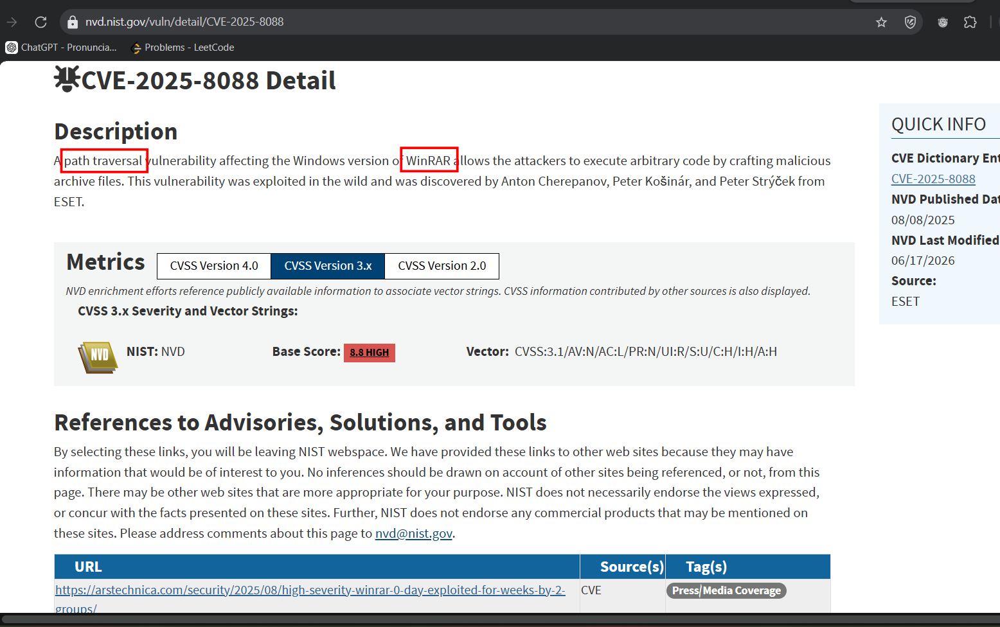

#### More about this vulnerability 

`CVE-2025-8088` is a critical path traversal vulnerability in WinRAR (affecting versions 7.12 and older) discovered by ESET researchers. It allows an attacker to hide malicious payloads inside an archive, which are silently dropped outside the intended extraction folder into highly sensitive directories like the Windows Startup folder.

The core mechanics of the flaw rely on `NTFS Alternate Data Streams (ADS)` to trick WinRAR's path validation.

**Recap: What is an ADS?**

On Windows NTFS file systems, a file is not just a single block of data. It can have multiple "streams" of data attached to it.

- The Main Stream: The normal file contents (e.g., document.txt).
  
- An Alternate Stream: Hidden data attached to the file, referenced with a colon. 
  
For example, `document.txt:hidden_payload.exe`.

(Note: Windows natively uses ADS for the "Mark-of-the-Web" security zones, such as attaching :Zone.Identifier to downloaded internet files).

**How the exploit works?**

When you extract files, WinRAR has strict safety checks to prevent traditional directory traversal attacks like `..\..\..\Startup\malware.exe`. If it sees standard relative path dots (..), it blocks them to protect the system.

CVE-2025-8088 bypasses this logic by abusing how WinRAR handles ADS naming boundaries during extraction:

- `The crafted archive`: The attacker creates a malicious RAR archive. Inside it, they define a file target using a colon to indicate an alternate data stream. However, they inject path traversal characters immediately after the colon. It looks structurally like:
  ```text
  some_decoy.pdf:..\..\..\..\..\..\Users\Public\malware.exe
  ```

- `The Validation Bypass`: WinRAR reads the filename and passes it to its path sanitation checks. Because the string looks like an NTFS stream name (`filename:stream`), WinRAR's internal parsing engine gets confused. It attempts to isolate the primary file name, incorrectly processes the bounds of the colon identifier, and fails to sanitize the path traversal sequence tucked inside the stream string.

- `The Unsafe Write`: WinRAR flags the file path as safe and initiates extraction. Windows interprets the full path, resolves the ..\ traversal sequences, and drops the payload (malware.exe) directly into a completely different target directory

Thus, the user sees a perfectly normal decoy document extract right into their temporary folder, completely unaware that an executable was just dropped silently in the background.

**Answer: CVE-2025-8088**

### 2. What is the nature of this vulnerability?

Already covered in the previous question

**Answer: Path Traversal**

### 3. What is the name of the archive file under Susan's documents folder that exploits the vulnerability upon opening the archive file?

I first open the disk image file with FTK Imager, there is nothing much, perhaps the challenge wants us to leverage the system file rather than grant us full access to the file system, let's first grab the master file table `$MFT` of the C drive:

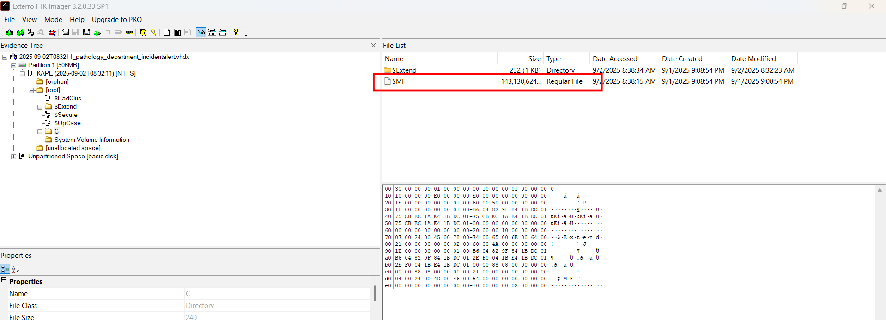

Using `MFTEcmd` from Eric Zimmerman to parse it into a csv file, then let another tool of him - Timeline Explorer handle the rest.

As mentioned in the question, it lies in Susan's documents folder, thus I filter for parent path contains `.\Users\susan\Documents` (as we are already inside C):

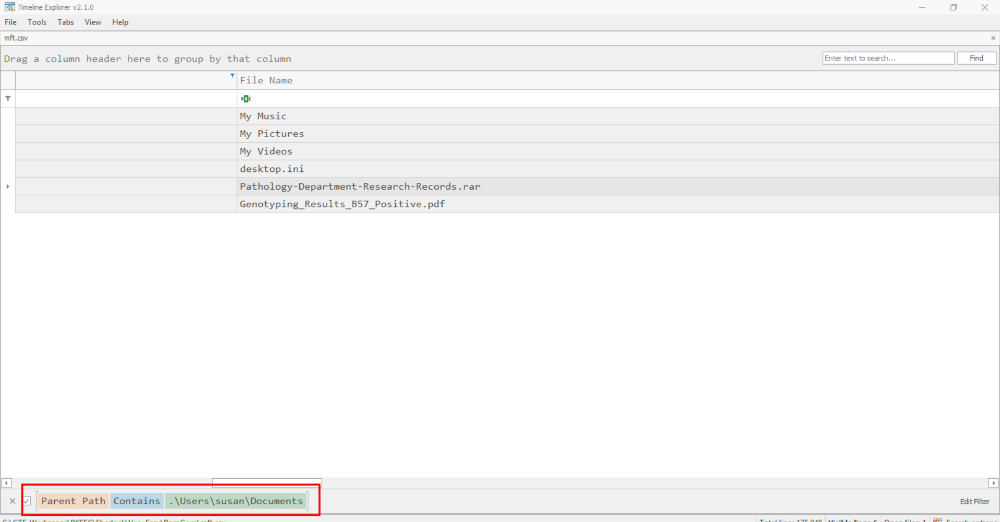

Found the archive here!

**Answer: Pathology-Department-Research-Records.rar**

### 4. When was the archive file created on the disk?

We can find it in one MFT attribute:

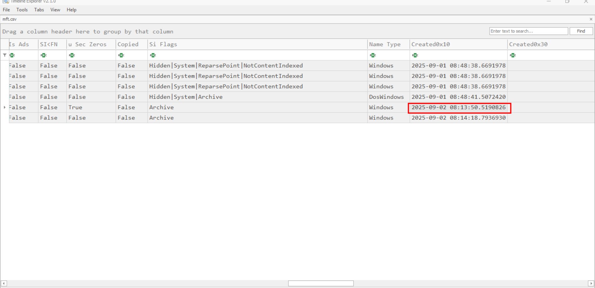

**Answer: 2025-09-02 08:13:50**

### 5. When was the archive file opened?

This question is a bit more tricky, this can either be found in MFT's `LastRecordChange`, or `UpdateTimestamp` inside the UsnJournal `$J` file (filter for Update Reason of ObjectId Change):

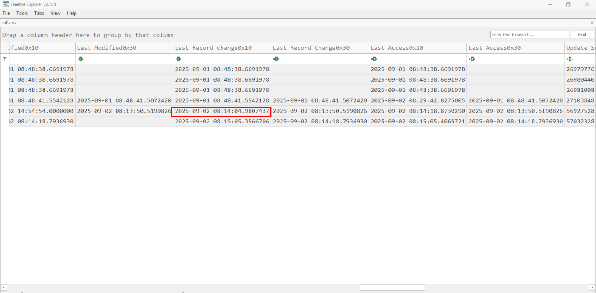

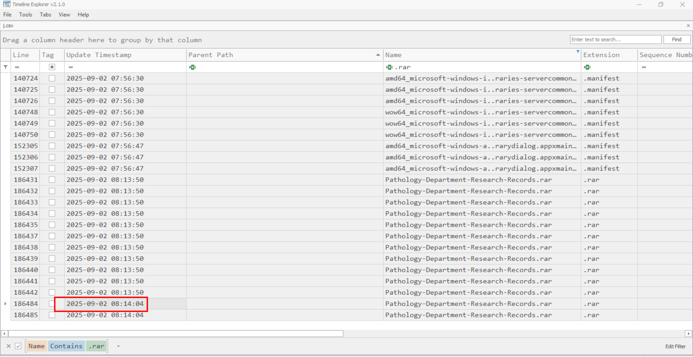

**Answer: 2025-09-02 08:14:04**

### 6. What is the name of the decoy document extracted from the archive file, meant to appear legitimate and distract the user?

It also lies in the Documents folder, you can see in previous image

**Answer: Genotyping_Results_B57_Positive.pdf**

### 7. What is the name and path of the actual backdoor executable dropped by the archive file?

We have no idea what is the malware's name yet, so the MFT is not usable for now, let's try to find in UsnJournal first, all the extracted files, including the malicious executable dropped by exploiting the CVE, should appear adjacent to each other with respect to time, I try to find for the decoy document first, then the executable is in plain sight:

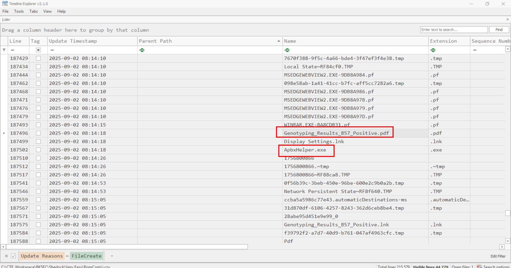

Now find for its full path in MFT:

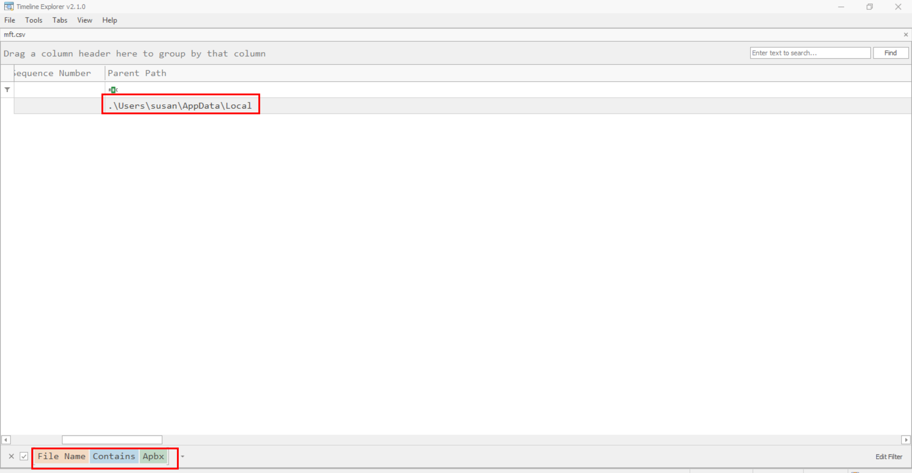

**Answer: C:\Users\Susan\Appdata\Local\ApbxHelper.exe**

### 8. The exploit also drops a file to facilitate the persistence and execution of the backdoor. What is the path and name of this file?

Apply the same schema, we can see this suspicious `.lnk` file:

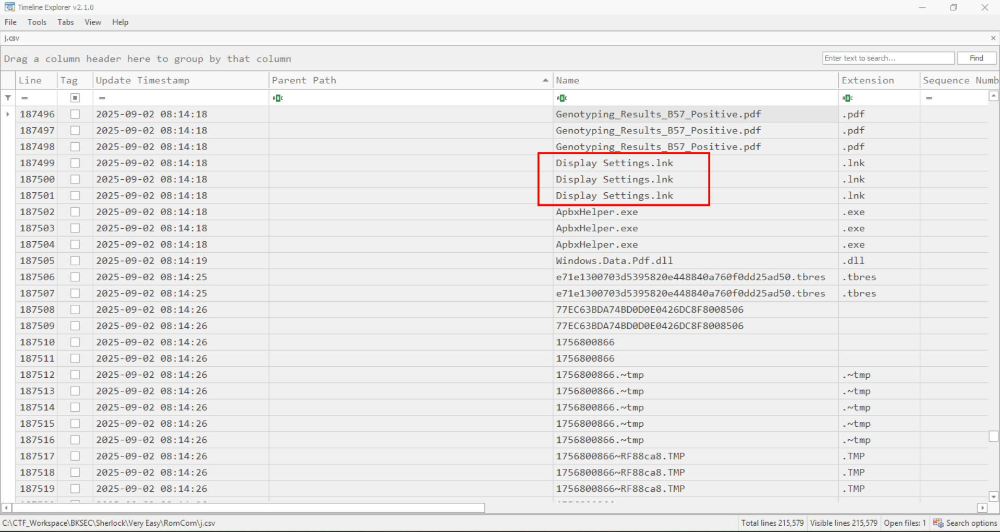

Check for the MFT:

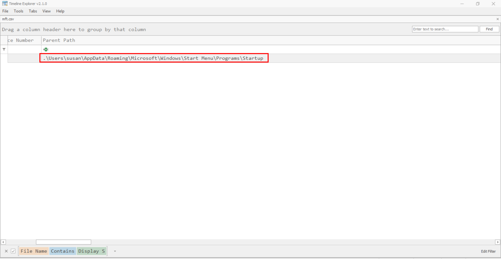

Alright, exactly as expected, a persistent mechanism

**Answer: C:\Users\Susan\AppData\Roaming\Microsoft\Windows\Start Menu\Programs\Startup\Display Settings.lnk**

### 9. What is the associated MITRE Technique ID discussed in the previous question?

At first, I thought it should be T1547.001, but it turns out to be this, as shortcut is being abused, that `.lnk` file is either masquerading attempt, or a truly legitimate shortcut gets replaced:

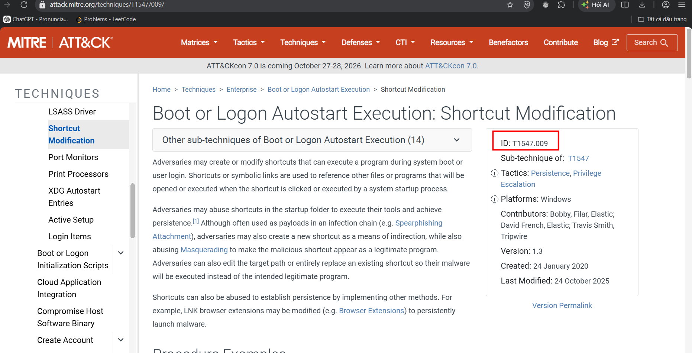

**Answer: T1547.001**

### 10. When was the decoy document opened by the end user, thinking it to be a legitimate document?

Use MFT's attributes again:

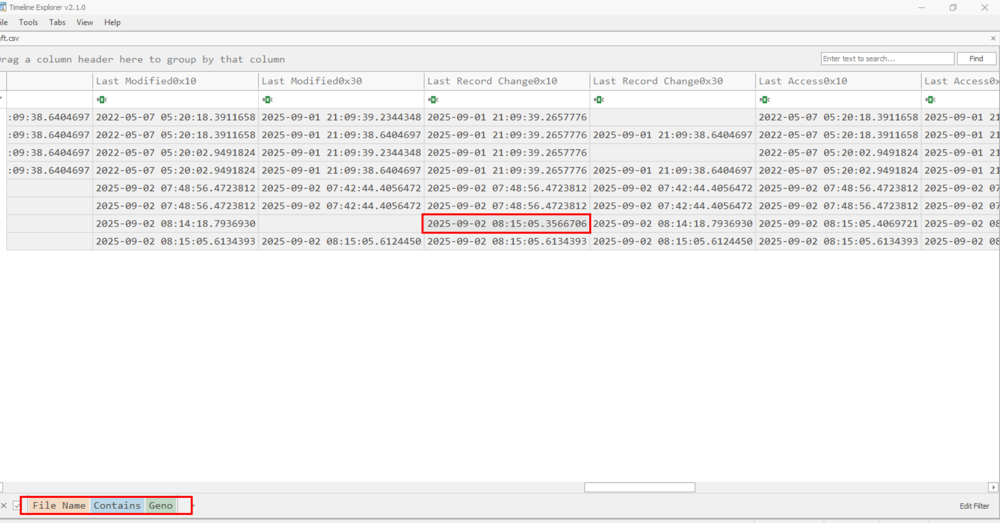

**Answer: 2025-09-02 08:15:05**