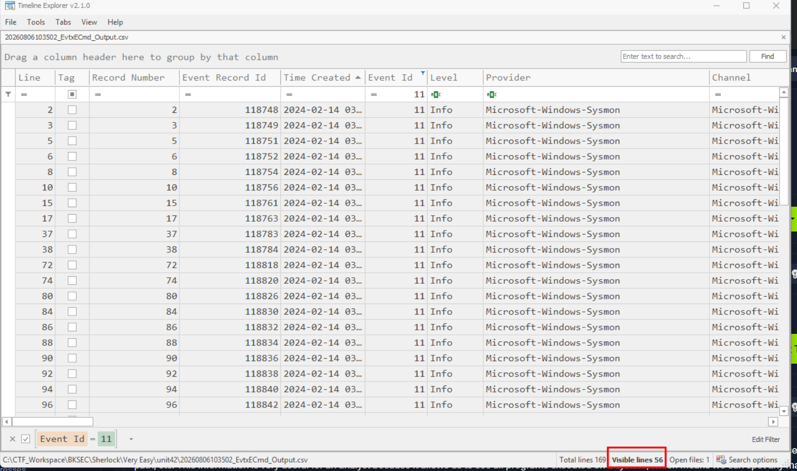
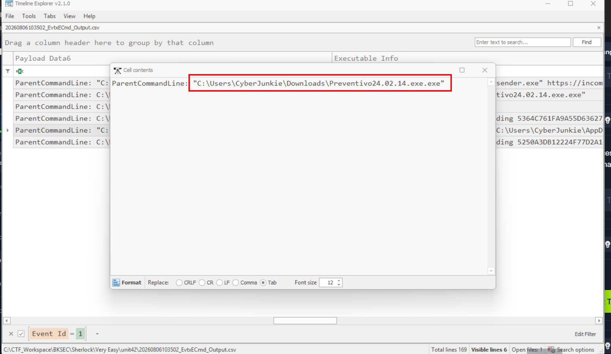
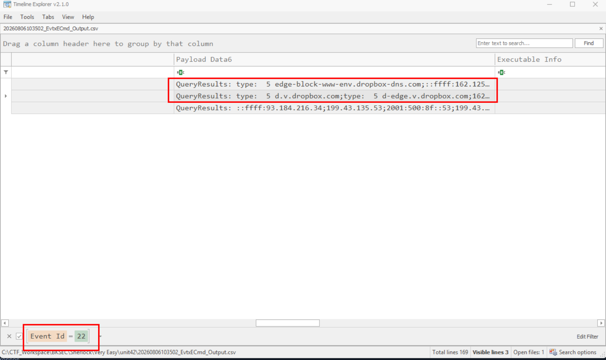
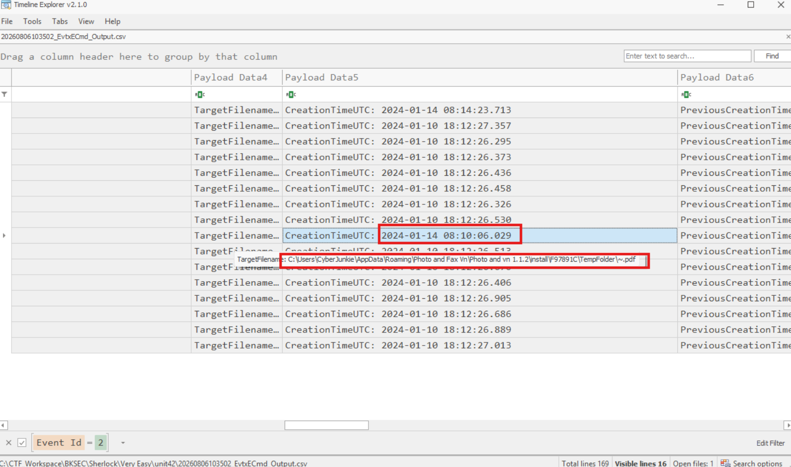
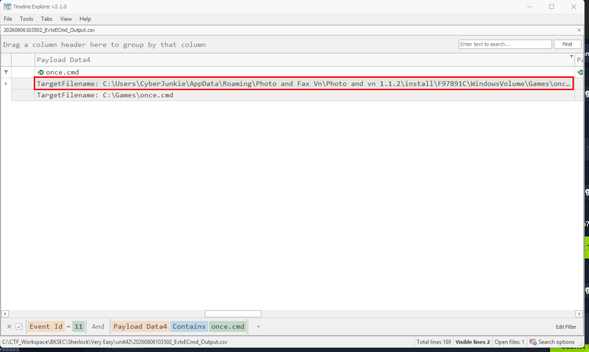

# Unit42

## Sherlock scenario

In this Sherlock, you will familiarize yourself with Sysmon logs and various useful EventIDs for identifying and analyzing malicious activities on a Windows system. Palo Alto's Unit42 recently conducted research on an UltraVNC campaign, wherein attackers utilized a backdoored version of UltraVNC to maintain access to systems. This lab is inspired by that campaign and guides participants through the initial access stage of the campaign.

To answer the questions in this lab, you will only need the Event Viewer, with VirusTotal as an optional supplement. Below are some important Sysmon Event IDs that can be utilized in your analysis:

Event ID 1: Process Creation/Execution. Includes process path, parent process path, and command-line arguments.
Event ID 2: File Creation Time Changed. Includes the file making the change, the file to which the change is being made, tampered timestamp, and original timestamp.
Event ID 3: Network Connection. Includes the process making the connection, destination IP Address, and port.
Event ID 5: Process Termination. Includes the name of the process that was killed or terminated itself.
Event ID 11: File Created. Includes the process creating the file, the file being created, and its full path.
Event ID 22: DNS Query. Includes the process querying the domain, the target domain name, and the IP Addresses they resolve to.

## Given artifact

A sysmon log file

## Questions

### 1. How many Event logs are there with Event ID 11?

Parse the log with EvtxEcmd then open in Timeline explorer, filter for ID 11:

**Answer: 56**

### 2. Whenever a process is created in memory, an event with Event ID 1 is recorded with details such as command line, hashes, process path, parent process path, etc. This information is very useful for an analyst because it allows us to see all programs executed on a system, which means we can spot any malicious processes being executed. What is the malicious process that infected the victim's system?

Filter for id 1, there is one strange process:

**Answer: C:\Users\CyberJunkie\Downloads\Preventivo24.02.14.exe.exe**

### 3. Which Cloud drive was used to distribute the malware?

Filter for id 22 about DNS query, we can see the drive being queried for address:

**Answer: dropbox**

### 4. For many of the files it wrote to disk, the initial malicious file used a defense evasion technique called Time Stomping, where the file creation date is changed to make it appear older and blend in with other files. What was the timestamp changed to for the PDF file?

Filter for ID 5 and look for file ending with `.pdf`:

**Answer: 2024-01-14 08:10:06**

## 5. The malicious file dropped a few files on disk. Where was "once.cmd" created on disk? Please answer with the full path along with the filename.

Filter for ID 11 and look for that file name:

**Answer: C:\Users\CyberJunkie\AppData\Roaming\Photo and Fax Vn\Photo and vn 1.1.2\install\F97891C\WindowsVolume\Games\once.cmd**

## 6. The malicious file attempted to reach a dummy domain, most likely to check the internet connection status. What domain name did it try to connect to?

We can see it in DNS queries from a previous question

**Asnwer: www.example.com**

## 7. Which IP address did the malicious process try to reach out to?

Also in that frame, in the response column, or filter for ID 3

**Answer: 93.184.216.34**

## 8. The malicious process terminated itself after infecting the PC with a backdoored variant of UltraVNC. When did the process terminate itself?

Filter for ID 5 and look for that process

**Answer: 2024-02-14 03:41:58**
