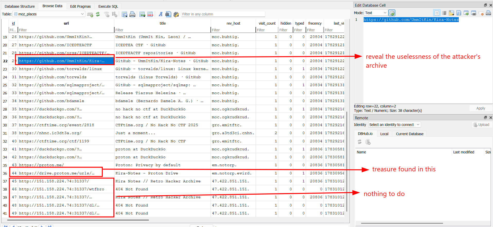
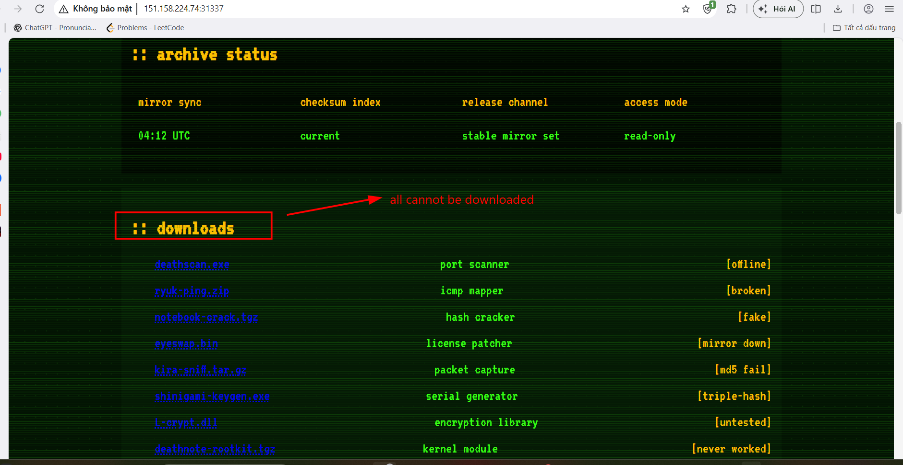
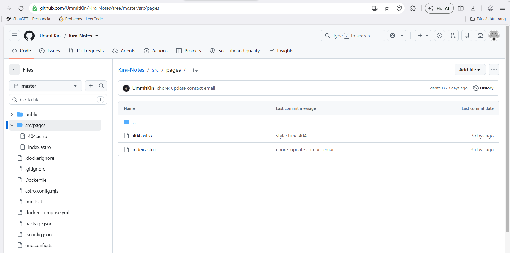
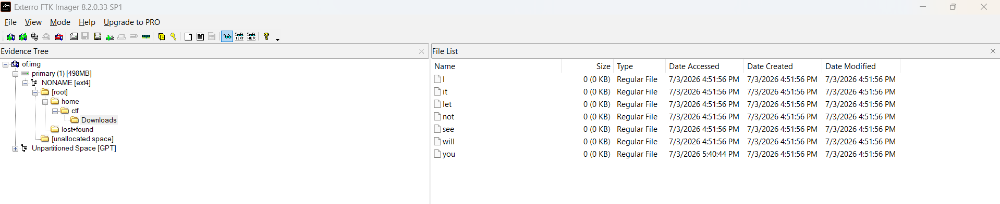
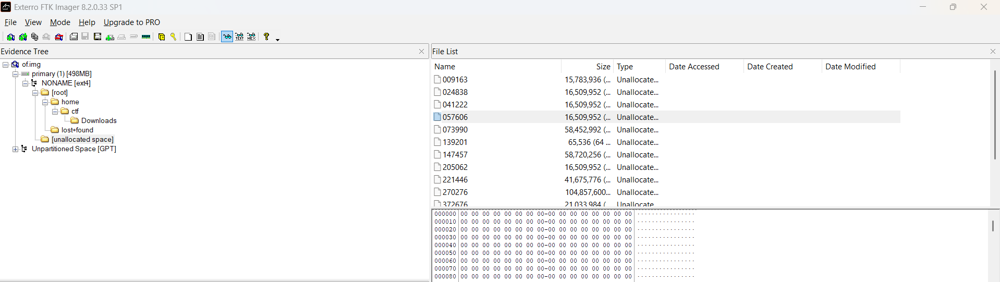
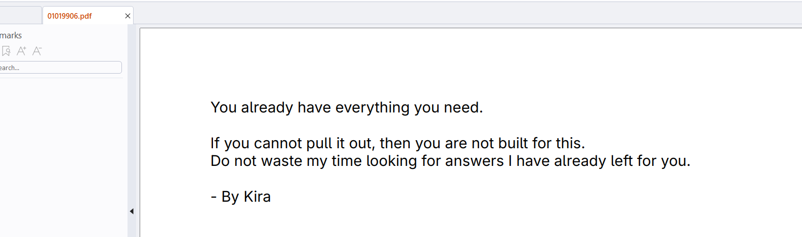
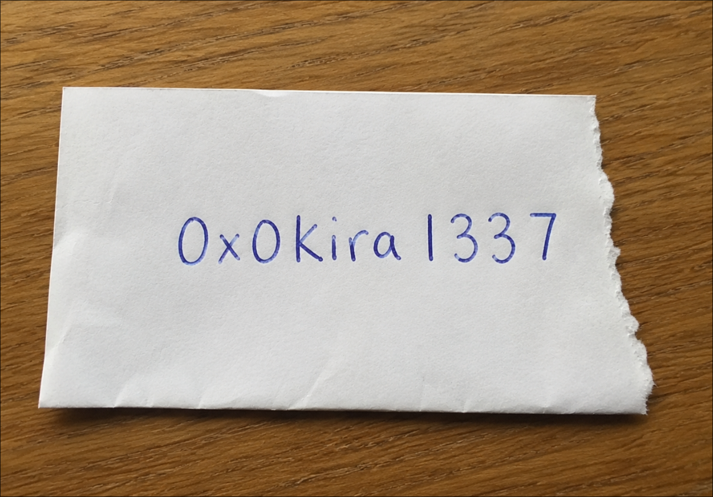
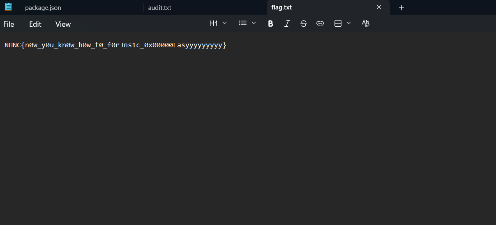

# Kira Notes

## Challenge's Description

Please don't use AI to solve this question

Learn instead of letting the agent do it :(

What is the category? Once you play it, you will know.

## Given artifacts

A sqlite database

## Solving process

Open that database with DB Browser, in the `moz_places` table, I see a list of visited websites from user, sorted chronologically:



Alright, at first I was not that informed about the URLs, I first visit the attacker's site, and see nothing to do:



Everything that's assumed to be downloadable returns 404 Not Found error code

Then I pivot to the github repo, it turns out to be an [Astro](https://astro.build/) app (a JavaScript web framework optimized for building fast, content-driven websites), inspecting the source code yields the fact that there are not any file residing in the website, the 404 error is a feature, not a bug:



Then I move to the URL visited just before the attacker's site, the proton drive, following that URL, I was able to download 3 files: two useless PNG images, and a disk image file. I first open it using FTK Imager, but only those empty dummy files are found:



There are also deleted files in unallocated space, however, unlike windows NTFS, Linux's ext4 makes it impossible for forensics tools like FTK Imager to recover the files:



> ### Ext4 Inode Block Wiping Theory
>
> Unlike Windows NTFS, which simply marks file records (in the Master File Table, or `$MFT`) as inactive while keeping the pointer descriptors (Data Runs) intact, Linux **Ext4** handles file deletions much more destructively:
> 
> * **Inode Clearing:** When a file is deleted in Ext4, its directory entry is unlinked, and its inode is marked as free. Crucially, the **extent tree (block pointers)** inside the inode structure is completely **zeroed out**.
> * **Loss of Offsets:** Because the inode no longer points to any physical blocks on the disk, metadata-based forensic tools like FTK Imager or Sleuth Kit's `icat`/`tsk_recover` cannot follow any pointers to find the file data. They read the inode, find no block references, and recover a 0-byte (empty) file.
> * **The Need for Carving:** The actual data blocks are marked as free but their raw contents remain intact in the unallocated space. Therefore, content-based recovery (**File Carving**) using tools like `foremost` or `photorec` is required to scan the raw disk image for file headers/footers (signatures) and extract the contents.

Left with no other choice, I decide to use carving tools instead, run `foremost` on the disk image file as it is quite small:

```bash
mkdir foremost-output
foremost -i of.img -o foremost-output
```

The carved folder contains 1 pdf file, 1 png images and 1 zip archive:



The image:



So the password for unzipping is `0x0kira1137`:



Got a text file holding the flag.

About the difficulty raised by ext4 FS, I once think that `ext4magic` together with the exported `journal` from the root FS in FTK Imager would help, but the recovered dir keeps being empty...

> ### Why `ext4magic` and Journal Recovery Failed
>
> Ext4 uses the Journaling Block Device 2 (`JBD2`) journal (located at Inode 8) to maintain filesystem consistency. Before any metadata changes (like file deletions) are written to disk, they are logged in the journal. In theory, `ext4magic` can read this journal, find a copy of the inode before its block pointers were zeroed, and reconstruct the deleted files.
> 
> However, this failed here because:
> 
> * **Circular Buffer:** The Ext4 journal is a circular ring buffer. Once transactions are successfully committed/checkpointed to the main disk filesystem blocks, their journal space is marked as free and overwritten by newer transactions.
> * **Clean Unmount Checkpoint:** Before the disk image was captured, the filesystem underwent a clean unmount. A clean unmount flushes and checkpoints all remaining transactions in the journal.
> * **Overwritten Transactions:** Since the deletion occurred and the filesystem was subsequently unmounted cleanly, the historical transactions containing the file's old block pointers were committed and then overwritten/flushed from the journal buffer.
> * **Empty Transaction Log:** Inspecting the journal with `debugfs -R "logdump"` shows only `Journal starts at block 0, transaction 82` with no active transactions remaining. Because the metadata copies were no longer in the journal, `ext4magic` had no historical records to restore from.

`Flag: NHNC{n0w_y0u_kn0w_h0w_t0_f0r3ns1c_0x00000Easyyyyyyyyy}`