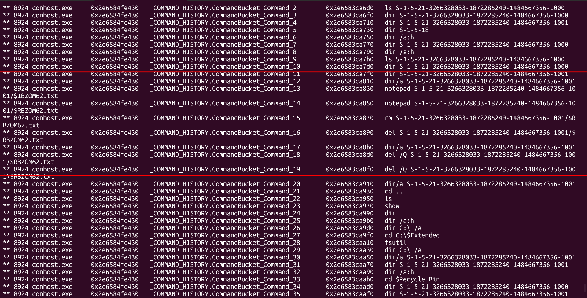
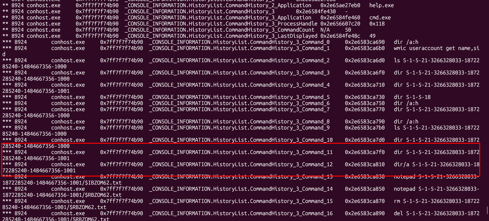
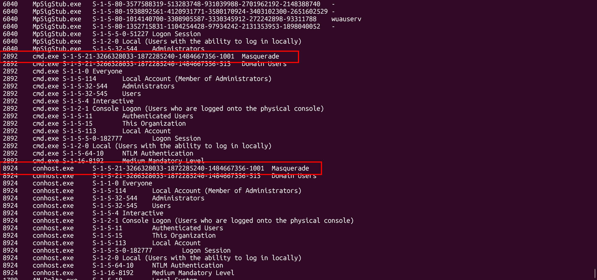
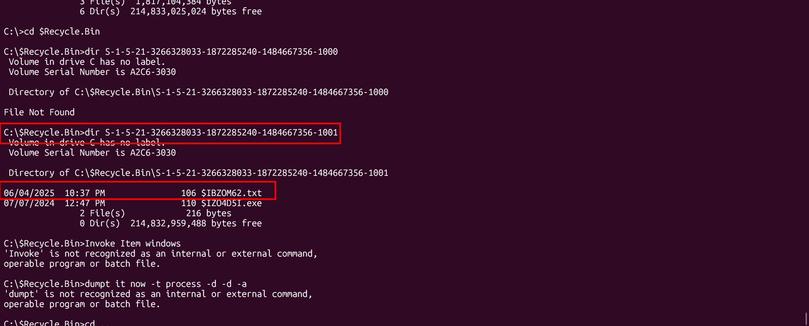
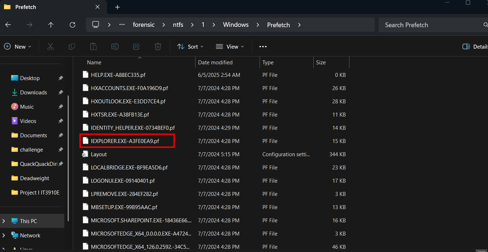
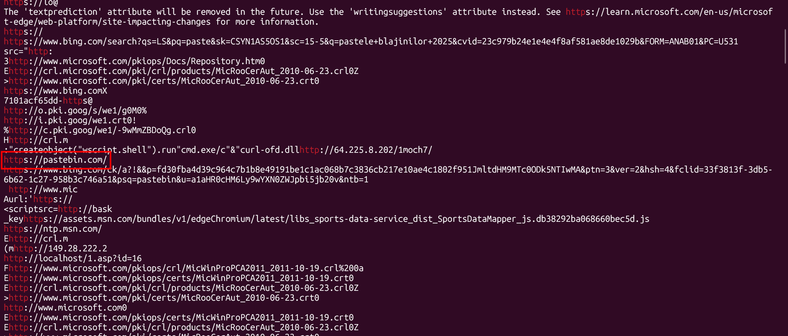
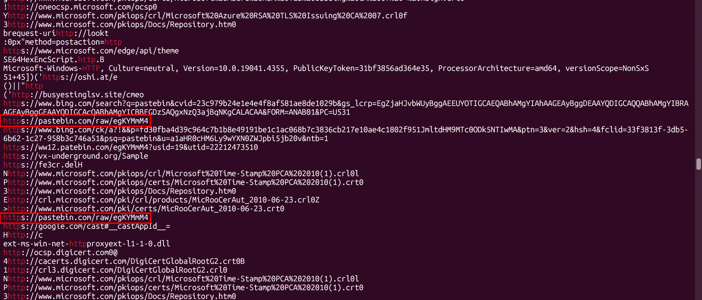
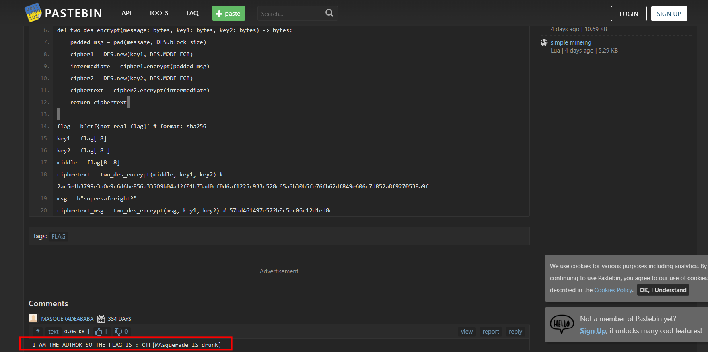

# DeadWeight

## Description

description: Well, well, well... This one is tricky and hard to beat. Let's take a second to relax. Here it comes! I managed to delete THE flag from the system, muhahaha, but... I still remember the times when I used axel to get my beloved flag. Enough with the story—provide the answers to the questions below. File is: https://mega.nz/file/O6BzGKTY#bssfLGqOF5wVWh6RVJOq-yN8CgAi2CNVVMWSkXas3PA MD5(second flag)=b029aefa19e1889303614610be7d3295

## Given artifact

A raw memory dump file

## Solving process

### What is the SID (Security Account Identifier) of the user who tried to delete the flag? (Ex. OmniCTF{ssid})

I first try volatility's `cmdscan` to see which command is left inside the memory dump file:



There is some commands trying to delete a text file in the recycle bin, as we know, `I...` holds the metadata, and `R...` holds the actual content of the deleted file (which is likely the very `flag.txt`). In fact I get the correct answer right after I try that SID, but as there is another SID in the result, let's dive deeper to verify:



This is the result of running `consoles` plugin, we the the commands identified in the previous attempt. Then I try running `getsids` plugin to know that the active user is Masquerade:



**Answer: OmniCTF{S-1-5-21-3266328033-1872285240-1484667356-1001}**

### When did the user delete the flag.txt? (Ex:OmniCTF{07/02/2025 7:20})

Also in the output of `consoles`, we can see the commands' result, the metadata file in recycle bin is created at this time, which is exactly when the file `flag.txt` is deleted: 



**Answer: OmniCTF{06/04/2025 10:37}**

### What is the accidental malicious file present in the filesystem ? (OmniCTF{name.extension})

To solve this file, I use `memprocfs` with forensics mode 2 to retrieve all files in RAM (although most of them are corrupted due to the fact that it's partly overwritten in the active RAM), while wandering around common files place, I see this weird entry in `prefetch` (which holds information about executables being run):



The legitimate thing is `iexplore.exe`, the redundant `r` makes it extremely suspicious, and it is indeed the correct answer

**Answer: OmniCTF{iexplorer.exe}**

### What is the first flag? (Flag format: CTF{funny_words})

The description mentions something about flag downloaded with `axel`, but how strange, `axel` is a linux tools, but this is a windows dump... I also see nothing downloaded in command history, so I have no choice but to inspect the raw dump directly and grep for `http`, with a view to finding some URL left in browser's cache:



Some interesting things here! Pastebin is a common place to hold flag in challenges, and I find the full URL in later lines:



Follow that link, we get the first flag in the comment:



**Answer: CTF{MAsquerade_IS_drunk}**

### What is the second flag? (Flag format: ctf{sha256})

Now we will pay attention to the code in pastebin:

```python
##Is this the flag???!??Idk man...I am calling Andrei here.I only do forensics 
 
from Crypto.Cipher import DES
from Crypto.Util.Padding import pad
 
def two_des_encrypt(message: bytes, key1: bytes, key2: bytes) -> bytes:
    padded_msg = pad(message, DES.block_size)
    cipher1 = DES.new(key1, DES.MODE_ECB)
    intermediate = cipher1.encrypt(padded_msg)
    cipher2 = DES.new(key2, DES.MODE_ECB)
    ciphertext = cipher2.encrypt(intermediate)
    return ciphertext
 
flag = b'ctf{not_real_flag}' # format: sha256
key1 = flag[:8]
key2 = flag[-8:]
middle = flag[8:-8]  
ciphertext = two_des_encrypt(middle, key1, key2) # 2ac5e1b3799e3a0e9c6d6be856a33509b04a12f01b73ad0cf0d6af1225c933c528c65a6b30b5fe76fb62df849e606c7d852a8f9270538a9f
msg = b"supersaferight?"
ciphertext_msg = two_des_encrypt(msg, key1, key2) # 57bd461497e572b0c5ec06c12d1ed8ce
```

From the code, we are given:
- The structure of the second flag: `ctf{sha256_hash_here}`.
- A SHA-256 hash is a 64-character hex string (characters `0-9` and `a-f`). So the flag is of the form `ctf{` + 64 hex characters + `}`.
- `key1` is the first 8 bytes of the flag (i.e., `ctf{` + first 4 hex characters).
- `key2` is the last 8 bytes of the flag (i.e., last 7 hex characters + `}`).
- `middle` is the remaining 53 hex characters.
- A known plaintext/ciphertext pair:
  - Plaintext: `supersaferight?`
  - Ciphertext: `57bd461497e572b0c5ec06c12d1ed8ce` (Double-DES encrypted with `key1` and `key2`).
- The ciphertext of the `middle` string: `2ac5e1b3799e3a0e9c6d6be856a33509b04a12f01b73ad0cf0d6af1225c933c528c65a6b30b5fe76fb62df849e606c7d852a8f9270538a9f`.
- The MD5 hash of the correct flag: `b029aefa19e1889303614610be7d3295`.

### Meet-in-the-Middle Strategy

Instead of trying every combination of `key1` and `key2` together (which would require 16^4 * 16^7 ≈ 17.6 trillion operations), we perform a **Meet-in-the-Middle (MitM)** attack:

1. **Encrypt from the left (Forward table):**
   Encrypt the known plaintext `supersaferight?` (padded) with all possible 16^4 = 65,536 variations of `key1` (`ctf{xxxx`). Store the resulting intermediate blocks in a hash map mapping back to the suffix.
2. **Decrypt from the right:**
   Decrypt the known ciphertext with all possible variations of `key2`.
3. **The Meet-in-the-Middle:**
   Check if the decrypted block exists in the forward lookup table. When a match is found, we have found the matching key pair!

**Optimization using DES Parity:**
DES keys ignore the lowest bit (parity bit) of each byte. Since the key is comprised of ASCII hex characters, several characters produce identical DES keys (e.g. `0` and `1` are identical, `b` and `c` are identical, etc.). This groups the 16 hex characters into 9 unique classes, reducing the search space of `key2` from 16^7 to 9^7 = 4,782,969 unique DES keys. This makes the decryption search instantaneous.

Once the keys are found, we decrypt the `middle` ciphertext, reconstruct the candidate flags, verify their MD5 against the target hash, and get the final flag.

Here is the solver script:

```python
import sys
from hashlib import md5
from itertools import product
from Crypto.Cipher import DES
from Crypto.Util.Padding import pad, unpad

# Known Plaintext/Ciphertext pairs
KNOWN_P = pad(b"supersaferight?", 8)
KNOWN_C = bytes.fromhex("57bd461497e572b0c5ec06c12d1ed8ce")
MID_C = bytes.fromhex("2ac5e1b3799e3a0e9c6d6be856a33509b04a12f01b73ad0cf0d6af1225c933c528c65a6b30b5fe76fb62df849e606c7d852a8f9270538a9f")
TARGET_MD5 = "b029aefa19e1889303614610be7d3295"

# Groups of equivalent characters under DES parity (ASCII value >> 1)
EQUIV_MAP = {
    '0': '01', '1': '01',
    '2': '23', '3': '23',
    '4': '45', '5': '45',
    '6': '67', '7': '67',
    '8': '89', '9': '89',
    'a': 'a',
    'b': 'bc', 'c': 'bc',
    'd': 'de', 'e': 'de',
    'f': 'f'
}
REPS = ['0', '2', '4', '6', '8', 'a', 'b', 'd', 'f']

print("[*] Generating forward table for key1...")
forward = {}
for p in product("0123456789abcdef", repeat=4):
    suffix = "".join(p)
    k1 = ("ctf{" + suffix).encode()
    mid = DES.new(k1, DES.MODE_ECB).encrypt(KNOWN_P)
    forward[mid] = suffix

print(f"[*] Forward table built with {len(forward)} entries. Matching key2...")
for reps_tuple in product(REPS, repeat=7):
    prefix_rep = "".join(reps_tuple)
    k2 = (prefix_rep + "}").encode()
    mid = DES.new(k2, DES.MODE_ECB).decrypt(KNOWN_C)
    
    if mid in forward:
        suffix_rep = forward[mid]
        print(f"[+] Found DES-equivalent match! key1_rep suffix: {suffix_rep}, key2_rep prefix: {prefix_rep}")
        
        k1_options = [EQUIV_MAP[c] for c in suffix_rep]
        k2_options = [EQUIV_MAP[c] for c in prefix_rep]
        
        for k1_chars in product(*k1_options):
            k1_str = "ctf{" + "".join(k1_chars)
            for k2_chars in product(*k2_options):
                k2_str = "".join(k2_chars) + "}"
                
                try:
                    dec1 = DES.new(k2_str.encode(), DES.MODE_ECB).decrypt(MID_C)
                    dec2 = DES.new(k1_str.encode(), DES.MODE_ECB).decrypt(dec1)
                    middle = unpad(dec2, 8).decode()
                    
                    flag = f"{k1_str}{middle}{k2_str}"
                    if md5(flag.encode()).hexdigest() == TARGET_MD5:
                        print(f"\n[!] Success! Correct Flag: {flag}")
                        sys.exit(0)
                except Exception:
                    continue
```

By running the script, we decrypt the middle ciphertext and verify the final flag:

**Answer: ctf{a4062225bc93279ef48b44c6710079649a36b66755c56fc0dd7e7098dd266828}**


