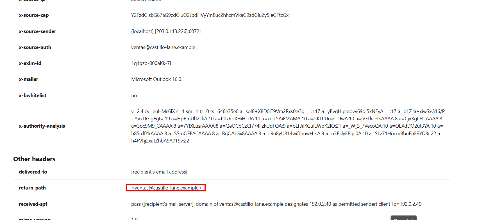
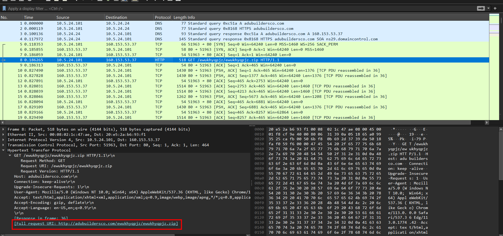
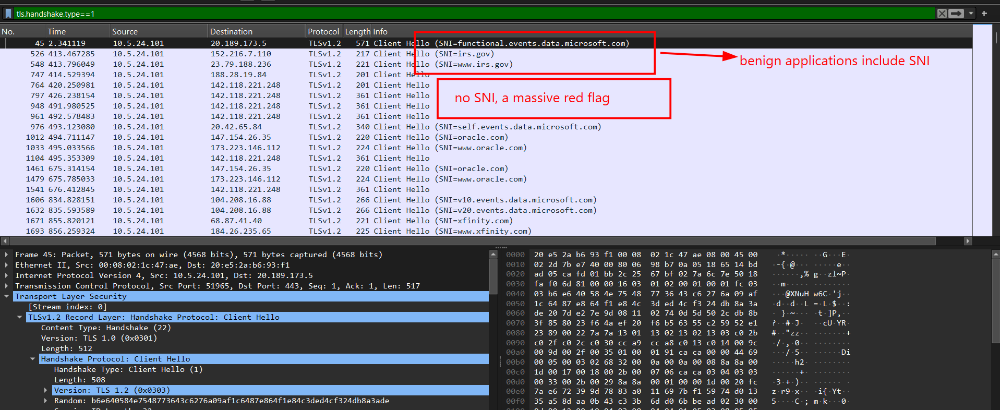
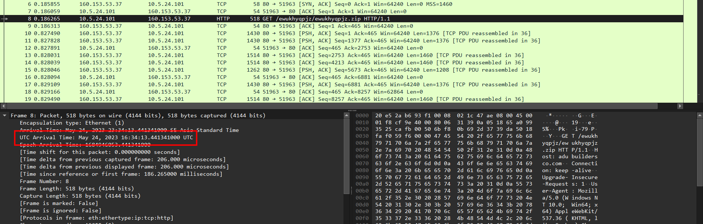
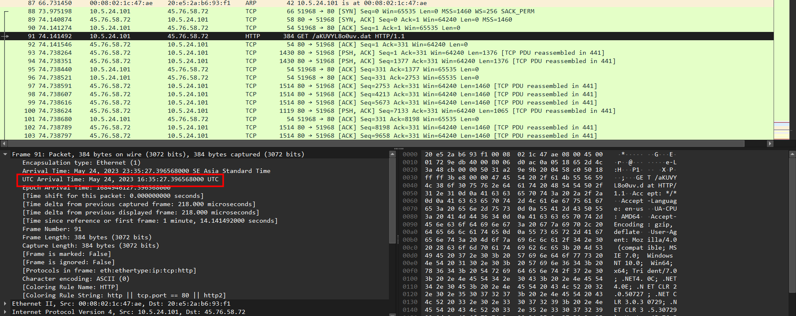

# Quack Quack Diri Diri Duck

## Description

none

## Given artifacts

A folder containing 6 email `.eml` files, and a packet capture file

## Solving process

### How many emails have malicious PDFs? (Example: OmniCTF{67})

I use [this web](https://eml-analyzer.herokuapp.com/#/) to analyze `.eml` files. Based on the content, both 5 emails with name like `Email{i}.eml` contain malicious PDF

**Answer: OmniCTF{5}**

### Arrange the emails the attacker used to send the PDFs alphabetically from a -> z? (Example: OmniCTF{abc@andydwdhhdd.net+test@omnictf.com})

Based on `return-path` headers, we can determine the source of those emails with PDF:



Do the same with other emails, the sorted senders are: **OmniCTF{bounce+84921-4f93@campaign-mail.example+bounce-77291@mailer-node.example+michellemay@aryanproo.co.ke+scanner@documents.castillo-lane.example+ventas@castillo-lane.example}**

```text
- The Return-Path header (often referred to as the "Envelope Sender" or "Bounce Address") specifies the email address where automated bounce messages or Non-Delivery Reports (NDRs) are sent if the email fails to reach its destination.

- How it gets created? -> When an email is transmitted between servers, it uses the SMTP protocol. The sending server declares the sender's address using the MAIL FROM command. When the final receiving mail server accepts the message to place it in the user's inbox, it takes that MAIL FROM address and permanently stamps it at the very top of the email headers as the Return-Path.

- Why it matters in CTF Forensics ?
+) Spotting Forgeries: The From: header—which is what the user actually sees in their email client—is easily spoofed. An attacker might set the From: header to admin@yourcompany.com to trick the victim. However, they often leave the Return-Path pointing to their actual infrastructure so they can track if the email bounced. Mismatches between the From: and Return-Path domains are a classic sign of phishing.

+) Email Authentication (SPF): Sender Policy Framework (SPF) is a security protocol that checks if a sending IP is authorized to send mail on behalf of a domain. Crucially, standard SPF validates the domain found in the Return-Path, not the visible From: header.

+) Third-Party Senders: It is worth noting that a mismatch isn't always malicious. Legitimate mailing lists, marketing platforms (like Mailchimp), or CRM tools often use a custom Return-Path to process bounce-backs automatically, even while the From: header displays the company's real address.
```

### What is the first malicious HTTP download URL in the PCAP? (Example: OmniCTF{url})

Easily seen in the pcap:



**Answer: OmniCTF{https://waqaskhan.pk/tphhynsded/tphhynsded.zip}**

### How many unique remote IP-and-port combinations use the Qakbot TLS client fingerprint? (Example: OmniCTF{67})

Let's begin with some background knowledge for analyzing TLS packets: 

```text
  JA3 is a method for fingerprinting the TLS Client Hello packet. It was developed by Salesforce researchers (John Althouse, Jeff Atkinson, and Josh
  Atkins).

  When a client (like a web browser or a piece of malware) initiates a secure connection (TLS handshake) with a server, it sends a Client Hello packet.
  Because different software, operating systems, and libraries use different SSL/TLS implementations (like OpenSSL, Windows Schannel, Go's TLS,
  BoringSSL, etc.), the Client Hello contains a unique combination of configurations.

  JA3 gathers 5 specific fields from the Client Hello:
  1. TLS Version (e.g., TLS 1.2 or 0x0303)
  2. Accepted Ciphers (the list of cryptographic algorithms the client supports)
  3. List of Extensions (like SNI, session tickets, supported groups)
  4. Supported Elliptic Curves
  5. Elliptic Curve Point Formats

  #### How the Fingerprint is Created:

  1. These fields are converted into their decimal representation.
  2. They are joined in order using commas (,), and individual values within a field are separated by dashes (-).
  3. This creates a raw string, for example:
  771,49195-49199-49200-52393,0-23-65281-10-11,29-23-24,0
  4. This raw string is then MD5-hashed to produce a 32-character hexadecimal string (the JA3 hash).

  Even if malware changes its destination IP, domain, or encrypts its payload, its JA3 signature remains the same because it compiles and uses the exact
  same socket/TLS library to perform connections. This makes JA3 a powerful tool to track malware communication.
```

First we filter for TLS Client Hellos: `tls.handshake.type==1`, note that benign applications almost always use domain names (like `google.com`) and send a Server Name Indication (SNI) extension in the Client Hello so the server knows which website certificate to present. Malware connecting directly to hardcoded IP C2 servers typically does not use SNI (the SNI field is blank)



Have a look at a packet without SNI extension, as I've noted, this JA3 hash will be the fingerprint of the malware, let's use `tshark` to efficiently extract all IP/port combinations:

```bash
tshark -r 2023-05-24-obama264-Qakbot-infection.pcap -Y "tls.handshake.ja3 == 43016d7f7f9336b17c884650d0d2545d" -T fields -e ip.dst -e tcp.dstport | sort | uniq -c
```

```text
     81 142.118.221.248 2222
      1 185.81.114.188  443
      1 188.28.19.84    443
      4 201.130.154.90  443
```

**Answer: OmniCTF{4}**

### Identify all unique Qakbot TLS C2 endpoints, separated by +, in ascending order. (Example: OmniCTF{192.168.11.0:80+192.168.11.3:443})

Already unveiled in the previous question

**Answer: OmniCTF{142.118.221.248:2222+185.81.114.188:443+188.28.19.84:443+201.130.154.90:443}**

### At what timestamp is the malicious ZIP requested? (Example: OmniCTF{YYYY-MM-DD HH:MM:SS})



### At what timestamp is the Qakbot DLL requested? (Example: OmniCTF{YYYY-MM-DD HH:MM:SS})



### How many seconds pass between DLL GET and first C2 ClientHello? (Example: OmniCTF{6.767})

Just do some math...

**Answer: 340.388**

### What malware family is represented? (Example: OmniCTF{Fam})

**Answer: Qakbot**

### What is the malware campaign/variant identifier? (Example: OmniCTF{Mal})

**Answer: obama264**