# Tsuki's Rythm Game

## Scenario

Tsuki is a cryptocurrency enthusiast and the lead developer of a community rhythm game. Recently, she was testing mods and new beatmaps created by players for the game. However, a few days later, she was shocked to discover that her wallet had been completely drained.

Currently, the security response team has extracted a network traffic capture from Tsuki's work computer, along with the entire game folder of the rhythm game. Please conduct a digital forensic analysis on them.

## Given artifact

Two zip files named `Game.zip` and `Evidence.zip`, a packet capture file is also given.

## Solving process

This challenge follows HTB Sherlocks format, we must answer a series of questions to get the flag

### 1. What is the MD5 hash of the main executable of the rhythm game downloaded by the victim? (E: 38fc27eae9f85049ee8a002a38c794b7)

Let's look at the pcap file first, from the protocol hierarchy, we can see the significant amount of data transferred through HTTP protocol, seems familiar in malware C2 scenario:

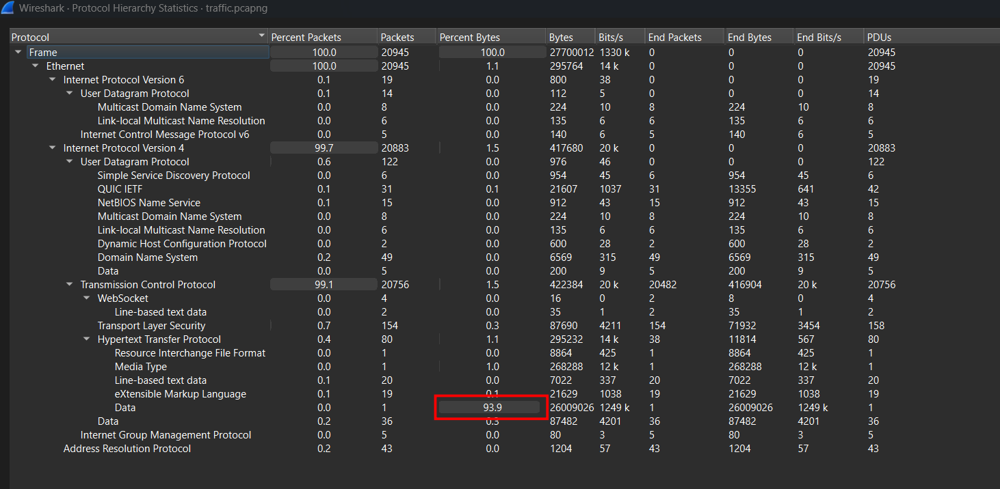

Filtering for HTTP only, we can immediately see the suspicious rhythm game downloaded by the victim, this is also the game file provided in extracted `Game.zip`, using `md5sum` command to obtain its hash.

`Answer: 1eeb9c6ed21903f22e1b28dbcbc5c01c`

### 2. What are the Key and IV used by the rhythm game to encrypt and decrypt the beatmaps? (Format: Key_IV) (E: Thisiskey@123456_Thisisiv@1234567)

At first, I try decompiling it directly with `ghidra`, but the huge amount of functions makes me rethink, then I use the obtained hash from Q1 to submit to VirusTotal, it turns out to be compiled with `PyInstaller`. This is a precious guide, we will use `pyinstxtractor.py` to handle it (if you don't know this tool, well then you have not read my other write-ups, try some :v) 

In the extracted folder, we can be quite sure that this is the main program:

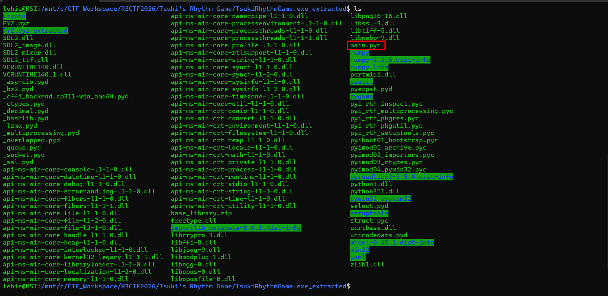

Those `.pyc` file are compiled, we cannot read it directly, you can either use `pycdc` or [this web](pylingual.io) to decompile it, here is the original python file:

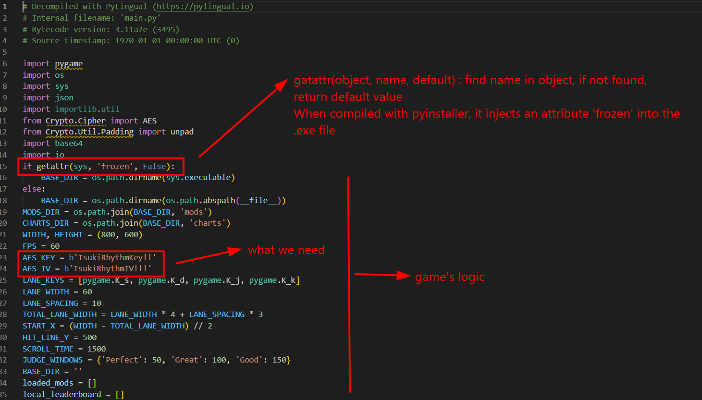

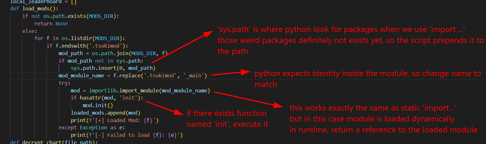

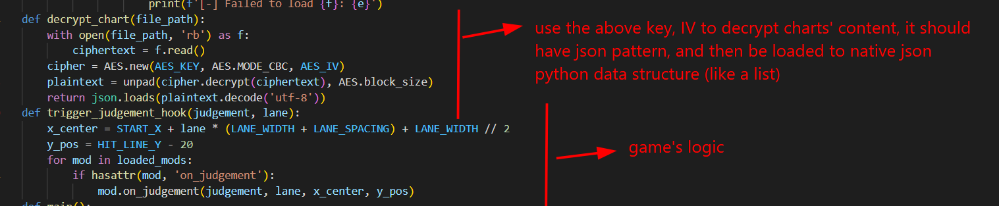

Note that it also appends the returned reference into a list for further usage, I've run out of space in that snapshot

Alright, the huge `main()` is almost game's logic, and we also have grasped the main things to focus: the module in `mods` and encrypted json in `charts`. We will attempt to unpack them, but let's finish this question first

`Answer: TsukiRhythmKey!!_TsukiRhythmIV!!!`

### 3. What is the MD5 hash of the malicious payload bytecode ultimately decrypted by the rhythm game? (E: ff418d8b23b59a2a88f013c68f3c4873)

Let's construct a script to decrypt all the charts to json form:

```python
import os
import json
from Crypto.Cipher import AES
from Crypto.Util.Padding import unpad

ES_KEY = b'TsukiRhythmKey!!'
AES_IV = b'TsukiRhythmIV!!!'

CHARTS_DIR="./charts"

for filename in os.listdir(CHARTS_DIR):
    if filename.endswith('.tsuki'):
        filepath=os.path.join(CHARTS_DIR, filename)
        with open(filepath, 'rb') as f:
            ciphertext=f.read()
        cipher = AES.new(AES_KEY, AES.MODE_CBC, AES_IV)
        try:
            # Decrypt and unpad
            plaintext = unpad(cipher.decrypt(ciphertext), AES.block_size)
            chart_data = json.loads(plaintext.decode('utf-8'))

            # Save as JSON
            output_filepath = os.path.join(CHARTS_DIR, filename.replace('.tsuki', '.json'))
            with open(output_filepath, 'w', encoding='utf-8') as out_f:
                json.dump(chart_data, out_f, indent=4, ensure_ascii=False)
        except Exception as e:
            print(f"Error decryptin {filename}")
```

After running the decryption script to get json files, I begin inspecting them, most of its content are base64 encoded form of media file like audio, image... which are referenced to from the `main()` function to display. So we cannot get anything further from them. Let's try the `mods` folder, files inside it are modules imported dynamically in the main program, so we can `cat` directly even though it's zipped:

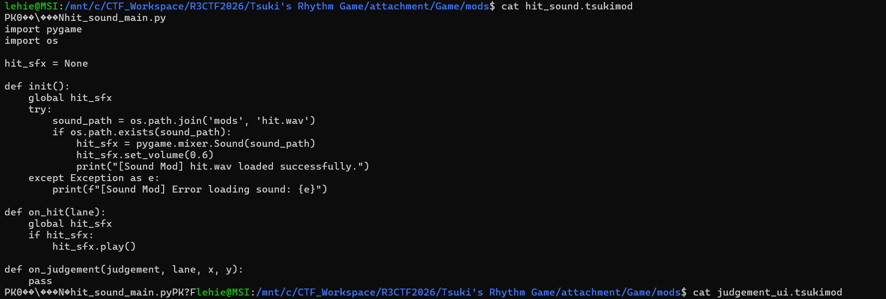

This seems benign, just loads the sound for the game

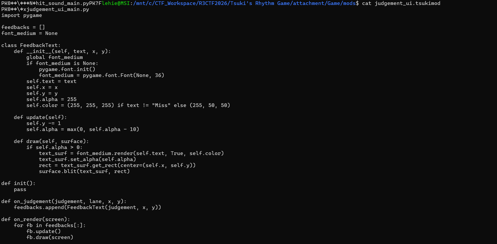

Also nothing wrong with this file

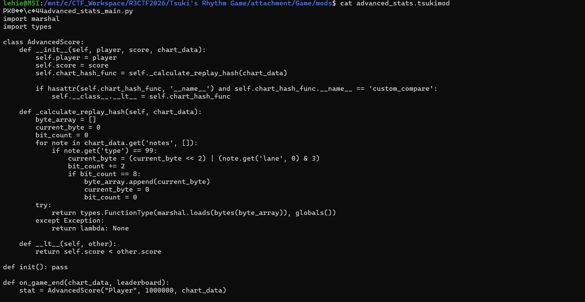

Caught here! This module is definitely malicious, it scan for all decrypted charts and looks for the one with attribute `type` equals to 99, then gradually build a payload using the `lane` attribute. Inspecting all decrypted json files, only this `Eggdrasil.json` contains `notes` attribute whose `type` equals to 99. The values in `lane` will then be used to gradually build the bytecode, let's construct a script to mimic that process:

```python
import os
import json
import hashlib

CHARTS_DIR="./charts"

for filename in os.listdir(CHARTS_DIR):
    if filename.enswith('.json'):
        filepath=os.path.join(CHARTS_DIR, filename)

        with open(filepath, 'r', encoding='utf-8') as f:
            try:
                chart_data=json.load(f)
            except Exception:
                continue

            notes=chart_data.get('notes', [])

            byte_array=[]
            current_byte=0
            bit_count=0
        
            for note in notes:
                if note.get('type')==99:
                    current_byte= (current_bytes<<2) | (note.get('lane',0) & 3)
                    bit_count+=2
                    if bit_count==8:
                        byte_array.append(current_byte)
                        current_byte=0
                        bit_count=0
            if byte_array:
                byte_code=bytes(byte_array)
                out_filepath=os.path.join(CHARTS_DIR, filename.replace('.json','_payload.bin'))
                with open(out_filepath, 'wb') as out_f:
                    out_f.write(byte_code)
```

Run it to get the payload, then `md5sum` to get the answer.

`Answer: aed1e4e8b9061e19506848ca579e46ac`

### 4. The attacker used the rhythm game to implant a C2 client on the victim's computer. What is the listening port of the C2 server it connects back to? (E: 9999)

Let's try to inspect the bytecode, it's definitely not the C2 client, perhaps a loader. We will use this script, in fact using mere `strings` also helps us identify the pattern, but I want to learn python code more thoroughly:

```python
import marshal
import dis

filepath='./Eggdrasil_payload.bin'

with open(filepath, 'rb') as f:
    bytecode = f.read()

try:
    code_obj=marshal.loads(bytecode)
    print("=== Code Object Metadata ===")
    print(f"Function Name:  {code_obj.co_name}")
    print(f"Source File:    {code_obj.co_filename}")
    print(f"Arguments:      {code_obj.co_varnames[:code_obj.co_argcount]}")
    print(f"Constants:      {code_obj.co_consts}")
    print(f"Names:          {code_obj.co_names}")
    print(f"Local Variables: {code_obj.co_varnames}")
except Exception as e:
    print(f"Error loading code object: {e}")
    exit(1)

try:
    print("\n=== Disassembled Bytecode ===")
    dis.dis(code_obj)
except Exception as e:
    print(f"Error disassembling bytecode: {e}")
    exit(1)
```

Here is the result:

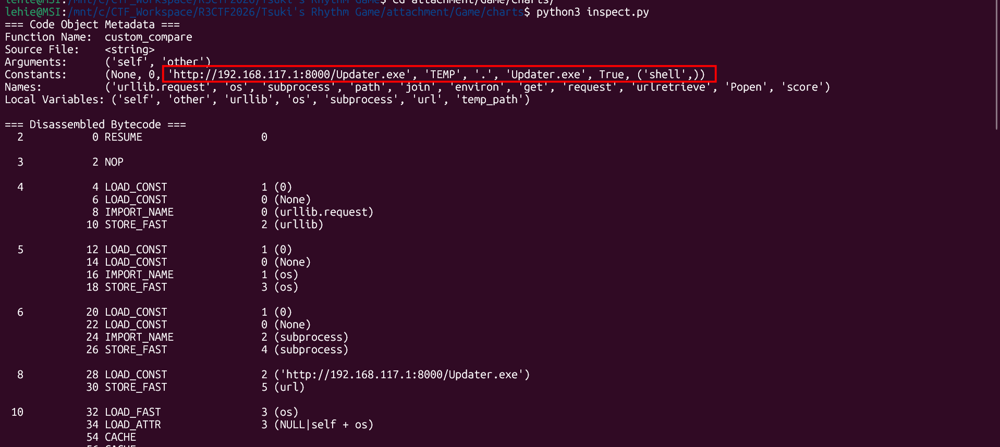

In fact, I saw this from the pcap file from the very beginning, and also exported it as well, this is the main C2 client, bytecode is just a loader.

There is also an alternative path, `pycdc` can not only decompile `.pyc` file, but also raw marshalled code object with no header, but we must specify the python version with `-v` flag, from the decompiled game, we know that it is 3.11, so let's try:

```bash
pycdc -c -v 3.11 Eggdrasil_payload.bin
```

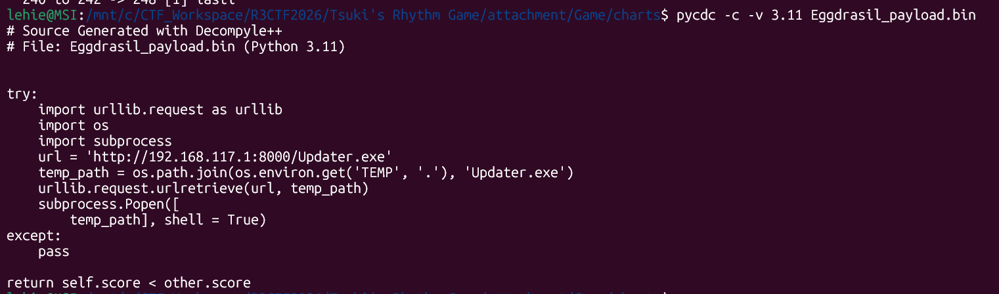

It's here in the pcap, I exported it before:

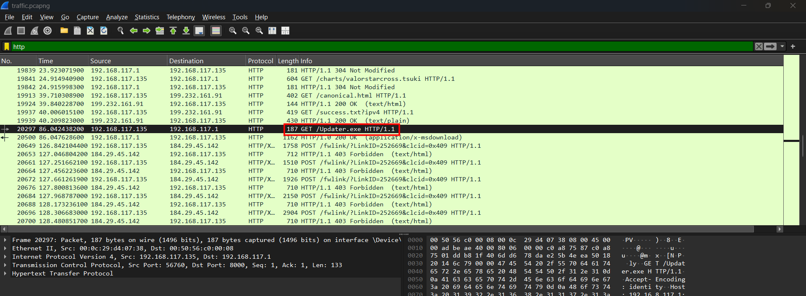

Filter for the malicious IP, I see that later communication happens in port 4444, this should be the listening port that the victim's machine connects back to. To cement my inference, I submit it to VirusTotal, and it's confirmed:

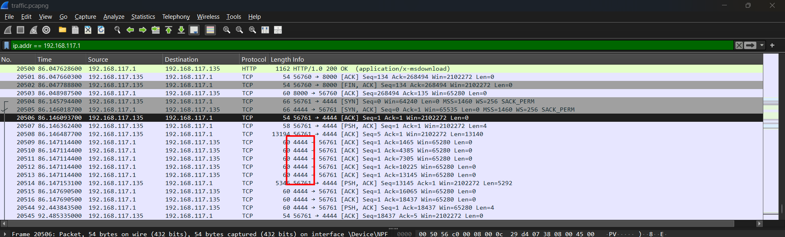

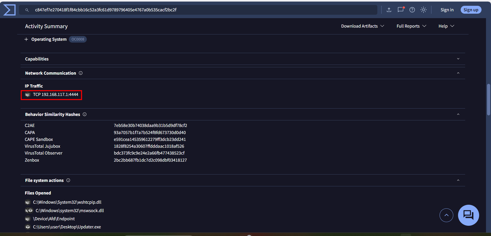

`Answer: 4444`

### 5. During its execution, the C2 client read a local file on the victim's machine for subsequent communication encryption. What is the absolute path of this file? (E: C:\Users\Public\a.txt)

Indeed I have no actual strategy for this question, I just check all decompiled functions one by one before I see this function:

```c++
longlong * FUN_1400053b0(longlong *param_1)

{
  ulonglong uVar1;
  undefined1 *puVar2;
  longlong *plVar3;
  
  *param_1 = 0;
  param_1[1] = 0;
  param_1[2] = 0;
  param_1[3] = 0xf;
  *(undefined1 *)param_1 = 0;
  puVar2 = (undefined1 *)FUN_14000c558(0x20);
  param_1[2] = 0x12;
  param_1[3] = 0x1f;
  *puVar2 = (char)*param_1;
  *param_1 = (longlong)puVar2;
  param_1[2] = 0;
  if (param_1[3] == 0) {
    FUN_140002090(param_1,1,0,0x43);
  }
  else {
    param_1[2] = 1;
    plVar3 = param_1;
    if (0xf < (ulonglong)param_1[3]) {
      plVar3 = (longlong *)*param_1;
    }
    *(undefined2 *)plVar3 = 0x43;
  }
  uVar1 = param_1[2];
  if (uVar1 < (ulonglong)param_1[3]) {
    param_1[2] = uVar1 + 1;
    plVar3 = param_1;
    if (0xf < (ulonglong)param_1[3]) {
      plVar3 = (longlong *)*param_1;
    }
    *(undefined2 *)((longlong)plVar3 + uVar1) = 0x3a;
  }
  else {
    FUN_140002090(param_1,1,0,0x3a);
  }
  uVar1 = param_1[2];
  if (uVar1 < (ulonglong)param_1[3]) {
    param_1[2] = uVar1 + 1;
    plVar3 = param_1;
    if (0xf < (ulonglong)param_1[3]) {
      plVar3 = (longlong *)*param_1;
    }
    *(undefined2 *)((longlong)plVar3 + uVar1) = 0x5c;
  }
  else {
    FUN_140002090(param_1,1,0,0x5c);
  }
  uVar1 = param_1[2];
  if (uVar1 < (ulonglong)param_1[3]) {
    param_1[2] = uVar1 + 1;
    plVar3 = param_1;
    if (0xf < (ulonglong)param_1[3]) {
      plVar3 = (longlong *)*param_1;
    }
    *(undefined2 *)((longlong)plVar3 + uVar1) = 0x57;
  }
  else {
    FUN_140002090(param_1,1,0,0x57);
  }
  uVar1 = param_1[2];
  if (uVar1 < (ulonglong)param_1[3]) {
    param_1[2] = uVar1 + 1;
    plVar3 = param_1;
    if (0xf < (ulonglong)param_1[3]) {
      plVar3 = (longlong *)*param_1;
    }
    *(undefined2 *)((longlong)plVar3 + uVar1) = 0x69;
  }
  else {
    FUN_140002090(param_1,1,0,0x69);
  }
  uVar1 = param_1[2];
  if (uVar1 < (ulonglong)param_1[3]) {
    param_1[2] = uVar1 + 1;
    plVar3 = param_1;
    if (0xf < (ulonglong)param_1[3]) {
      plVar3 = (longlong *)*param_1;
    }
    *(undefined2 *)((longlong)plVar3 + uVar1) = 0x6e;
  }
  else {
    FUN_140002090(param_1,1,0,0x6e);
  }
  uVar1 = param_1[2];
  if (uVar1 < (ulonglong)param_1[3]) {
    param_1[2] = uVar1 + 1;
    plVar3 = param_1;
    if (0xf < (ulonglong)param_1[3]) {
      plVar3 = (longlong *)*param_1;
    }
    *(undefined2 *)((longlong)plVar3 + uVar1) = 100;
  }
  else {
    FUN_140002090(param_1,1,0,100);
  }
  uVar1 = param_1[2];
  if (uVar1 < (ulonglong)param_1[3]) {
    param_1[2] = uVar1 + 1;
    plVar3 = param_1;
    if (0xf < (ulonglong)param_1[3]) {
      plVar3 = (longlong *)*param_1;
    }
    *(undefined2 *)((longlong)plVar3 + uVar1) = 0x6f;
  }
  else {
    FUN_140002090(param_1,1,0,0x6f);
  }
  uVar1 = param_1[2];
  if (uVar1 < (ulonglong)param_1[3]) {
    param_1[2] = uVar1 + 1;
    plVar3 = param_1;
    if (0xf < (ulonglong)param_1[3]) {
      plVar3 = (longlong *)*param_1;
    }
    *(undefined2 *)((longlong)plVar3 + uVar1) = 0x77;
  }
  else {
    FUN_140002090(param_1,1,0,0x77);
  }
  uVar1 = param_1[2];
  if (uVar1 < (ulonglong)param_1[3]) {
    param_1[2] = uVar1 + 1;
    plVar3 = param_1;
    if (0xf < (ulonglong)param_1[3]) {
      plVar3 = (longlong *)*param_1;
    }
    *(undefined2 *)((longlong)plVar3 + uVar1) = 0x73;
  }
  else {
    FUN_140002090(param_1,1,0,0x73);
  }
  uVar1 = param_1[2];
  if (uVar1 < (ulonglong)param_1[3]) {
    param_1[2] = uVar1 + 1;
    plVar3 = param_1;
    if (0xf < (ulonglong)param_1[3]) {
      plVar3 = (longlong *)*param_1;
    }
    *(undefined2 *)((longlong)plVar3 + uVar1) = 0x5c;
  }
  else {
    FUN_140002090(param_1,1,0,0x5c);
  }
  uVar1 = param_1[2];
  if (uVar1 < (ulonglong)param_1[3]) {
    param_1[2] = uVar1 + 1;
    plVar3 = param_1;
    if (0xf < (ulonglong)param_1[3]) {
      plVar3 = (longlong *)*param_1;
    }
    *(undefined2 *)((longlong)plVar3 + uVar1) = 0x68;
  }
  else {
    FUN_140002090(param_1,1,0,0x68);
  }
  uVar1 = param_1[2];
  if (uVar1 < (ulonglong)param_1[3]) {
    param_1[2] = uVar1 + 1;
    plVar3 = param_1;
    if (0xf < (ulonglong)param_1[3]) {
      plVar3 = (longlong *)*param_1;
    }
    *(undefined2 *)((longlong)plVar3 + uVar1) = 0x68;
  }
  else {
    FUN_140002090(param_1,1,0,0x68);
  }
  uVar1 = param_1[2];
  if (uVar1 < (ulonglong)param_1[3]) {
    param_1[2] = uVar1 + 1;
    plVar3 = param_1;
    if (0xf < (ulonglong)param_1[3]) {
      plVar3 = (longlong *)*param_1;
    }
    *(undefined2 *)((longlong)plVar3 + uVar1) = 0x2e;
  }
  else {
    FUN_140002090(param_1,1,0,0x2e);
  }
  uVar1 = param_1[2];
  if (uVar1 < (ulonglong)param_1[3]) {
    param_1[2] = uVar1 + 1;
    plVar3 = param_1;
    if (0xf < (ulonglong)param_1[3]) {
      plVar3 = (longlong *)*param_1;
    }
    *(undefined2 *)((longlong)plVar3 + uVar1) = 0x65;
  }
  else {
    FUN_140002090(param_1,1,0,0x65);
  }
  uVar1 = param_1[2];
  if (uVar1 < (ulonglong)param_1[3]) {
    param_1[2] = uVar1 + 1;
    plVar3 = param_1;
    if (0xf < (ulonglong)param_1[3]) {
      plVar3 = (longlong *)*param_1;
    }
    *(undefined2 *)((longlong)plVar3 + uVar1) = 0x78;
  }
  else {
    FUN_140002090(param_1,1,0,0x78);
  }
  uVar1 = param_1[2];
  if (uVar1 < (ulonglong)param_1[3]) {
    param_1[2] = uVar1 + 1;
    plVar3 = param_1;
    if (0xf < (ulonglong)param_1[3]) {
      plVar3 = (longlong *)*param_1;
    }
    *(undefined2 *)((longlong)plVar3 + uVar1) = 0x65;
    return param_1;
  }
  FUN_140002090(param_1,1,0,0x65);
  return param_1;
}
```

At first we see the `std::string` structure and initialization:

```c++
*param_1 = 0;
param_1[1] = 0;
param_1[2] = 0;
param_1[3] = 0xf;
*(undefined1 *)param_1 = 0;
```

In the MSVC standard library, a  `std::string`  structure occupies 32 bytes:

  •  param_1[0]  and  param_1[1]  (Bytes 0-15): The internal data buffer used for Small String Optimization (SSO).

  •  param_1[2]  (Bytes 16-23): Holds the current length of the string (initialized to  0 ).

  •  param_1[3]  (Bytes 24-31): Holds the capacity of the string (initialized to  0xf , which is 15 in decimal).

Then we will see some SSO logic, throughout the code, you will see this block repeating before any character written:

```c++
plVar3 = param_1;
if (0xf < (ulonglong)param_1[3]) {
    plVar3 = (longlong *)*param_1;
}
```

This is the standard C++ library performing a capacity check:

  • If the capacity ( param_1[3] ) is ≤ 15 ( 0xf ), the string is small and the characters are stored inside the
  local stack buffer ( param_1 ).

  • If the capacity grows >15, the string is moved to a heap-allocated buffer. The address of this heap memory is
  stored in  `*param_1` , and  `plVar3`  is updated to point to it.

The last part is character appending and reallocation:

```c++
      uVar1 = param_1[2]; // Get current length
      if (uVar1 < (ulonglong)param_1[3]) { // If length < capacity
        param_1[2] = uVar1 + 1; // Increment length
        // ... [SSO Check to find buffer address plVar3] ...
        *(undefined2 *)((longlong)plVar3 + uVar1) = <CHAR_VALUE>;
      }
      else {
        FUN_140002090(param_1, 1, 0, <CHAR_VALUE>); // Reallocate and append
      }
```

• If there is capacity: The length is incremented by 1, and the character is written directly to  buffer + length .

• If capacity is full: It calls  `FUN_140002090` , which is the internal MSVC string growth/reallocation routine
(like  `std::string::append`  or  `std::string::push_back` ) to allocate more memory on the heap and append the
character.

Trace the appended hex values then decode with cyberchef, I get the referenced file:

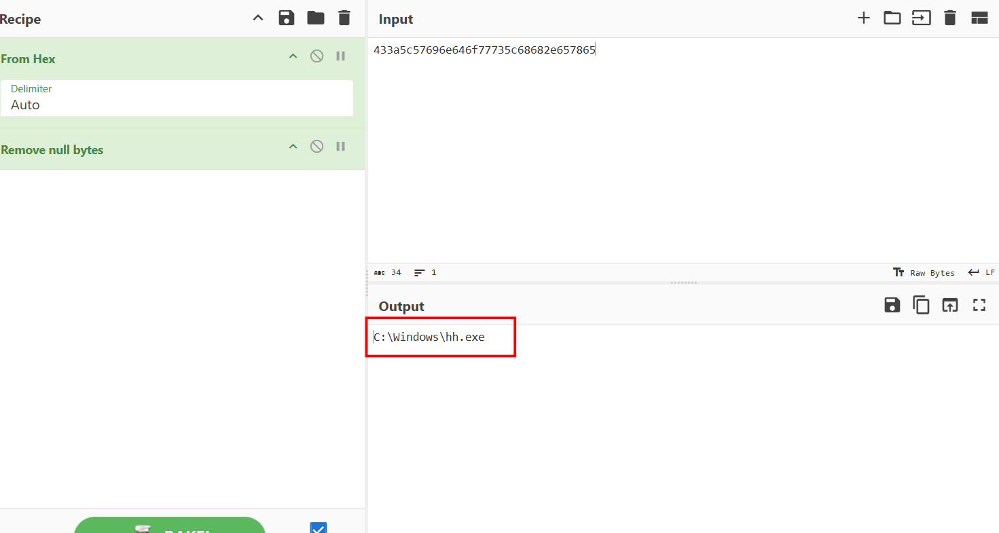

`Answer: C:\Windows\hh.exe`

### 6. Following up on the previous question, what was the original MD5 hash of this file when it was read? (E: dcc596761e0273d4531c1e0af3f02462)

Let's trace which calls the path-builing function, the result is here:

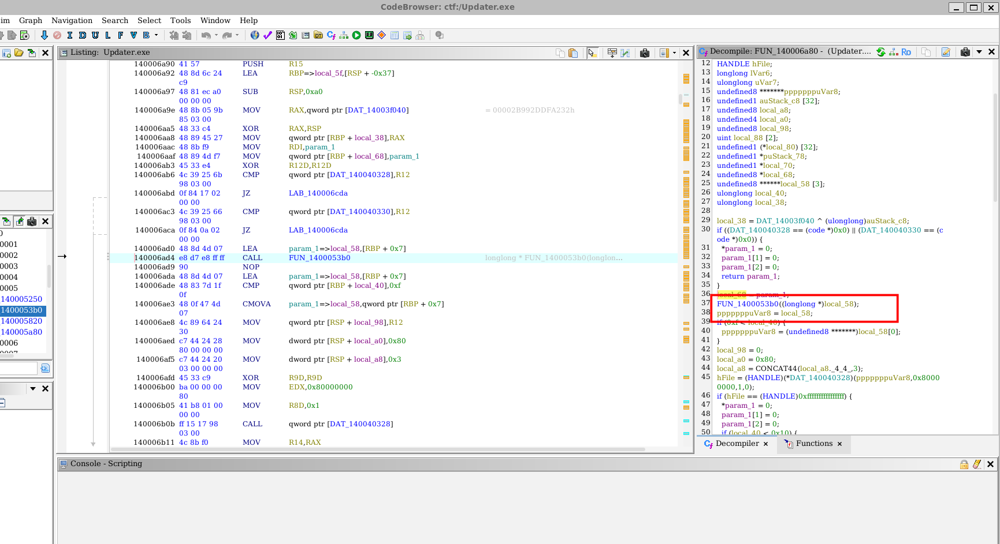

This functions gets the file size and reads all content into a buffer, now I will continue to trace which calls this function:

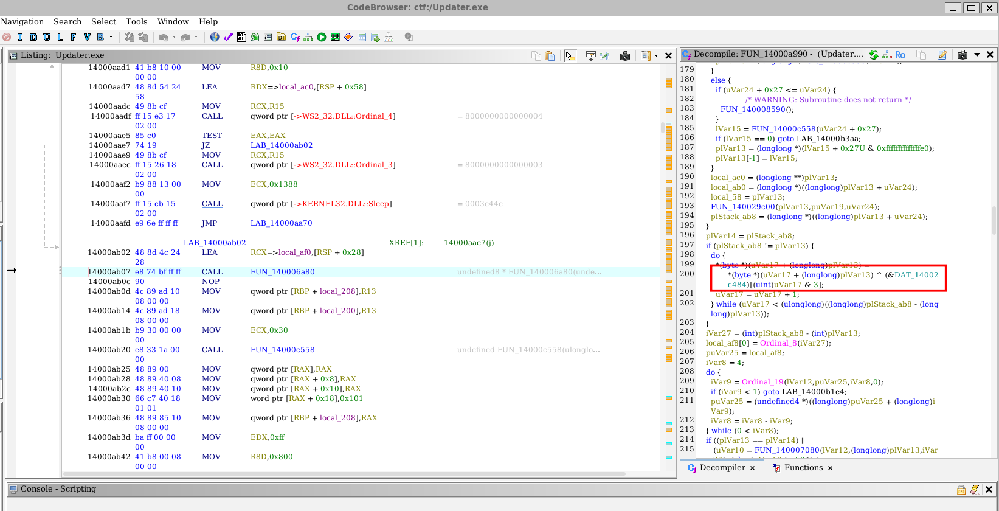

The content of `hh.exe` is XORed with a key stored in `DAT_14002c484` before being sent to the attacker's server port 4444. Let's go to the XOR key's position:

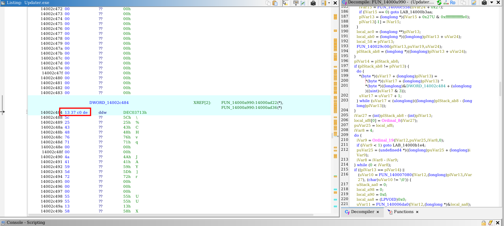

Note that I changed data type to double-word so that it displays the whole 4-byte key in a line. Now we will return to the pcap file. This should be the very first callback communication, I trace the TCP stream number in wireshark first, then use cmd `tshark` to extract the stream:

```bash
tshark -r traffic.pcapng -Y "tcp.stream == 31 && tcp.srcport != 4444" -T fields -e tcp.payload | tr -d '\n' > xored_payload.hex
```

The first 4 bytes of the packet is the payload's length, `00 00 48 00` means 18432 bytes of payload, so use cyberchef to obtain the original `hh.exe`:

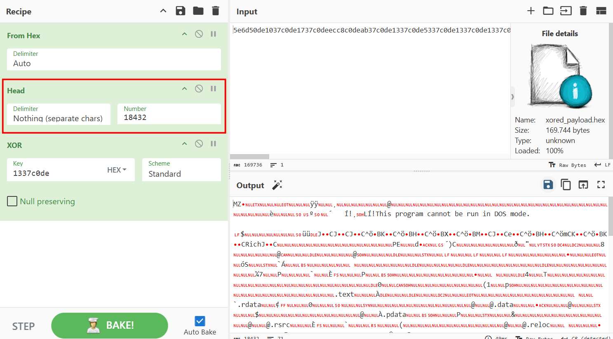

Download that file and let `md5sum` do its work.

`Answer: 2c8fe78d53c8ca27523a71dfd2938241`

### 7. After establishing the C2 connection, what was the first command issued and executed by the attacker via the C2 server? (E: dir)

To decrypt the C2 traffic, we first analyze the decryption function `FUN_1400046b0` and the parser function `FUN_140004d80` in `Updater.exe`:

```c++
    longlong * FUN_1400046b0(longlong *param_1, int *param_2, ulonglong *param_3, int *param_4)
    {
      // ... BCrypt setup for AES-CBC
      BCryptOpenAlgorithmProvider(&local_60, L"AES", (LPCWSTR)0x0, 0);
      BCryptSetProperty(local_60, L"ChainingMode", (PUCHAR)L"ChainingModeCBC", 0x20, 0);

      // AES symmetric key derived directly from param_2 (dynamic key)
      BCryptGenerateSymmetricKey(local_60, local_res18, (PUCHAR)0x0, 0, *(PUCHAR *)param_2, param_2[2] - *param_2, 0);
      
      // Decrypts ciphertext (param_4) using IV (param_3)
      BCryptDecrypt(local_res18[0], *(PUCHAR *)param_4, param_4[2] - *param_4, (void *)0x0, local_58,
                    (int)pUStack_50 - (int)local_58, (PUCHAR)*param_1, local_res10[0], local_res10, 0);
      // ... manually validates and truncates PKCS#7 padding bytes
    }
```

#### The Custom Deobfuscation Mechanism (Index Lookup)
Before AES decryption, the network payloads are transmitted as dot-separated string formats of integers (e.g. `132.242.96.156...`). The parser function `FUN_140004d80` translates these numbers back to raw bytes using a **Substitution Cipher** map built from the decrypted `hh.exe` file:
* **Negative numbers (e.g. `-96`)**: Represents a fallback byte value. The decoder strips the minus sign and uses the value directly as a byte (`96`).
* **Positive numbers (e.g. `132`)**: Represents an offset index into the **decrypted `hh.exe`** binary. The decoder retrieves the byte stored at that index of `hh.exe` (e.g., `hh_exe[132] = 0x4a`).

#### Packet Structure
Each deobfuscated payload packet is structured as:
```text
+----------------------+----------------------+----------------------+
|  AES Key (16 bytes)  |  Ciphertext (N bytes)|     IV (16 bytes)    |
+----------------------+----------------------+----------------------+
```

#### Programmatic Decryption Flow
We can write a script to decrypt the session by:
1. Reassembling the TCP payloads of Stream 31.
2. Extracting the first payload (which contains `hh.exe` XORed with `\x13\x37\xc0\xde`).
3. Reconstructing the clean `hh.exe` reference buffer by XOR-decrypting the extracted buffer.
4. Parsing all subsequent dot-separated strings, deobfuscating them using the reference `hh.exe` buffer, extracting the Key/IV/Ciphertext, and performing standard AES-CBC decryption.

```python
import os
from Crypto.Cipher import AES
from Crypto.Util.Padding import unpad
from scapy.utils import PcapReader
from scapy.layers.inet import TCP

PCAP_PATH = "traffic.pcapng"
HH_PATH = "hh.exe"

def deobfuscate_string(dot_str, hh_ref):
    """Translates the dot-separated index string back into raw bytes using the decrypted hh.exe reference."""
    tokens = dot_str.strip().replace("\n", "").replace(" ", "").split('.')
    raw_bytes = bytearray()
    for token in tokens:
        if not token:
            continue
        val = int(token)
        if val < 0:
            raw_bytes.append(-val)
        else:
            raw_bytes.append(hh_ref[val])
    return bytes(raw_bytes)

def decrypt_c2_packet(raw_packet):
    """Decrypts a raw C2 packet using AES-128-CBC."""
    if len(raw_packet) < 32:
        return "[-] Error: Packet too short."
    aes_key = raw_packet[:16]
    aes_iv = raw_packet[-16:]
    ciphertext = raw_packet[16:-16]
    
    cipher = AES.new(aes_key, AES.MODE_CBC, aes_iv)
    try:
        plaintext = unpad(cipher.decrypt(ciphertext), AES.block_size)
        return plaintext.decode('utf-8', errors='ignore')
    except Exception as e:
        return f"[-] Decryption failed: {e}"

def main():
    # Resolve relative path for hh.exe if needed
    hh_file = HH_PATH
    if not os.path.exists(hh_file):
        hh_file = os.path.join(os.path.dirname(__file__), "hh.exe")

    if not os.path.exists(hh_file):
        print(f"[-] Decrypted Reference buffer '{hh_file}' not found.")
        return

    if not os.path.exists(PCAP_PATH):
        print(f"[-] PCAP file '{PCAP_PATH}' not found. Run this script in the directory containing it.")
        return

    print(f"[+] Loading decrypted reference buffer: {hh_file}")
    with open(hh_file, "rb") as f:
        decrypted_hh = f.read()

    print("[*] Reassembling TCP Stream 31 (port 4444)...")
    
    c2s_buffer = bytearray()
    s2c_buffer = bytearray()
    
    with PcapReader(PCAP_PATH) as reader:
        for p in reader:
            if p.haslayer(TCP) and p.haslayer('Raw'):
                sport = p[TCP].sport
                dport = p[TCP].dport
                payload = p['Raw'].load
                if sport == 56761 and dport == 4444:
                    c2s_buffer.extend(payload)
                elif sport == 4444 and dport == 56761:
                    s2c_buffer.extend(payload)

    print(f"[*] Reassembled {len(c2s_buffer)} bytes from Client -> Server")
    print(f"[*] Reassembled {len(s2c_buffer)} bytes from Server -> Client")

    # The first 18436 bytes of Client -> Server is the exfiltrated hh.exe (4 bytes length + 18432 bytes content)
    # The actual C2 responses follow after it.
    c2s_remaining = c2s_buffer[18436:]

    # Parse both streams into command/response pairs
    def parse_stream(buffer):
        offset = 0
        messages = []
        while offset + 4 <= len(buffer):
            size = int.from_bytes(buffer[offset : offset + 4], byteorder='big')
            offset += 4
            if offset + size > len(buffer):
                break
            payload = buffer[offset : offset + size]
            offset += size
            
            dot_str = payload.decode('ascii', errors='ignore')
            raw_pkt = deobfuscate_string(dot_str, decrypted_hh)
            plaintext = decrypt_c2_packet(raw_pkt)
            messages.append(plaintext)
        return messages

    print("[*] Decrypting conversation...")
    commands = parse_stream(s2c_buffer)
    responses = parse_stream(c2s_remaining)

    # Print conversation side-by-side / sequentially
    print("\n" + "="*60)
    print("                 C2 SESSION DECRYPTED")
    print("="*60)
    
    for i in range(max(len(commands), len(responses))):
        print(f"\n--- Transaction {i+1} ---")
        if i < len(commands):
            print(f"\033[91m[Server -> Client]\033[0m Command: {commands[i].strip()}")
        if i < len(responses):
            print(f"\033[92m[Client -> Server]\033[0m Response:\n{responses[i].strip()}")
            
    print("\n" + "="*60)

if __name__ == "__main__":
    main()

```

Applying this deobfuscation and decryption logic to the first incoming server transmission reveals the first command.

`Answer: ipconfig /all`

### 8. What was the return result of the whoami command executed by the attacker? (E: aurasec\pig)

The C2 client executes the command and encrypts the response using `FUN_1400049a0` (the encryption counterpart):

```c++
    longlong * FUN_1400049a0(longlong *param_1, int *param_2, ulonglong *param_3, longlong *param_4)
    {
      // ... BCrypt setup for AES-CBC
      BCryptOpenAlgorithmProvider(&local_78, L"AES", (LPCWSTR)0x0, 0);
      BCryptSetProperty(local_78, L"ChainingMode", (PUCHAR)L"ChainingModeCBC", 0x20, 0);
      
      // Computes and appends PKCS#7 padding bytes manually
      uVar2 = param_4[1] - *param_4;
      uVar6 = 0x10 - (ulonglong)((uint)uVar2 & 0xf);
      // ... appends padding and runs BCryptEncrypt
      BCryptEncrypt(local_80, local_68, (int)pauStack_60 - (int)local_68, (void *)0x0, local_50,
                    (int)pUStack_48 - (int)local_50, (PUCHAR)*param_1, local_res20[0], local_res20, 0);
    }
```

For the output response, the client:
1. Generates a random 16-byte AES key and 16-byte IV.
2. Encrypts the command output using AES-CBC.
3. Concatenates `[Key (16 bytes)] + [Ciphertext] + [IV (16 bytes)]`.
4. Obfuscates the concatenated buffer using the `hh.exe` index lookup array and sends it.

By deobfuscating and decrypting the client's second response transmission, we obtain the output of the `whoami` command.

`Answer: desktop-gb98l3m\tsuki`

### 9. The attacker created a new user on the victim's computer. What are the username and password of this user? (Format: Name_Password) (E: Aura_123456)

By continuing to decrypt the session payloads sequentially using our C2 stream reassembler, we see the attacker issue the following command sequence in transactions 6 and 7:
* **Command 6**: `net user aurahack P@ssw0rd /add`
* **Command 7**: `net localgroup Administrators aurahack /add`

This adds a local backdoor user account to the system.

`Answer: aurahack_P@ssw0rd`

### 10. By analyzing the retrieved files, what is the 7th word of the MetaMask wallet seed phrase saved by the victim? (E: watermelon)

Among the forensic artifacts in the `Evidence` directory, we find the RDP Bitmap Cache file **`Cache0000.bin`**.

#### RDP Bitmap Cache Analysis
RDP Bitmap Cache is used by the Windows Remote Desktop Protocol client to locally store recently displayed screen tiles (64x64 pixel blocks) to optimize RDP session performance. During an active session, if a user opens a text file or browser containing sensitive details, those details are cached as visual tiles.

We can extract these cached tiles using **`bmc-tools`**:
```bash
python3 bmc-tools.py -s Evidence/Cache0000.bin -d extracted_bitmaps -b
```

* `-s`: Specifies the source `Cache0000.bin` file.
* `-d`: Specifies the destination folder.
* `-b`: Generates an aggregated collage bitmap that merges all the extracted tiles chronologically into a single large image, making it easy to visually read text.

By examining the generated collage, we locate cached screen fragments displaying the victim's MetaMask 12-word seed phrase. The 7th word is split across two consecutive RDP cache tiles:
* **`Cache0000.bin_1471.bmp`** (displays the first part, `fa`/`ate`)
* **`Cache0000.bin_1472.bmp`** (displays the second part, `int`)

Converting these RDP tiles to PNG for our writeup:

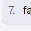 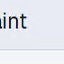

Combining them visually reconstructs the 7th word: **`faint`**.

`Answer: faint`

### 11. What is the victim's Ethereum wallet address? (E: 0x55897c6Af89Ef014EeC7BF031c26f55C23bF4367)

Following the same RDP Bitmap Cache analysis from the previous question, we search the parsed tiles and aggregated collage for cryptocurrency details. We find fragments of a screen capture depicting the victim's Ethereum wallet transaction or setup page.

Reassembling the character segments from the RDP cache reveals the victim's Ethereum wallet address.

`Answer: 0x27A2481a2D840C64c1f6a99842E1A63A1586237e`

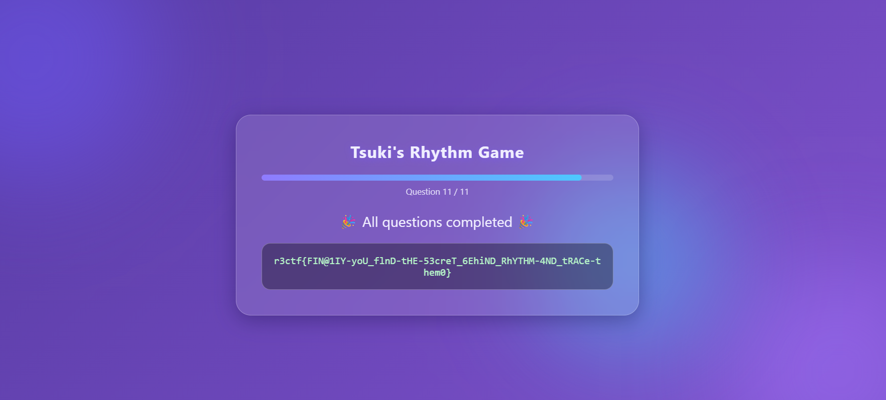

`Flag: r3ctf{FIN@1IY-yoU_flnD-tHE-53creT_6EhiND_RhYTHM-4ND_tRACe-them0}`