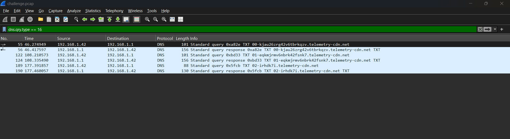
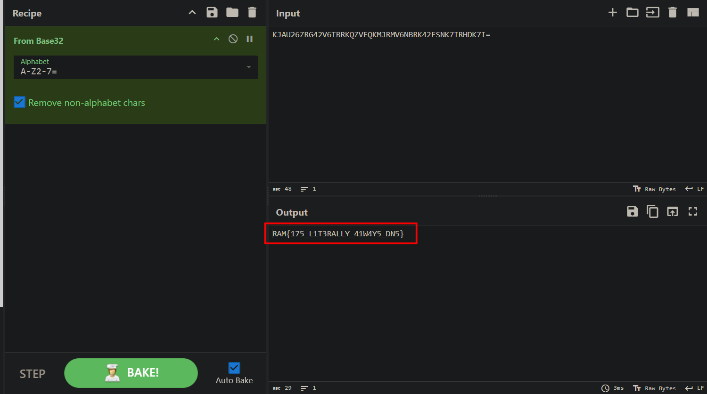

# C2 No Evil

## Scenario

(forget to take note)

## Given artifact

A packet capture file

## Solving process

Take a look at those DNS query, they are definitely the flag encoded some way:

Using `tshark` to extract them, then put into cyberchef (Magic recipe first to identify):

`Flag: RAM{175_L1T3RALLY_41W4Y5_DN5}`