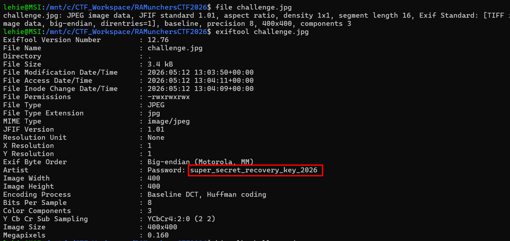
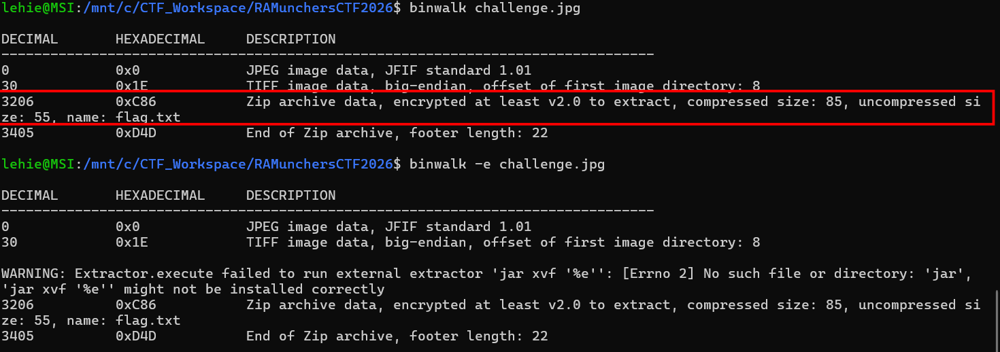
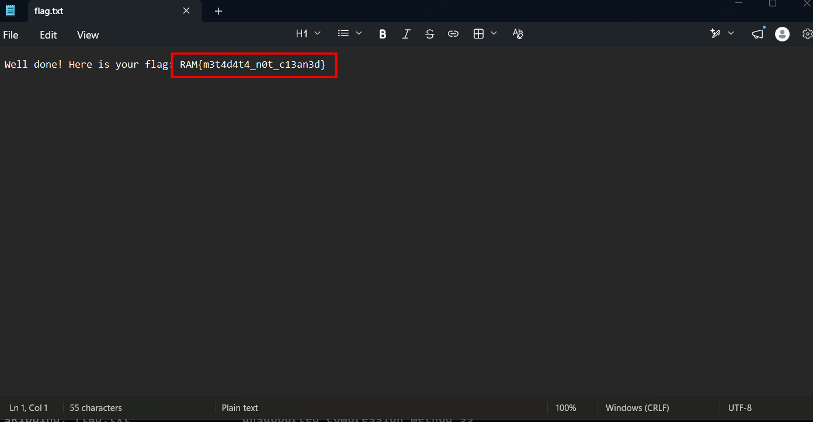

# Pixel Perfect

## Scenario

(forget to note)

## Given artifact

A jpg image

## Solve

I always check `exiftool` with given images:

There is a password, but for what ? Does an image need password to open, definitely not. Perhaps something is embedded here, check with `binwalk`:

That makes perfect sense, a zip archive, and the found password should be used here:

Inside is a text file containing the flag

`Flag: RAM{m3t4d4t4_n0t_c13an3d}`