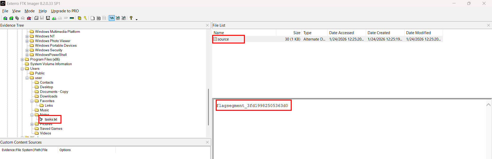
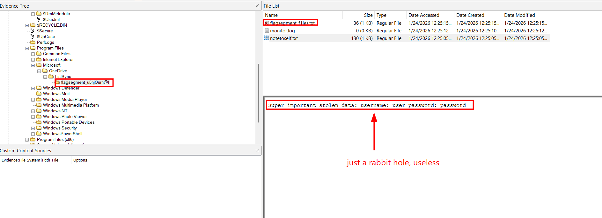
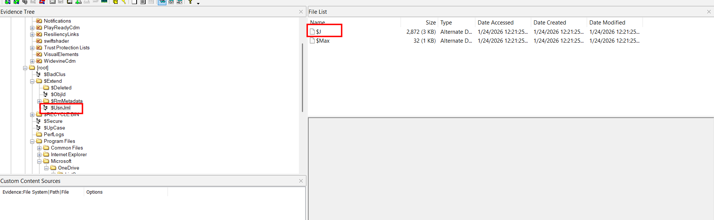
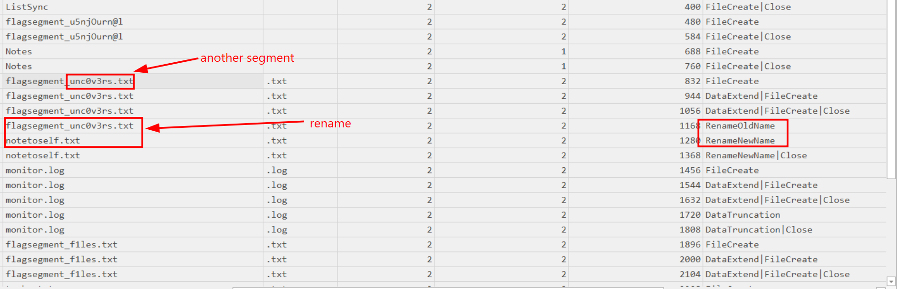
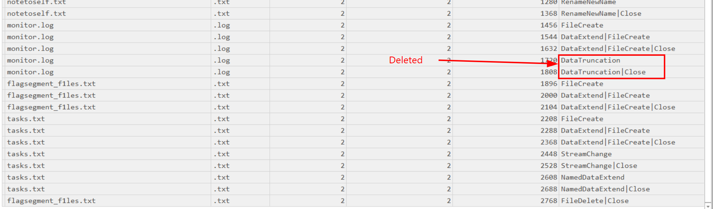
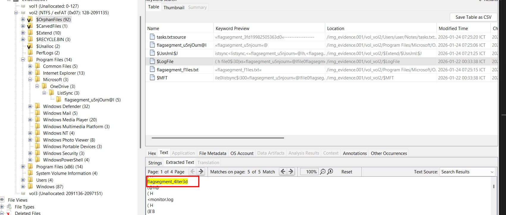

# Journaling 

## Scenario:

**I was using this Windows machine for journaling and notetaking, but I think malware got onto it. Can you take a look and put together any evidence left on disk?**

**Note 1: Sufficient information is provided to figure out the order of flag segments Note 2: Flag segments should be connected by underscores and wrapped in texsaw{} Example flag format: texsaw{part1_part2_part3}**

## Attachment

We are armed with a disk image file, which can be opened either from FTK imager or autopsy

## Solving process

Wandering around ftk imager, this is the first thing I notice, an ADS containing the 5-th flag segment

Continue to inspect manually to find for anomalies, I encounter a folder that contains 2 segments:

Forget the fake credential they put here, it's just decoy. Now I cannot find anything more just with this FTK imager, as the problem name suggests, Journal , insinuating Update Sequence Number (USN) Journal, is a 'security camera' that records all changes to files and directories like creation, modification, rename, add ADS, change stream, deletion...

We have it in an ADS here, but we cannot read it directly, we need a tool, and Eric Zimmerman's MFTECmd will help us. After processing it and converting to csv, I use Timeline Explorer, another Eric's tool, to inspect it.

So that segment file has been renamed to `notetoself.txt` and add fake credential to deceive us. 

What's more, looking at the monitor.log file, we see that it has size of 0 bytes, and the journal file tells us that it has been truncated. When a file is deleted, MFT will delete the link to the that memory region, but the data in hard disk **may** not be overwritten instantly, so the ghost of it may still be wandering in `unallocated space`

As we don't know exactly, or relatively, where to find, we must resort to the "strings-grep" procedures, FTK imager free version does not have search feature, so I change to autopsy, a dedicated tool. 

Searching for the pattern "flagsegment_" , I get the final part here.

`Flag: texsaw{u5njOurn@l_unc0v3rs_4lter3d_f1les_3fd19982505363d0}`