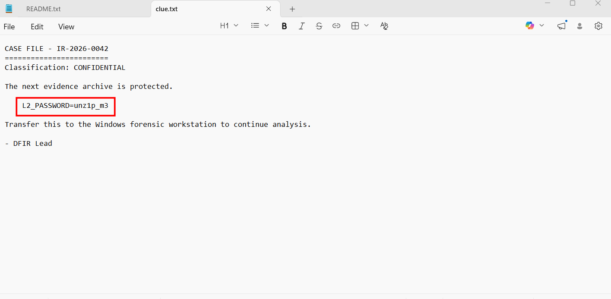
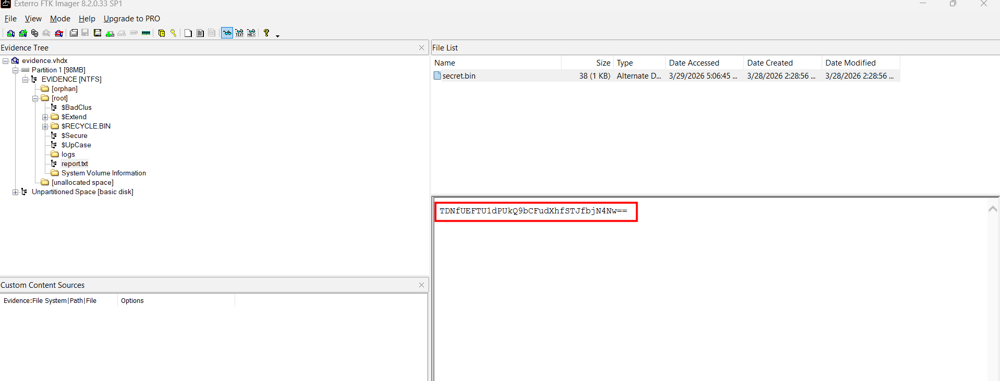
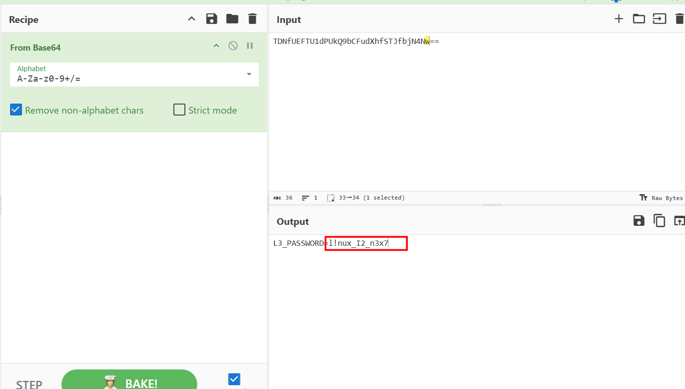
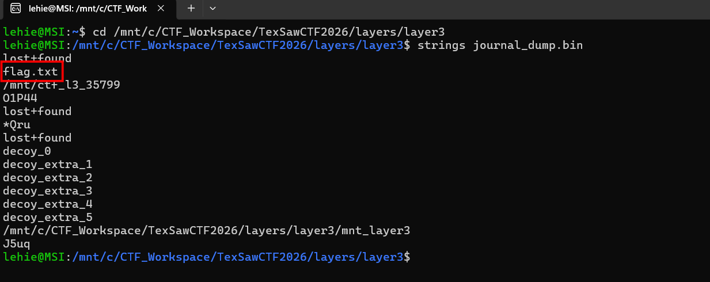
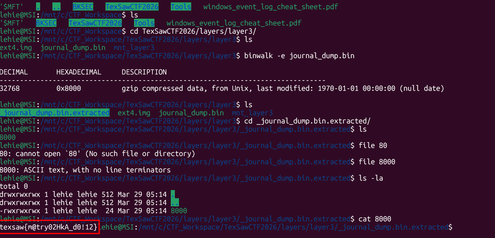

# layers

## Scenario:

I don't even remember to copy it here lol...

## Given artifacts

Three layers1,2,3 folders and a .DS_Store file, a feature of macOS

## Solving process

To be honest, I cannot know what is the meaning of this challenge, I will just list what I did to get the flag 

- First we unzip layer1 folder, inside it are some files, ranging from text file to something I am not sure what it is, but only this worth noticing, it holds the pass to unzip layer2:

- After extracting layer2, we find a .vhdx file and a folder, again, the only thing that is valuable here is the unzip password for layer 3, which lies in the ADS of report.txt, we can see it from FTK imager, or inisde the extracted folder:

- Decode it with cyberchef:

- After unzipping layer3 , we find an ext4 disk image file, but nothing can be extracted from it, even FTK imager or binwalk. So with the help of LLM, I try extracting the journal file of this image, remember $j in NTFS ? And this journal file holds the same meaning as that file, and even more, as $j in NTFS only holds changes to files, this journal file even holds the 'ghost' data, where files have been deleted, but its data is still wandering before being overwritten. It's attached to inode 8, so run `icat ext4.img 8 > journal_dump.bin` to extract it. Then run `strings` on the file, we see a big hint here:

Let's use binwlak to extract it, it should be still intact, not overwritten as this is a CTF challenge...:

Got the flag!

`Flag: texsaw{m@try02HkA_d0!12}`