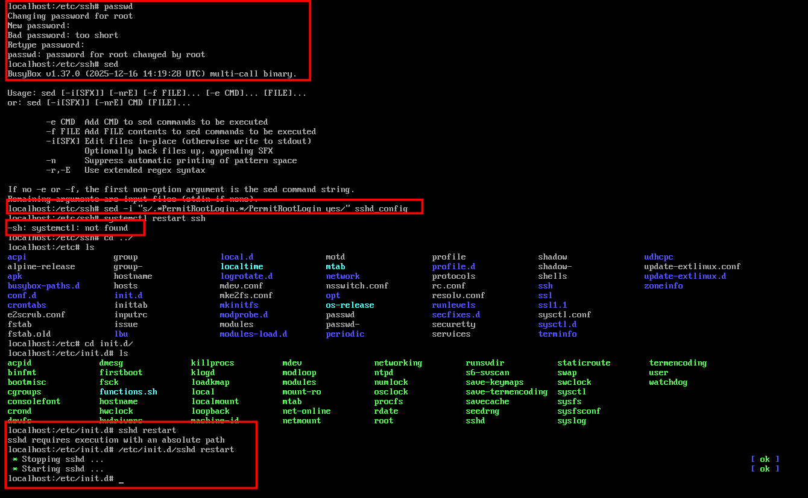
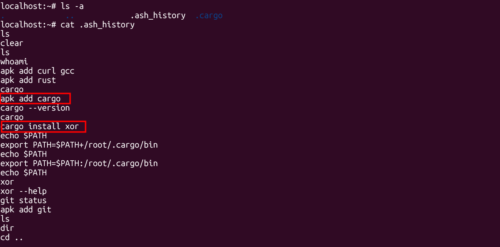
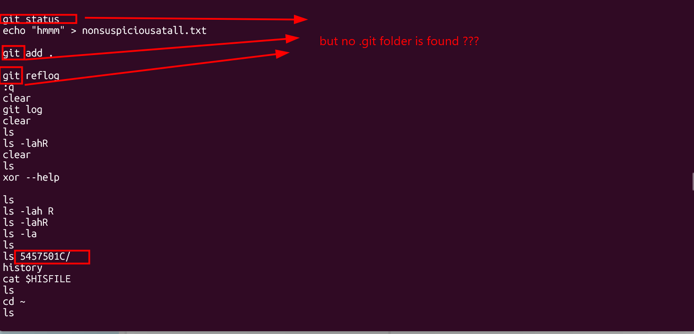
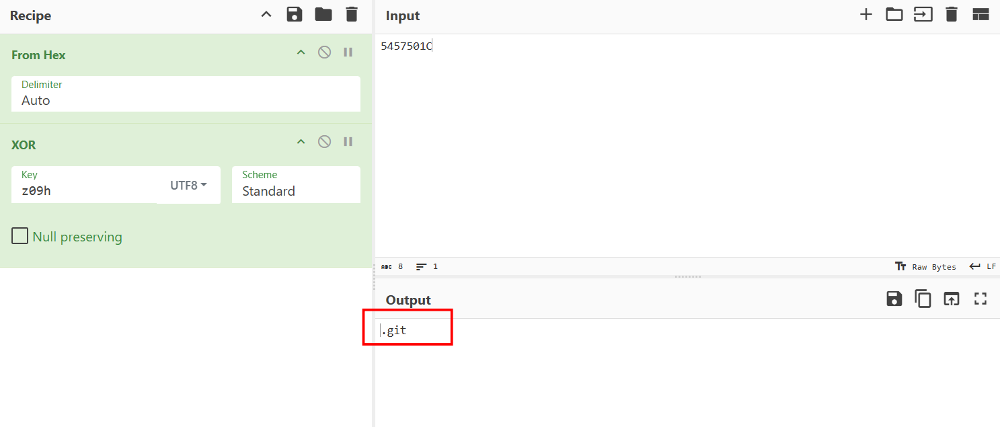
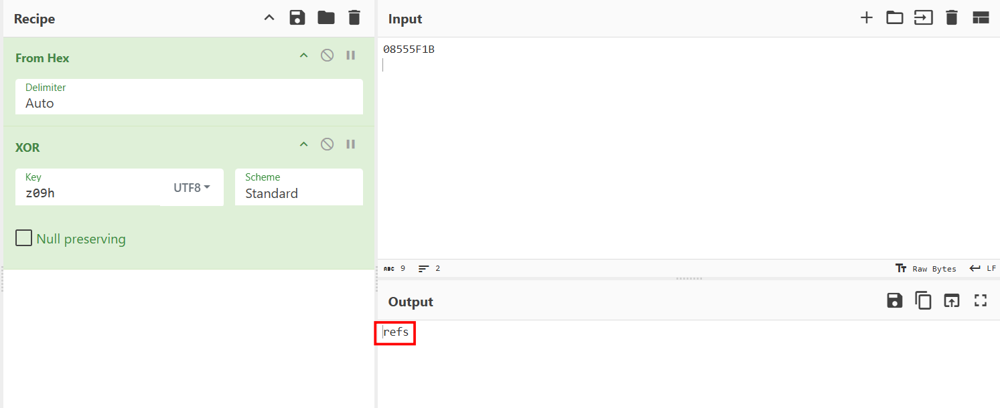
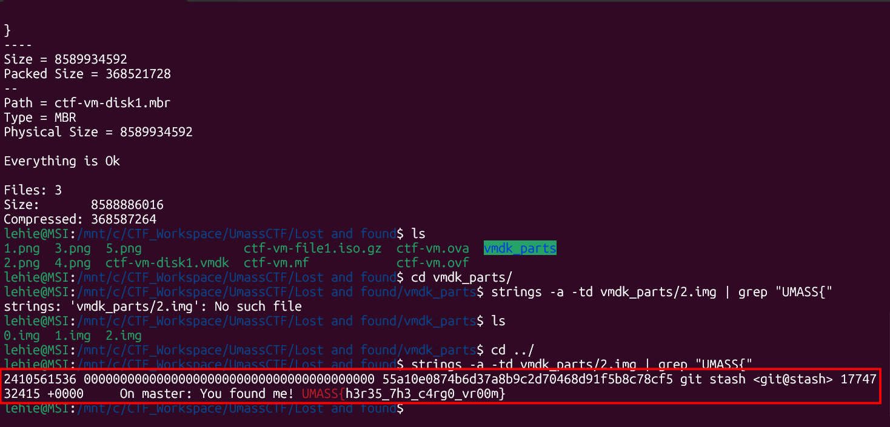

# Lost And Found

## Scenario

Help! I was running commands on my ultra minimalistic Linux VM when I installed my favorite package and everything turned into nonsense!

## Given artifact

An Open Virtualization Format (OVA) file, this can be either booted as a virtual machine in VMware, or unpacked using TAR (an .ova file is essentially just a stadard TAR archive) and 7zip, standard Linux 7z archiving tool natively understands VMware disk formats and will automatically extract the raw partitions.

## Solving process

I choose to boot up the VM first, as this is a minimal Linux machine, it lacks a lot of things, even though we can install more if we want. However, the unbearable thing is that this VM cannot recognize a mouse, no cursor, cannot scroll to read long file, so I think of making SSH connect into it from my WSL:



You can see that it's not that simple, we are given credentials for root user, and SSH to a root account is sometimes not permitted, including this VM. I have to manually modify that policy, then restart SSH service, but `systemctl` is even not supported! So I have to reach the path of `sshd` to force it to restart.

Okay, after gaining access to the VM with a colourful terminal from my machine, I begin to investigate, the first thing to notice is one of the hints: don't trust the `history` command, running `history` in a shell often shows the shell's in-memory view, not the on-disk history file. That means the user may have edited or manipulated the stored history separately.

Then we need to inspect the `/root/.ash_history` file, not lazily type `history` in the terminal:



At first I even wonder about the file name, usually we will see `.bash_history`, but this is an Alpine Linux environment (which we know because the package manager is apk). Alpine uses BusyBox by default, and its default shell is ash (the Almquist shell), not bash. Therefore, its history file is naturally `.ash_history.`

Looking at the command history, we can deduce a lot of things:

This immediately tells us several things:

1. The user installed a tool named `xor`.
2. They initialized a Git repo in `/home`.
3. They committed "a bunch of nonsense".
4. They created decoy files like `red-herring` and `nonsuspiciousatall.txt`.
5. They viewed the reflog.
6. They manually edited `.ash_history` afterward.

The user installed standard compilers and tools (gcc, python3, git, curl), but the most notable action was installing the Rust toolchain (rust, cargo) specifically to install a custom binary: `cargo install xor`. This strongly implies that some files, or even a whole folder was XOR-encrypted using this tool.

Further analysis with `strings` on the binary file and external research unveils the behaviour of this tool:

- It XORs file contents.
- In recursive mode, it also XORs filenames.
- Encrypted names are then hex-encoded.

That's why the `/home` directory looks exactly like a pile of garbage hex strings



We may see in the command history that user created a git repo in the home folder, but no `.git` folder can be found in that place. However, they manually revisit one particular folder inside `home`. Pay close attention to the folder name, it consist of 8 hexadecimal character, corresponding to 4 bytes, exactly the same as `.git`, so that must be the git folder being xor-encrypted!

We may manually test the derived key on some other folder to assert our hypothesis:





To be honest, I tried in vain to recover the folder, by taking the standard structure patter, XOR with the folder/file with appropriate length to recover the full key. But the key never seems to repeat soon, I give up when the discovered key is 63 bytes.

Now we may shift to another hypothesis, that the `.git` folder is just a distraction, the the flag lies in the deleted commands, reflog, or slack... To inspect these thoroughly, we need to look directly on the raw disk files, not the allocated file displaying on the terminal. Let's shutdown the machine and unpack it:

```bash
tar -xvf ctf-vm.ova
7z x ctf-vm-disk1.vmdk -ovmdk_parts
```

`7zip` will recognize the structure, and in `vmdk_parts` folder, we will see file named 1.img, 2.img... cleanly.

Now let's try a dirty trick: `strings with grep`, we assume the flag is hidden in the slack space as the author deletes the history command, let's run this

```bash
strings -a -td vmdk_parts/2.img | grep "UMASS{"
```

After around ... 20 mintutes, we finally get the treasure:



The user’s workflow likely looked like this:

1. Install Rust and Cargo.
2. Install the `xor` package.
3. Create or modify a repo in `/home`.
4. Add lots of decoy directories and files.
5. Commit nonsense.
6. Use `git stash` with a custom message containing the flag.
7. Run `xor -k ... -r .` to trash names and contents.
8. Edit shell history to hide the command.
9. Leave deleted reflog, index, and stash metadata in raw ext4 slack.

So from thee beginning, we were deceived by the visible file system ...

`Flag: UMASS{h3r35_7h3_c4rg0_vr00m}`