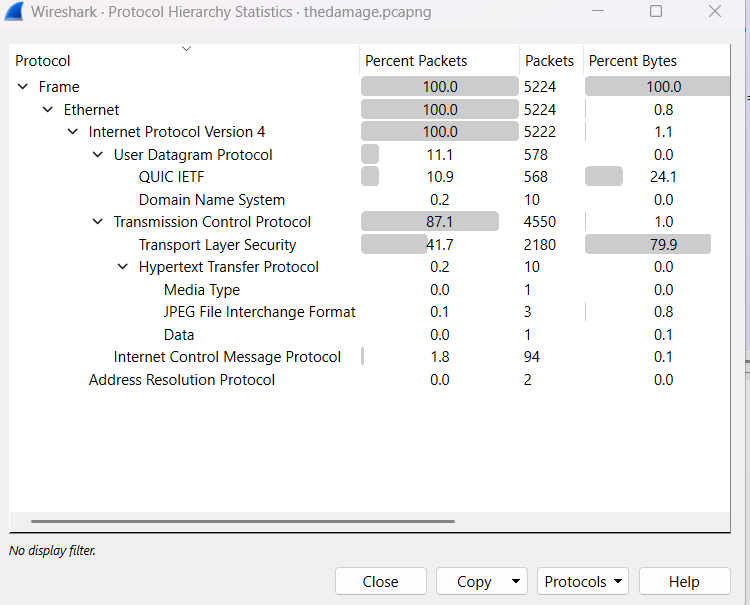
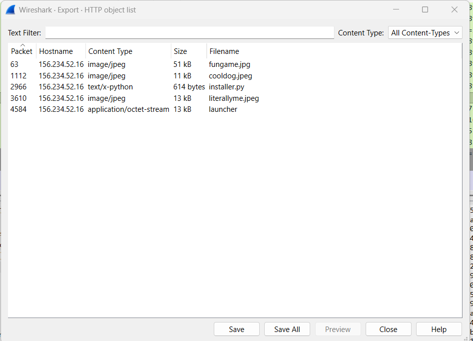
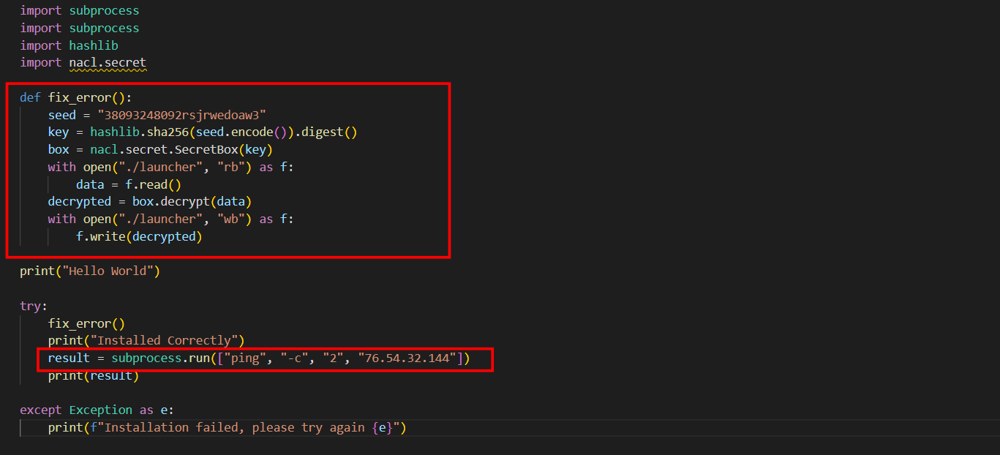
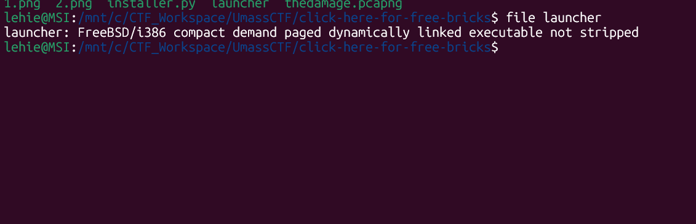
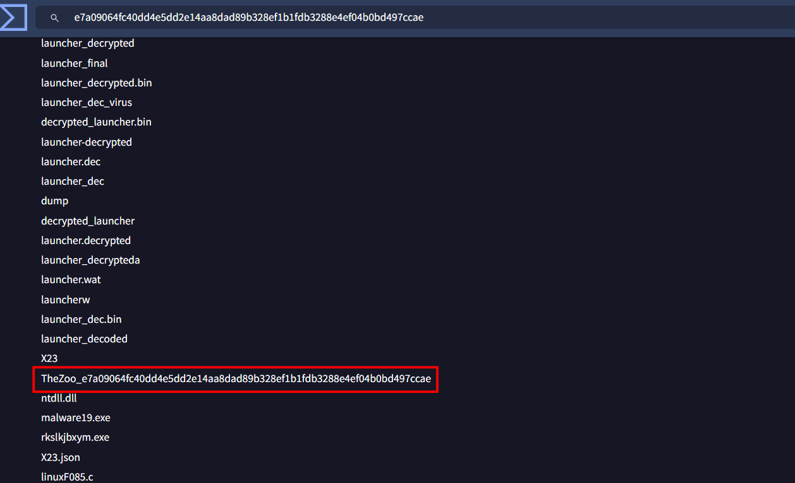

# Click Here For Free Bricks

## Scenario

Hey! A man was caught with malware on his PC in Lego City. Luckily, we were able to get a packet capture of his device during the download. Help Lego City Police figure out the source of this malicious download.

The flag for this challenge is the name of this virus on VirusTotal under the details tab with the format UMASS{[String]_[Sha256 Hash]}. For example if your hash is 2cf24dba5fb0a30e26e83b2ac5b9e29e1b161e5c1fa7425e73043362938b9824, there will be a virus name under the details tab with a format similar to ForensicsChallenge_2cf24dba5fb0a30e26e83b2ac5b9e29e1b161e5c1fa7425e73043362938b9824, where "ForensicsChallenge" is an arbitrary string.

## Given artifacts

A package capture file

## Solving process

Skimming through the hierarchy, I notice that almost the traffic is encrypted with TLS, but there are still some HTTP packets:

Let's see what was downloaded from those requests:

The images are likely decoy, but we can see an executable file and a python script that seem malicious, let's export them for further investigation

So the `launcher` executable is currently encrypted, this python script plays the role of decrypting it, after that, it sends some ping request to an external server

I isolate merely the decrypt function, remove all the connection to external world, and run it, the file after decryption is classified as above. Since it is not stripped, we may as well reverse-engineer it with ghidra or IDA, but I'm not so familiar with that task, and the problem does not require it as well. Now we take this executable onto VirusTotal to find the flag:

Got the flag!

`Flag: UMASS{TheZoo_e7a09064fc40dd4e5dd2e14aa8dad89b328ef1b1fdb3288e4ef04b0bd497ccae}`