# Minimal Linux machine analysis 
*Forensics task given by gorgeous mentor Tran Quoc "teebow1e" Tri Trung*

## Setting up machine

- Given a .vdi file dedicated to VirtualBox, but I only have VMware and don't want to install a new VM-managing software just to open a file. Luckily, with the help of big brother Danh Quan, I know about a command-line tool that helps convert .vdi files to .vmdk for VMware - qemu-img.

- Run command `.\qemu-img.exe convert -f .vdi -o .vmdk "C:\CTF_Workspace\Task\ubuntu2004_1.vdi" "C:\CTF_Workspace\Task\ubuntu2004_1.vdmk"` in the directory holding the tool, I successfully convert it into my convenient format.

- Import it to VMware as a new virtual machine, I leave almost every setting by default, even though this VM is quite minimal and consumes inconsiderable resources:

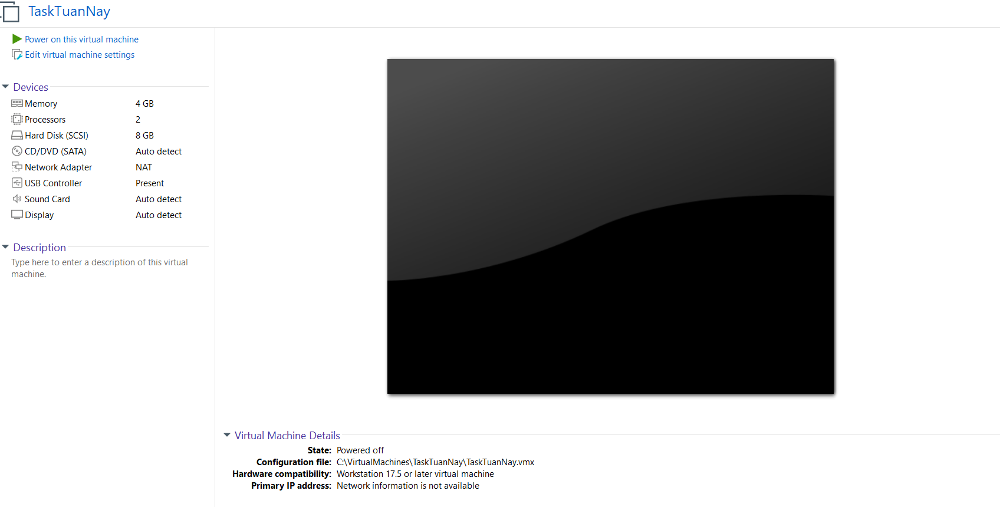

## Investigation

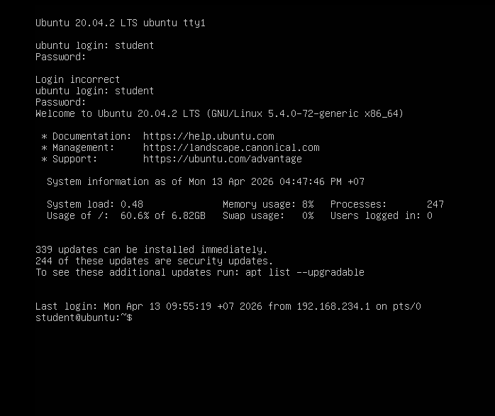

- Upon seeing this terminal pops up, I know this will be a hard, boring attempt. A beautiful GUI, colourful terminal can also put difficulties in my way, let alone a lifeless terminal like this, anyway, let's roll up our sleeve!

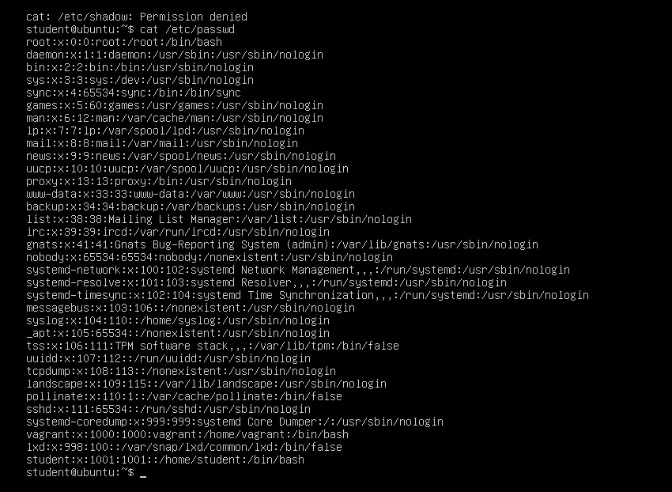 

- I begin by skimming through /etc/passwd  and /etc/shadow file, that's my habit, I want to know whether a suspicious account, often with root privilege, is created here. However, nothing is worth noticing. What's more, you can notice that I cannot read the shadow file, it's normal as I'm running the cat command with privilege of a normal user, let's see if we can escalate to root by running `sudo -l`:

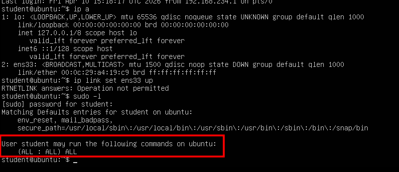

- Great!! That means we can run command under any user's privilege, including root, and we can run any command. Now let's run `sudo su -` to become root. You may notice that I ran `ip a` before checking for root privilege, that's because I want to check whether I can make a SSH connection into this machine, you know, this obsolete machine even cannot recognize a mouse, no cursor, no scrolling, I cannot read long files like logs in the future. Using `less` may be a way, but it's too inconvenient. So I check for any running network card, the is a valid card `ens33` but it's down, we need to revive it with `ip link set ens33 up`, no need for sudo prefix, we are already the super-administrator. Then ask for an IP address with `dhclient -v ens33`, I put -v option to see the DORA process:

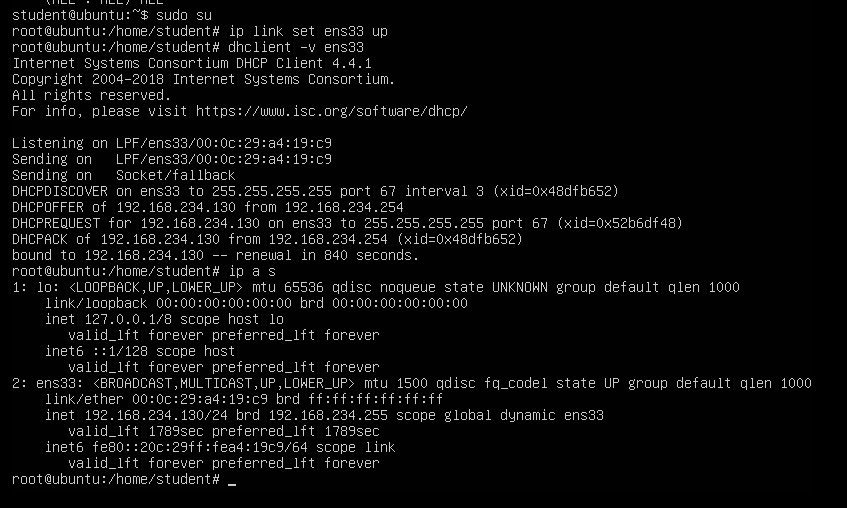

- Now that the machine is accessible, let's make a SSH connection to it from WSL. As expected, it's much more convenient to navigate, now let's begin with `auth.log`:

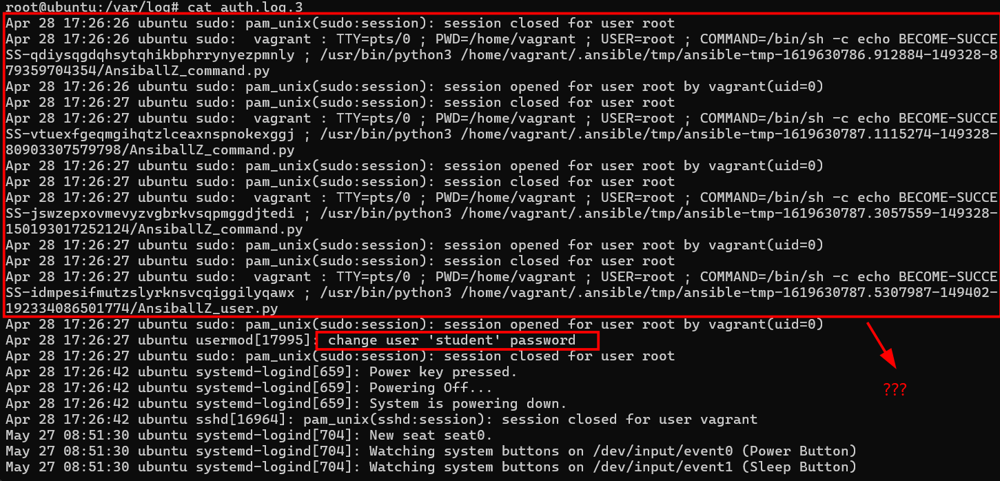

- At first I get suspicious with these logs, but after asking LLM, I know that this is not that machine bombarded by a sophisticated payload. Those are footprints of Ansible, a famous tool for automating administration tasks. It acts under [**vagrant**](https://developer.hashicorp.com/vagrant) user, creates python scripts for automating task and saves them to /tmp folder. When executing those script, it runs with sudo privilege. The "Echo: Becoming success..." part is just Ansible annoucing that it has successfully escalated to root.

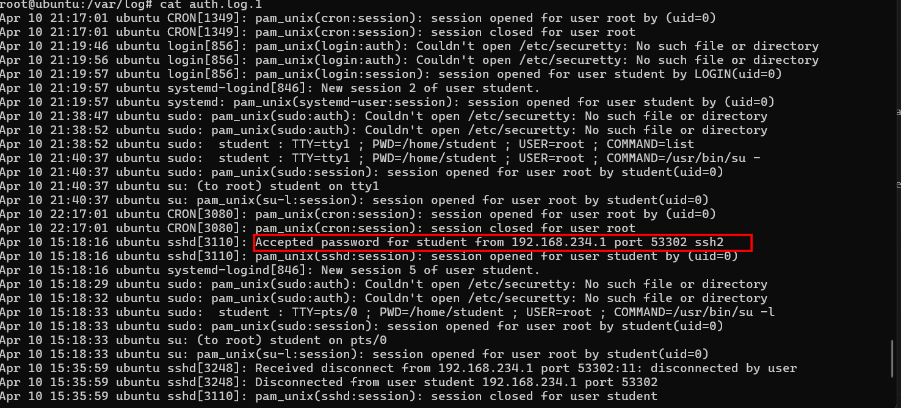

- Maybe that's all we can collect from auth.log, as you can see in the newer log is my attempt to make SSH connection, not the artifacts left by attacker anymore.

- Still stay in /var/log folder, I intend to investigate `apt log`, but in one moment I change my mind and read the bash history first, the bash history of root user is empty, but that of `student` is not:

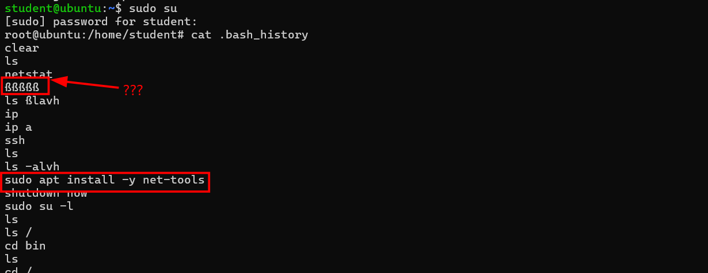

- Perhaps the attacker is in the reconaissance phase here ? They run ip, ip a, netstat to investigate the machine, when net-tools is missing, they don't mind escalating to **sudo** to install it. Is this an IoC, or am I overcomplicating things ? Let's see...

- Returning to apt log, we can see that older log is compressed with gunzip, this is a mechanism of Linux to save space:

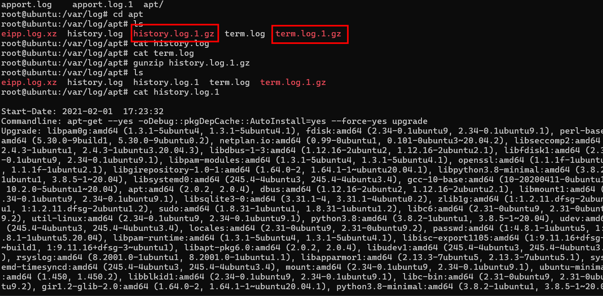

- Let's dive into the oldest log:

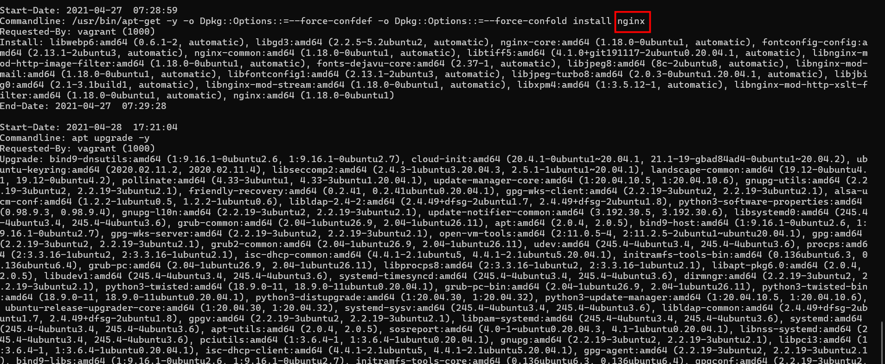

- Initially everything seems to be normal, installed packages are all core for Linux system and legitimate, but from this, we should assess this server from a different perspective: **it's a webserver**

- After seeing `nginx` get installed, I put every other logs aside and head for nginx logs, including access.log and error.log, let's begin with access.log first:

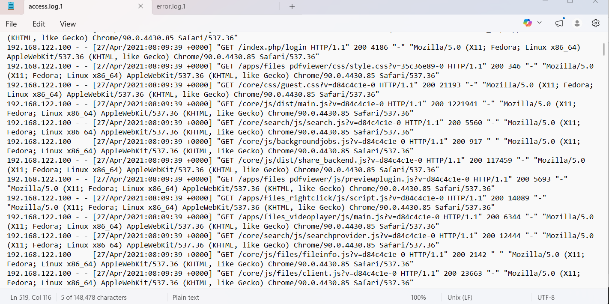

- From this web structure, with the help of LLM, I realize that this server is running as a personal cloud server, particularly NextCloud, but the access pattern still shows nothing suspicious, this seems like normal users browsing the web.

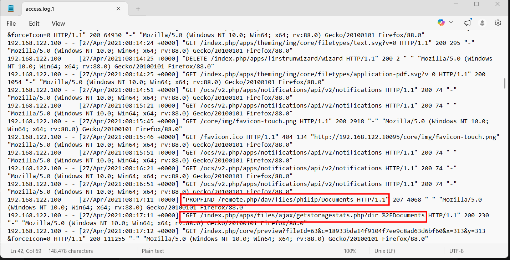

- At first, I find this log very suspicious, how can an user access these private folders/files without even logging in, what is more, the `...100` IP address even uses **two** different user-agents:

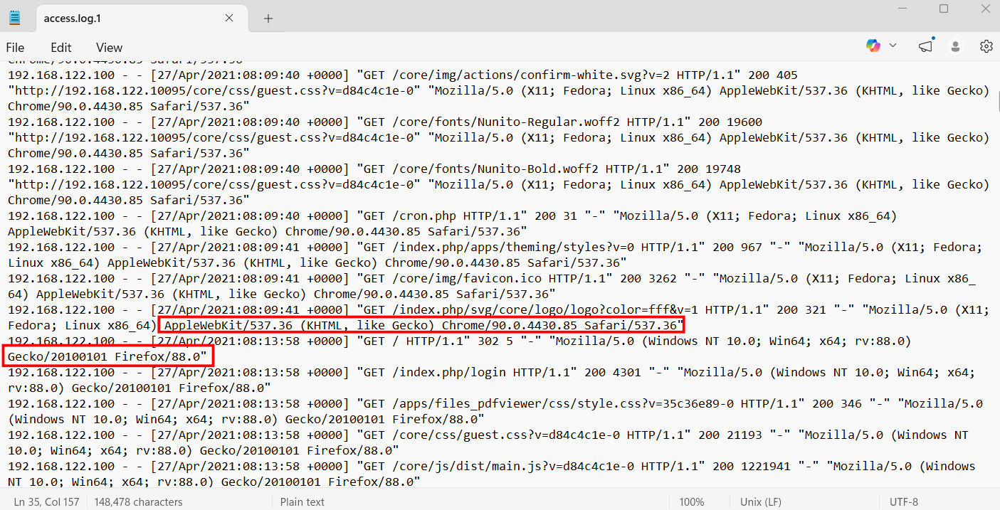

- This makes me rather confident that this is an IoC, however, after find POST request to assert my thought, I realize that the access to private files is legitimate, as the user already logs in successfully, and there is no brute-force attempt, one login and it is correct, it should be a normal user:

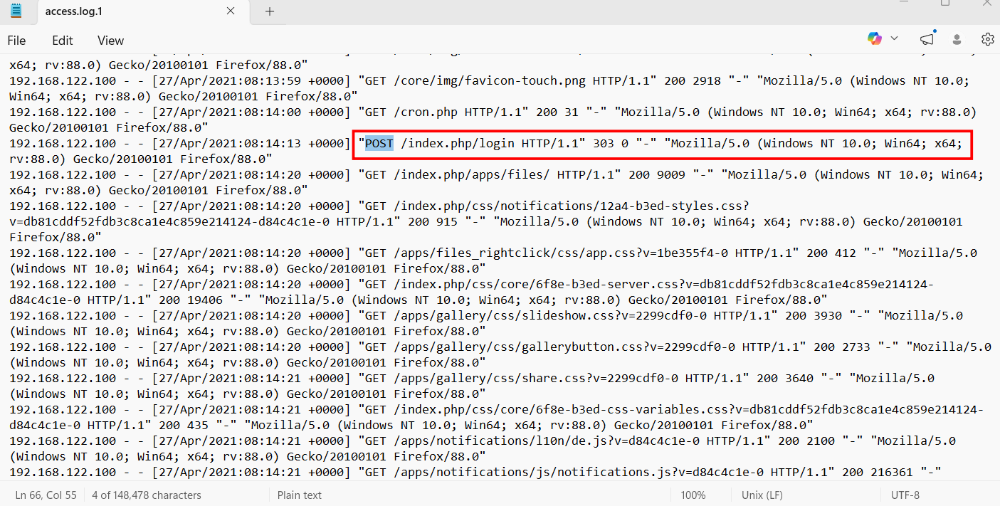

- Continue inspecting the log, I see another pattern that worth noticing, the presence of csrftoken (Cross-site Request Forgery) means that the user is about to **upload** something, which may be malicious. The server will only accept if the token is valid:

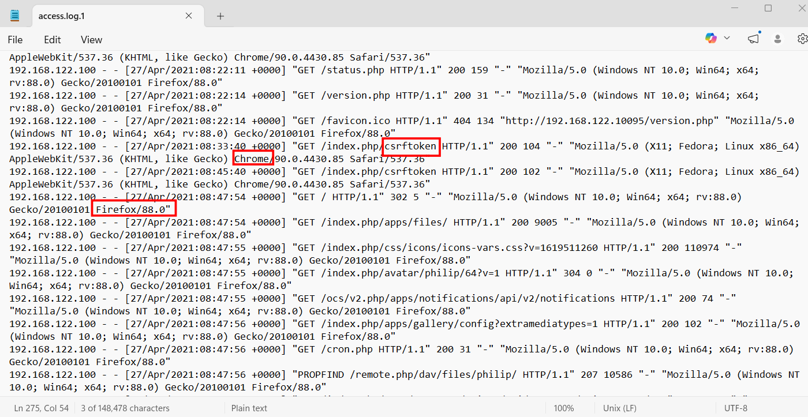

- But then, I am overthinking again, that is just a text file, the user creates it, then write something to it and eventually... delete it, things would be worse if the txt file were converted to .php for example with MOVE request, but it was not:

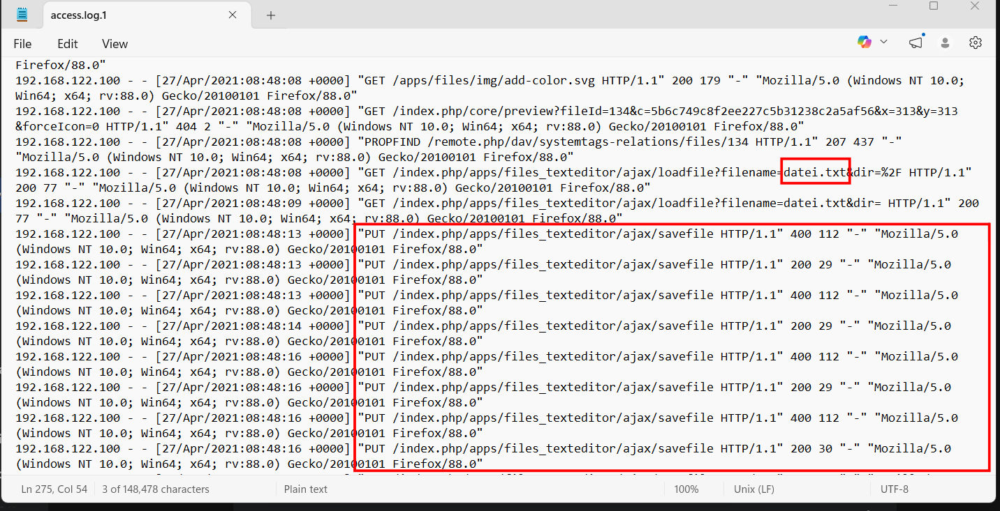

- However, all of the sudden, this pile of exploitation takes me aback:

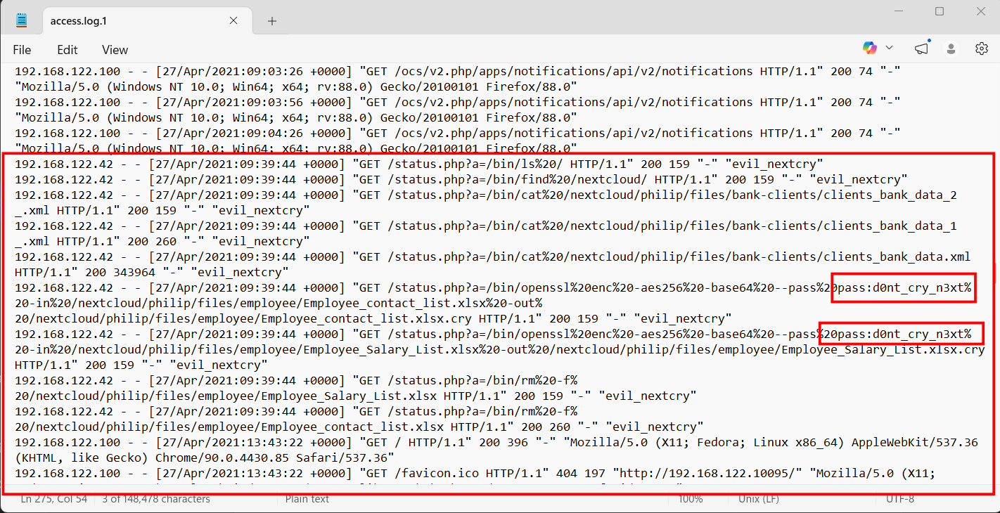

- Somehow the attacker gain RCE here, we have never seen in the log that this `status.php` is modified or abused somewhere. With just a parameter `a` after the .php site, hacker can inject command and execute it right in the server, let's see what they did: `/bin/ls` and `/bin/find /nextcloud/` to scan the whole directory, `/bin/cat...` to read and possibly exfiltrate private data, then they use `openssl` to encrypt these file into .cry file as ransomware, and finally they remove these files. What worths noticing here is that they harde-coded the key in the request, so we can decrypt these file later if we need.

- From that point on, the access.log shows no more compromise indicator, the normal user gets back and possibly cries when seeing his file being encrypted to garbage and even removed. So let's move to the error.log:

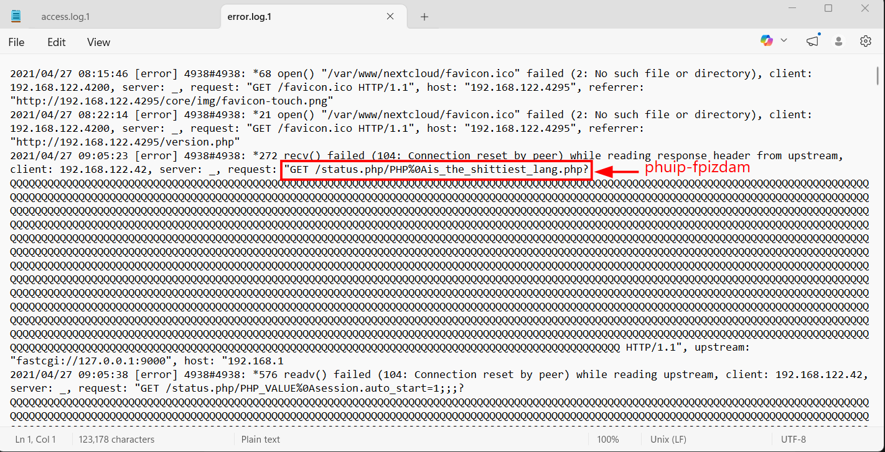

- Everything is clear from the first sight, the hacker is not crazy enough to hard-code these lines about php, this is a signature of [phuip fpizdam](https://github.com/neex/phuip-fpizdam), a tools written dedicatedly to exploit [CVE-2019-11043](https://nvd.nist.gov/vuln/detail/cve-2019-11043)

- Cite NIST: "In PHP versions 7.1.x below 7.1.33, 7.2.x below 7.2.24 and 7.3.x below 7.3.11 in certain configurations of FPM setup it is possible to cause FPM module to write past allocated buffers into the space reserved for FCGI protocol data, thus opening the possibility of remote code execution."

- Looking at the `phuip fpizdam` repository, this is the exact pattern we see in the log:

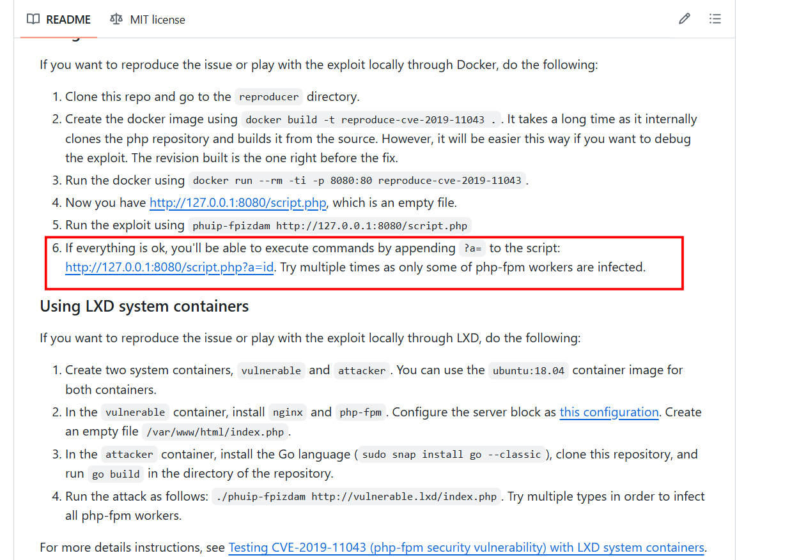

- I'm still wondering whether it has been done or not, so I return to two encrypted files, is anything hidden behind it ? I head for the directory, just to realize that the original files are still intact here ????

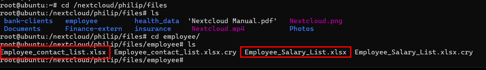

- I try investigate them, but they seem to be normal datasheet about employees' inoformation, no hidden flag of message, however, what if these file are decoys, and the secret lies in the encrypted files ?

- Run `openssl enc -d -aes256 -base64 --pass pass:d0nt_cry_n3xt -in Employee_contact_list.xlsx.cry -out Employee_contact_list_RESTORED.xlsx`, and the same for the remaining file, I successfully restore them, but then.. nothing is found, I was too sceptical!

- After that, I still want to assure there is no more abnormality, I check for `crontab` for possible backdoor/persistence, but as always, nothing is found..

- I officially give up!

## Conclusion 

1. Vulnerability & Initial Access
The breach was not the result of compromised SSH credentials or OS-level privilege escalation. Instead, the threat actor exploited CVE-2019-11043, a critical vulnerability caused by a misconfiguration between Nginx and PHP-FPM.

2. Execution & Evasion
Using the phuip-fpizdam exploit tool (originating from IP 192.168.122.42), the attacker performed a buffer overflow attack to inject malicious PHP directives. This allowed them to establish a fileless web shell operating entirely within the memory of the legitimate status.php process, successfully evading traditional file-based detection mechanisms.

3. Impact & Ransomware Deployment
Operating under the www-data user context, the attacker had sufficient privileges to access the Nextcloud data directory. The threat actor first exfiltrated sensitive data and subsequently executed a ransomware attack. They utilized the system's native openssl utility to encrypt user files with AES-256 and deleted the originals.

4. False Positives Identified
A thorough forensic review successfully ruled out several false positives. Suspicious activities associated with the student and root accounts—including cleared bash histories, failed net-tools installations, and Ansible automation logs—were confirmed to be benign artifacts from the initial lab environment provisioning, unrelated to the threat actor's activity.

5. Remediation & Recovery
The investigation culminated in a complete recovery of the compromised data. By analyzing the plaintext command-line arguments captured in the web server logs, the incident response team successfully extracted the encryption key (pass:d0nt_cry_n3xt). This allowed for the successful decryption and restoration of all affected files, resulting in zero permanent data loss.