# pf-ing 

## Scenario

This is the task for me to do in the Vietnamese Reunification - Labour Day holiday, given by my mentor **teebow1e**, created by `Azr43lKn1ght` as one of his DFIR lab series on Github

## Given artifacts

A memory dump file

## Solving process

Whenever I receive a dump file, I run `windows.info` , honestly not to check its version, but to check ... whether it is taken from a Windows machine or not:

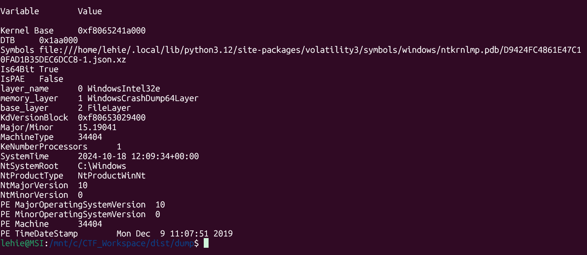

Now let's check for suspicious process using `windows.pstree`:

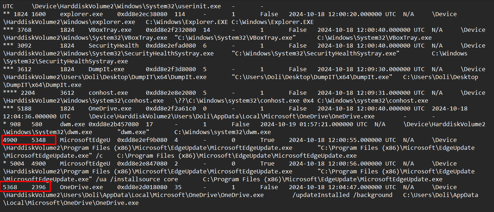

Well there is nothing suspicious, just two process with non-existent PPID, but their legitimacy is confirmed. Perhaps the process is hidden from `pstree`? I once read that some hidden processes that are not visible in the tree can be seen in another plugin : `windows.psscan`, let's try:

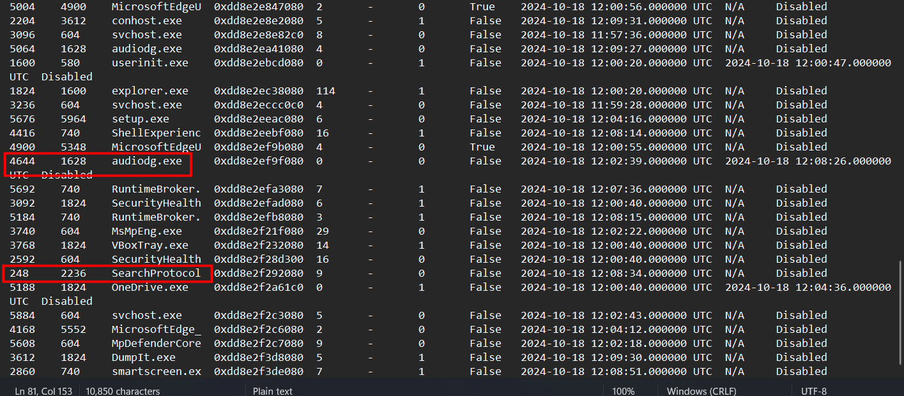

These two processes are missing from the process tree, the one with PID 4644 is benign, it exits before DumpIt captures this image, so it's reasonable to be missing. About the other, I also do not put much hope on it, but I still try `cmdline` and `dlllist` with `--pid 248` tag, however, volatility even cannot find that PID.

When hopelessly trying other plugins, I realize that this challenge does have a name, `pf-ing`, that tells all about what I need to do. Let's locate all prefetch files existing in the memory dump:

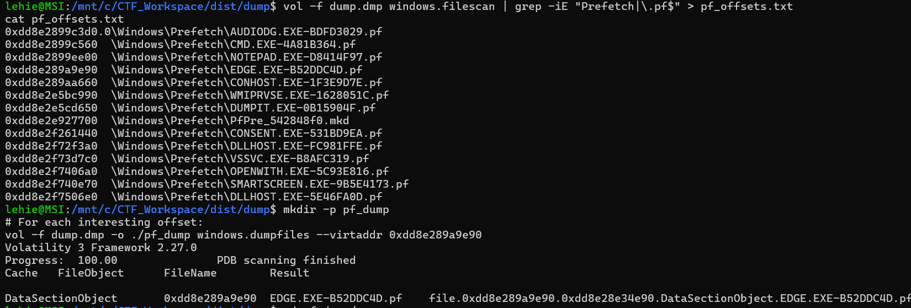

At first sight, I'm confused as nothing seems suspicious, but then I realize that there is only one legitimate executable for Microsoft Edge named `msedge.exe`, so what the hell is `edge.exe`, let's dump it for further analysis

Using Eric Zimmerman's `PECmd` tool, I can immediately see abnormal behaviour from this process:

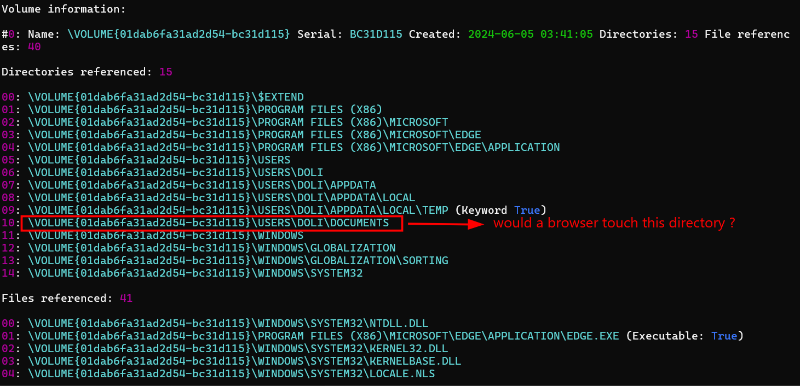

What is more, it access user's files in a defined pattern:

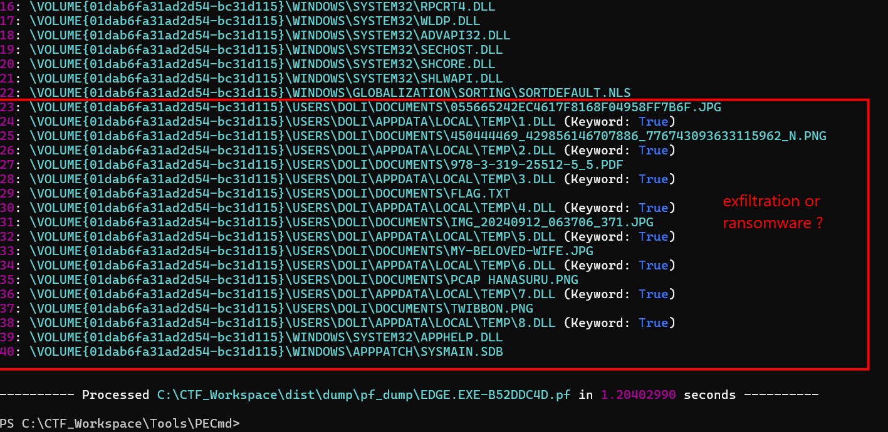

Each file is reference and deleted, as I cannot find them with `filescan`, however, the outputed .dll files are accessible, so I dump them:

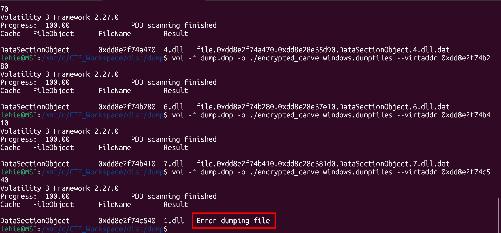

The first dll gets some kind of error when dumped, but even other successfully dumped files are corrupted, that's expected as the malware must have done something with them. To determine which kind of malware it belongs to, I take its hash and submit to VirusTotal:

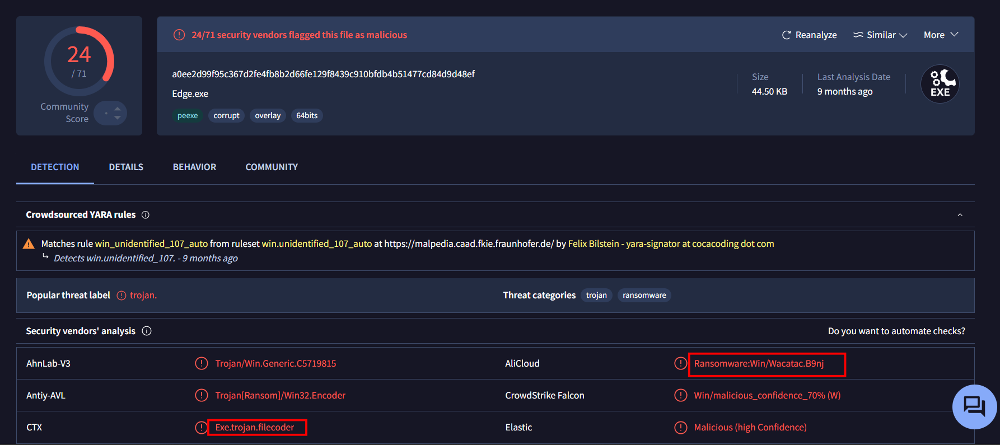

Exactly as I expected, it's a kind of ransomware. Now I will find and dump it form the memory image for decompiling and analysis. Upon reading result from ghidra, I notice a function here, it is neither the entry function nor the function called by entry, but it tells us almost everything about the ransomware's mechanism:

```c
void FUN_7ff6571b1830(void)

{
  uint _Seed;
  int iVar1;
  BOOL BVar2;
  size_t sVar3;
  LPWIN32_FIND_DATAA lpFindFileData;
  undefined8 uVar4;
  undefined *puVar5;
  char *pcVar6;
  FILE *pFVar7;
  undefined8 uVar8;
  undefined1 *puVar9;
  char *pcVar10;
  ulonglong uVar11;
  FILE local_6a8 [5];
  _WIN32_FIND_DATAA local_598;
  FILE local_458 [5];
  FILE local_348 [5];
  char local_238 [4];
  undefined2 auStack_234 [134];
  undefined1 local_128 [271];
  byte local_19;
  HANDLE local_18;
  int local_c;
  
  local_18 = (HANDLE)0xffffffffffffffff;
  local_c = 0;
  SHGetFolderPathA(0,5,0,0,local_128);
  uVar8 = 0;
  uVar4 = 0;
  SHGetFolderPathA(0,0x1c,0,0,local_238);
  sVar3 = strlen(local_238);
  builtin_strncpy(local_238 + sVar3,"\\Tem",4);
  *(undefined2 *)((longlong)auStack_234 + sVar3) = 0x70;
  FUN_7ff6571b17e4(local_238,sVar3,uVar4,uVar8);
  puVar9 = local_128;
  puVar5 = &DAT_7ff6571ba078;
  FUN_7ff6571b1591(local_6a8,0x104,&DAT_7ff6571ba078,(ulo nglong)puVar9);
  lpFindFileData = &local_598;
  local_18 = FindFirstFileA((LPCSTR)local_6a8,lpFindFileData);
  if (local_18 == (HANDLE)0xffffffffffffffff) {
    FUN_7ff6571b1540((byte *)"Error finding files in Documents\n ",(ulonglong)lpFindFileData,puVar5,
                     puVar9);
  }
  else {
    _Seed = FUN_7ff6571b15db((__time64_t *)0x0);
    srand(_Seed);
    do {
      if ((local_598.dwFileAttributes & 0x10) == 0) {
        FUN_7ff6571b1591(local_348,0x104,(byte *)"%s\\%s",(ulon glong)local_128);
        local_c = local_c + 1;
        pcVar10 = local_238;
        pcVar6 = "%s\\%d.dll";
        FUN_7ff6571b1591(local_458,0x104,(byte *)"%s\\%d.dll",(u longlong)pcVar10);
        local_19 = FUN_7ff6571b1652((char *)local_348,(char *)lo cal_458);
        if (local_19 == 0) {
          FUN_7ff6571b1540((byte *)"Failed to encrypt file: %s\n",( ulonglong)local_598.cFileName,
                           pcVar6,pcVar10);
        }
        else {
          pFVar7 = local_458;
          uVar11 = (ulonglong)local_19;
          FUN_7ff6571b1540((byte *)"Encrypted %s -> %s with XOR  key: 0x%02x\n",
                           (ulonglong)local_598.cFileName,pFVar7,uVar1 1);
          iVar1 = remove((char *)local_348);
          if (iVar1 == 0) {
            FUN_7ff6571b1540((byte *)"Deleted original file: %s\n",( ulonglong)local_348,pFVar7,
                             uVar11);
          }
          else {
            perror("Error deleting original file");
          }
        }
      }
      BVar2 = FindNextFileA(local_18,&local_598);
    } while (BVar2 != 0);
    FindClose(local_18);
  }
  return;
}
```

Just skimming through it we can see the encryption is XOR-ing with a single byte, however, let's fully analyze it:

- Two folders loaded with `ShGetFolderPathA` are My Document and Local AppData, you can refer to [this page](https://tarma.com/support/im9/using/symbols/functions/csidls.htm) for the use of CSIDL value.
- Then `strcat()` is used to append \Temp to the Local AppData path, constructing it absolute path `C:\Users\Doli\AppData\Local\Temp`
- After that, `sprintf()` finds for everything exist in Documents folder
- After a series of confusing operation, this function gets called:

```c
void FUN_7ff6571b15db(__time64_t *param_1)

{
  _time64(param_1);
  return;
}
```

- `_time64()` called with NULL will return current UNIX epoch
- Then `srand(_Seed)` seeds the global CRT `rand()` **once**

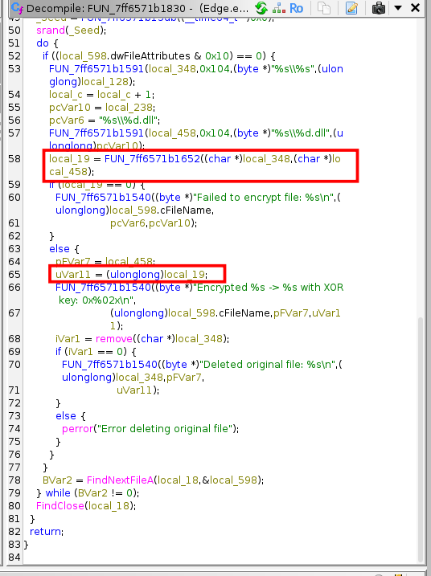

Now let's look at the called function to see the meaning of returned `local_19`:

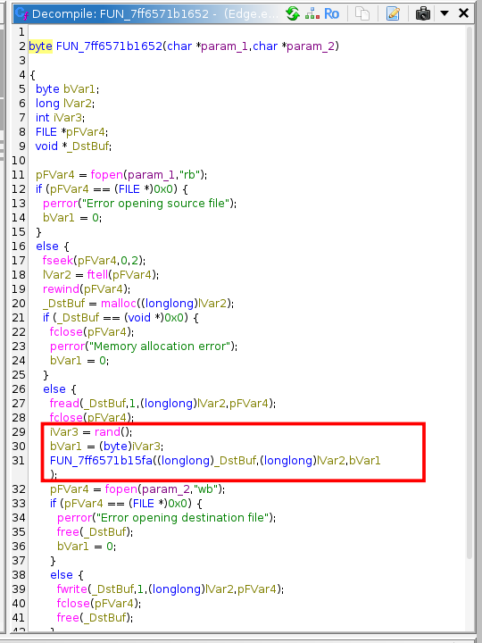

So each call to it advances `rand()` by 1, efficiently creates a new key for each file, `local_19` just holds the value indicating whether the operation is successful or not. `FUN...5fa()` is just a function performing XOR:

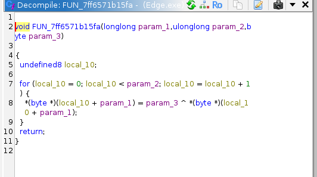

So the key for file N is `(byte)(rand_N & 0xFF)`, where `rand_N` is the N-th call in the sequence produced by MS CRT's LCG seeded with the wall-clock time when the program started.
MS CRT rand() is a documented Linear Congruential Generator:

```text
state_{n+1} = state_n * 214013 + 2531011
rand_n      = (state_{n+1} >> 16) & 0x7FFF
```

with state_0 = seed. Fully deterministic — given the seed, we can reproduce every key in order.

Well, even though we know the true mechanism, let's test our luck with a short-cut first, as the key is a single byte, there are only 256 possible candidates, totally brute-forceable. I will try on the suspicious 4.dll, corresponding to original `flag.txt`:

```python
with open('4.dll','rb') as f:
    ct=f.read()
for k in range(256):
    pt=bytes(k^b for b in ct)
    try:
        s=pt.decode('utf-8', errors='strict')
        if "SNI" in s:
            print(f'Key: {k}, decrypted: {s}')
    except UnicodeDecodeError:
        continue
```

Running that script only makes me realize that I fell on the author's trap:

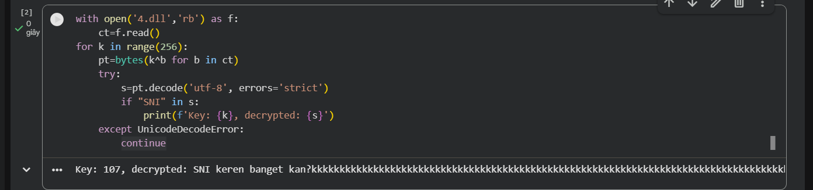

That file does not contain the flag, just a lure, that Indonesian text translates roughly to "SNI is really cool, right?" followed by kkkk... — and kkkk in Indonesian internet slang is laughter (their version of lol/haha). So the message reads as: "SNI is so cool, right? lololol". Mocking tone, very CTF-author energy.

However, it's not totally futile, we get the key for `4.dll`, and it can be used to verify the keys we simulate with LCG mechanism as the result from PECmd shows 2 runtime, if you have forgotten, the current run time is used as the seed for that algorithm:

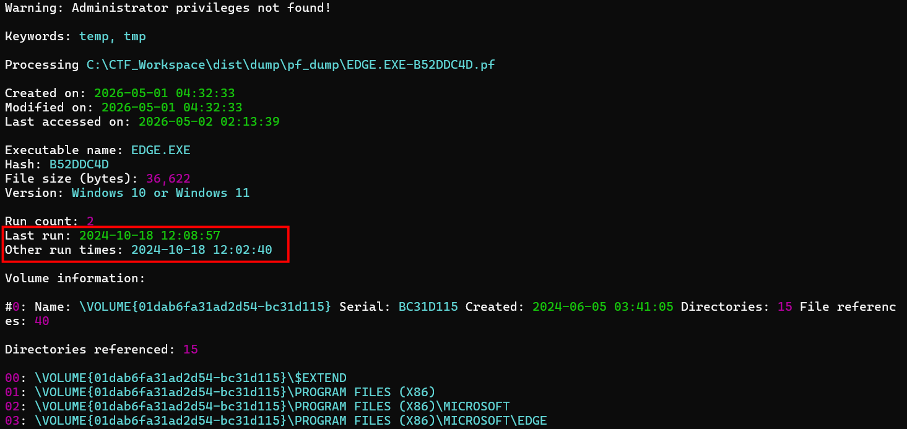

I will simulate the LCG algorithm here, choosing the last run time as the seed, remember to convert it to UNIX epoch time, I used `epochconverter.com`:

```python
def ms_rand_seq(seed,n):
    state=seed & 0xFFFFFFFF
    out=[]
    for _ in range(n):
        state = (state * 214013 + 2531011) & 0xFFFFFFFF
        out.append((state >> 16) & 0x7FFF)
    return out

# Find the seed
seed = 1729253337
keys=[r&0xFF for r in ms_rand_seq(seed, 256)]
print(f'All keys: {[hex(k) for k in keys]}')
```

Note that I used two AND operations to truncate the state and key, state is 32-bit but python int is arbitrarily large, so keeping them 32 bit is safer, and the key is a single byte, so we only keep the last byte:

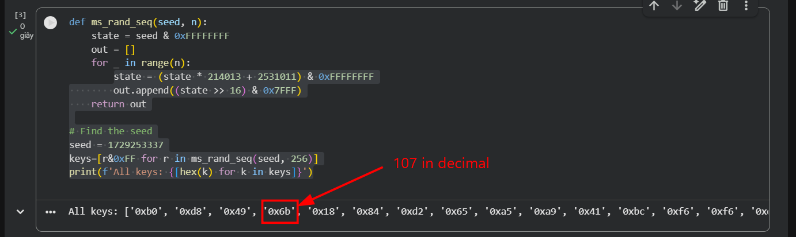

Great, it matches the key we found for 4.dll, now we can use the remaining keys to decrypt other files, and the flag is found on 6.dll:

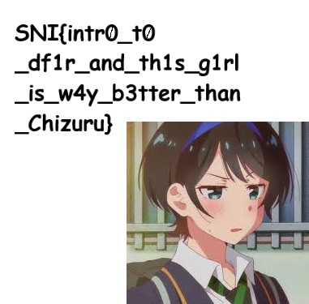

Nah, the author is a wibu ??? What's more, the original file name is `MY-BELOVED-WIFE.JPG`, ewww...

`Flag: SNI{intr0_t0_df1r_and_th1s_g1rl_is_w4y_b3tter_than_Chiruzu}

## Afterthought

I have hardly anything to comment for this task, the attack chain is not clear, we don't know why the machine is infected, and the ransomware is not so realistic as well, I think most ransomware will encrypt in-place, rather than create a new folder and put encrypted files in, which increase disk write and possibly trigger AV.
